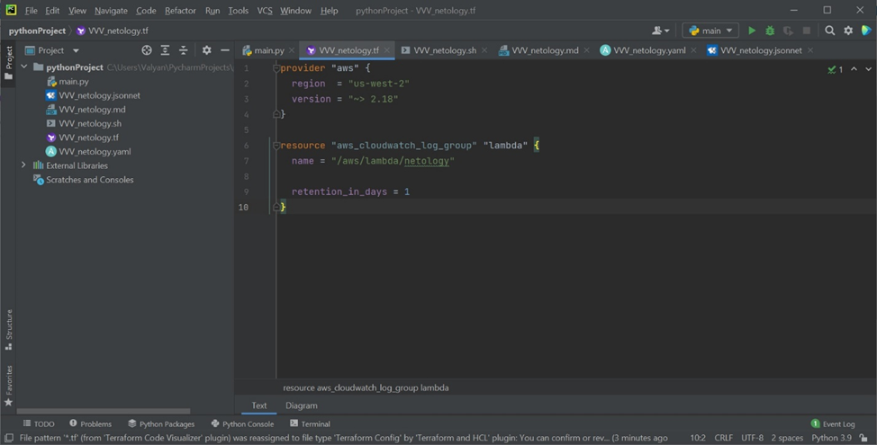
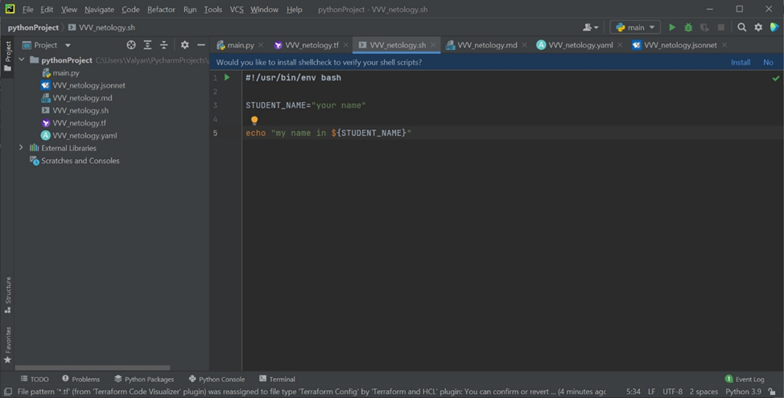
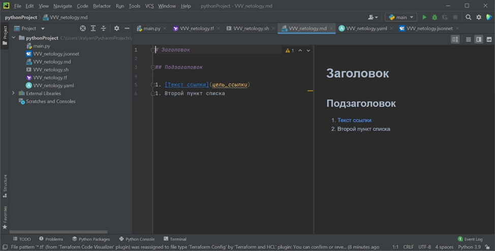
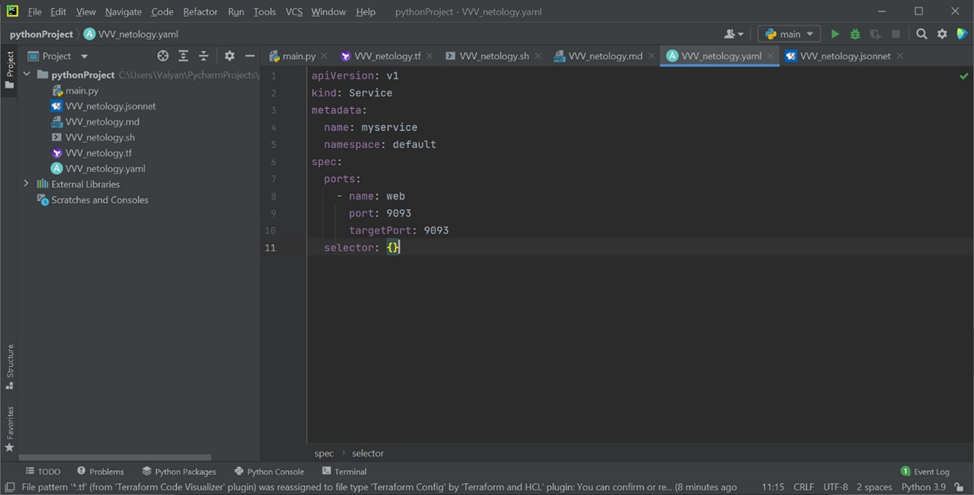
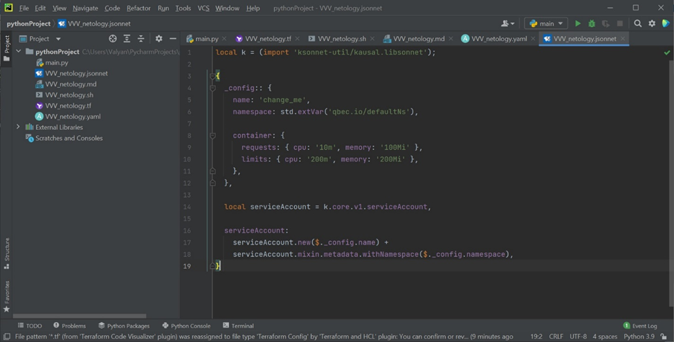

# Домашнее задание к занятию «1.1. Введение в DevOps»

## Задание №1 - Подготовка рабочей среды

Вы пришли на новое место работы или приобрели новый компьютер.
Первым делом надо настроить окружение для дальнейшей работы. 

1. Установить Py Charm Community Edition: https://www.jetbrains.com/ru-ru/pycharm/download/ - это бесплатная версия IDE. 
Если у вас уже установлен любой другой продукт от JetBrains,то можно использовать его. 
1. Установить плагины:
    - Terraform,
    - MarkDown,
    - Yaml/Ansible Support,
    - Jsonnet.
1. Склонировать текущий репозиторий или просто создать файлы для проверки плагинов:
    -  – терраформ, 
    - – bash, 
    -  – markdown, 
    -  – yaml,
    -  – jsonnet.
1. Убедитесь, что работает подсветка синтаксиса, файлы должны выглядеть вот так:
    - Terraform: 
    - Bash: 
    - Markdown: 
    - Yaml:  
    - Jsonnet: 
1. Добавьте свое имя в каждый файл, сделайте снимок экран и загрузите его на любой сервис обмена картинками.
1. Ссылки на картинки укажите в личном кабинете как решение домашнего задания. 

## Задание №2 - Описание жизненного цикла задачи (разработки нового функционала)

Чтобы лучше понимать предназначение дальнейших инструментов, с которыми нам предстоит работать, давайте 
составим схему жизненного цикла задачи в идеальном для вас случае.

### Описание истории

Представьте, что вы работаете в стартапе, который запустил интернет-магазин. Ваш интернет-магазин достаточно успешно развивался, и вот пришло время налаживать процессы: у вас стало больше конечных клиентов, менеджеров и разработчиков.Сейчас от клиентов вам приходят задачи, связанные с разработкой нового функционала. Задач много, и все они требуют выкладки на тестовые среды, одобрения тестировщика, проверки менеджером перед показом клиенту. В случае необходимости, вам будет необходим откат изменений. 

### Решение задачи

Вам необходимо описать процесс решения задачи в соответствии с жизненным циклом разработки программного обеспечения. Использование какого-либо конкретного метода разработки не обязательно. Для решения главное - прописать по пунктам шаги решения задачи (релизации в конечный результат) с участием менеджера, разработчика (или команды разработчиков), тестировщика (или команды тестировщиков) и себя как DevOps-инженера. 
В общем случае процесс будет выстраиваться следующим образом:
1. Менеджер принимает от клиента заказ, скажем, клиент хочет добавить на сайте новый функционал (кнопку с контактами, кнопку с историей покупок, поменять форму регистрации на сайте, добавить в проект еще одну базу данных с содержимым еще одного склада, добавить еще одну платежную систему в функционал онлайн оплаты и т.д). После обработки заказа от клиента менеджер формирует список требований, т.е что нужно реализовать и как это примерно должно выглядеть и работать (первичная постановка задачи).
Задач таких может быть много, они могут отменяться, изменяться, продлеваться и т.д, соответственно, менеджеров будет несколько, клиентов будет еще больше и поток задач будет постоянно изменяться, значит этот поток нужно фиксировать в тикет системе (самое простое, что приходит на ум это Jira), можно собирать сразу по несколько заявок, сортировать их по типу функционала и по ответственному менеджеру, после чего отслеживать процесс исполнения будет легче. Либо же, второй вариант, это выполнять заявки на ходу (подойдет такая схема, только если поток заявок не слишком интенсивный, что позволяет выполнять их в срок)
2. После того, как задача поставлена и на ее исполнение назначен разработчик (которых тоже сортируют по типу функционала, если их несколько) за функционал так-же может отвечать целая команда из аналитика, разработчика, тестировщика, супорта и ответственного продак-овнера, задача в таком случае будет назначена на ответственную команду.
3. Разработчик или команда анализируют поставленную задачу, оценивают, какие ресурсы им нужны для исполнения задачи, возможно, в процессе что-то корректируют по задаче исходя из собственных компетенций и формируют список требований к DevOps, скажем : «для реализации дополнительного функционала нам понадобится тестовый сервер, тестовая БД, может быть зеркало на целиком работающий сайт на тестовом контуре со всем функционалом и т.д»
4. Получив список требований от разработчика DevOps либо предоставляет доступ к уже существующему тестовому контуру либо разворачивает новые серверы на основе конфигурации уже работающего проекта и предоставляет к ним соответствующие доступы (нужен будет доступ разработчику, тестировщику, и менеджеру, про типы прав пока не говорим). 
5. После получения доступа к ресурсам разработчик внедряет новый функционал, прогоняет после окончания разработки его unit тестом и при успешном прохождении сигнализирует DevOps и тестировщику о том, что проект готов к тестированию
6. Получив отмашку от разработчика к дальнейшим работам над новым функционалом приступает тестировщик прогоняя проект различными тестами (нагрузочное тестирование, функциональное тестирование и т.д), при неуспешном прохождении тестировщик сигналит разработчику указывая на ошибки, разработчик их устраняет до тех пор, пока новый функционал полностью не пройдет тестирование (QA)
7. После успешного тестирования нового функционала доступ к нему предоставляется ответственному менеджеру, который перед передачей функционала сам верхнеуровнево убеждается в том, что разработанный функционал соответствует в определенной степени изначальной постановке задачи, если менеджера что-либо не устраивает, то эти моменты обговариваются с командой (разработчик, DevOps, тестировщик и т.д) и процедура доработки повторяется (пункты 3-6), если все хорошо, то согласовывается выкладка в продашн, т.е разработанный в соответствии с задачей функционал переносится с тестового контура на боевой, на этом этапе ответственным будет DevOps(процедура описана в очень общем случае), после переноса с тестового контура на боевой DevOps дает отмашку ответственному менеджеру о том, что функционал внедрен и можно передавать его заказчику. Соответствующая задача считается закрытой в тикет системе, история изменений в задачах и в функционале сохраняется, в документацию по проекту вносятся соответствующие изменения и весь процесс повторяется многократно для новых задач. 

Зачастую, тестовый контур для реализации подобных вещей настроен заранее, но иногда может и понадобится поднять что-то новое с большими ресурсами, правами и т.д, за автоматизацию этих процессов и будет ответственен в данном случае DevOps.

 