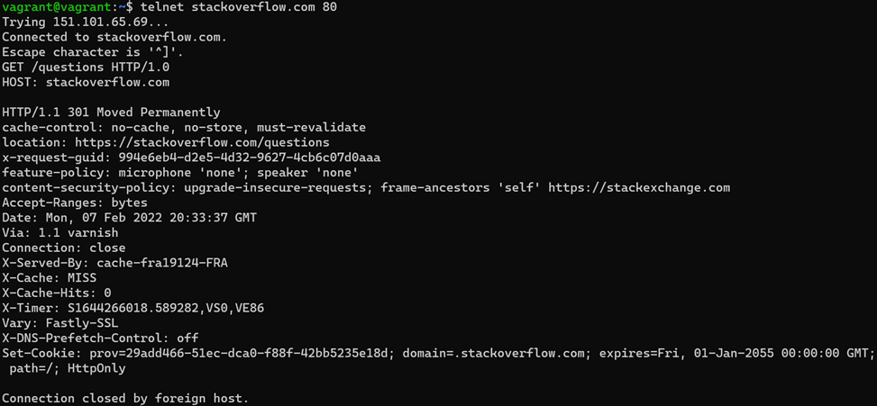

## Домашнее задание к занятию "3.6. Компьютерные сети, лекция 1"
1. Работа c HTTP через телнет.

 Подключитесь утилитой телнет к сайту stackoverflow.com
 telnet stackoverflow.com 80

отправьте HTTP запрос:

GET /questions HTTP/1.0

HOST: stackoverflow.com

[press enter]

[press enter]

В ответе укажите полученный HTTP код, что он означает?

Запрос GET /questions HTTP/1.0 HOST: stackoverflow.com 

