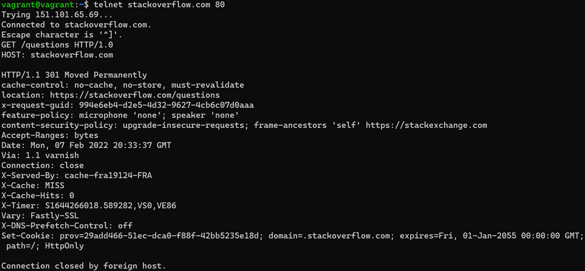
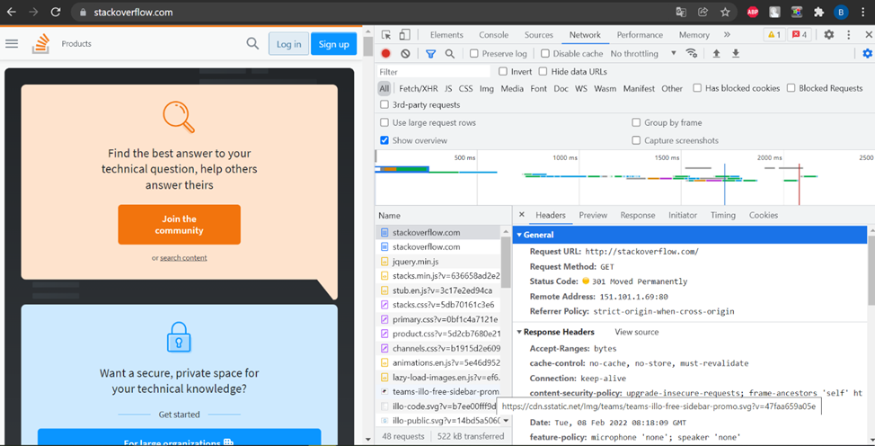
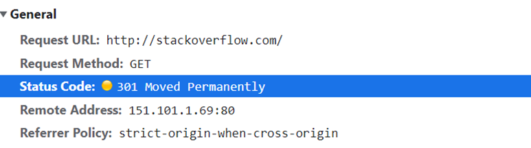
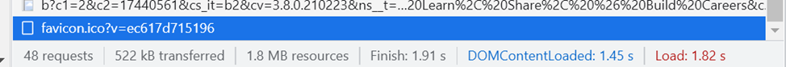
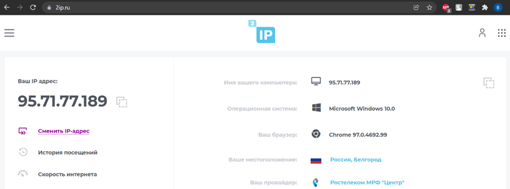
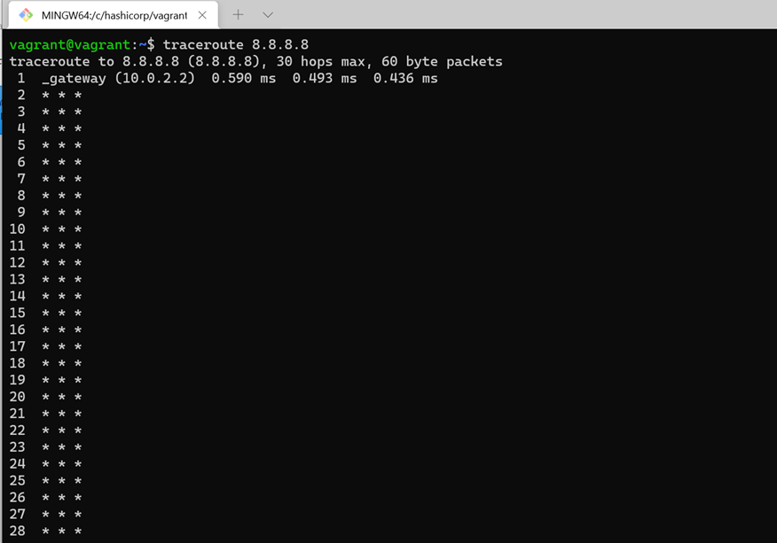
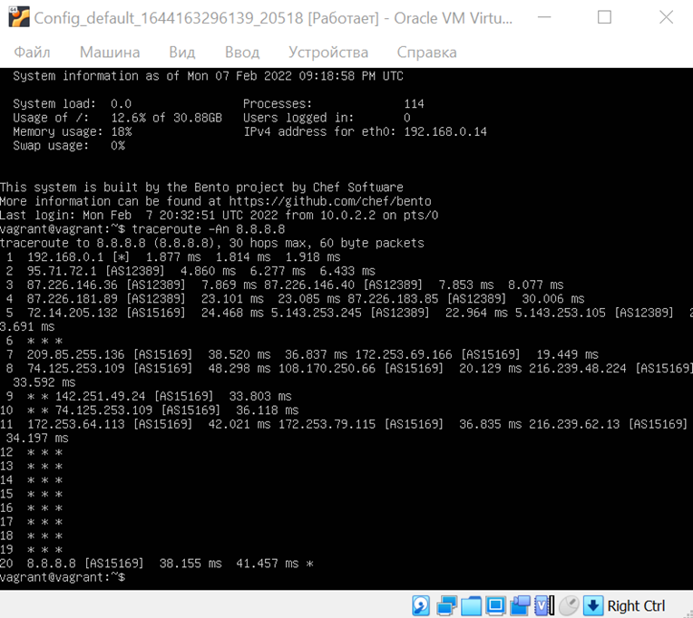
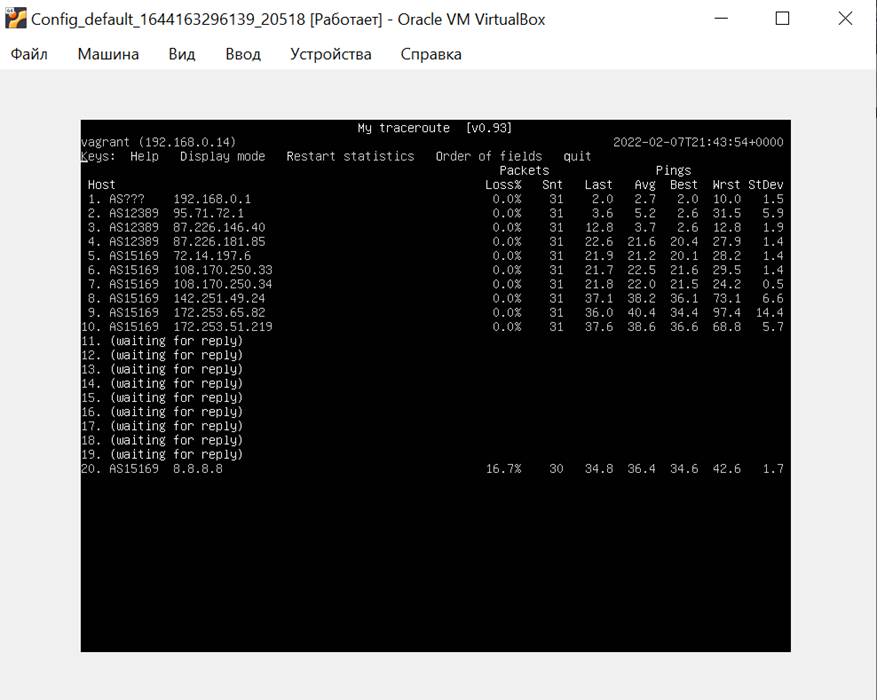
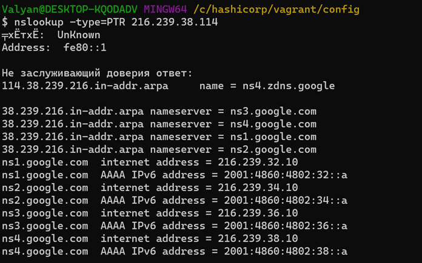
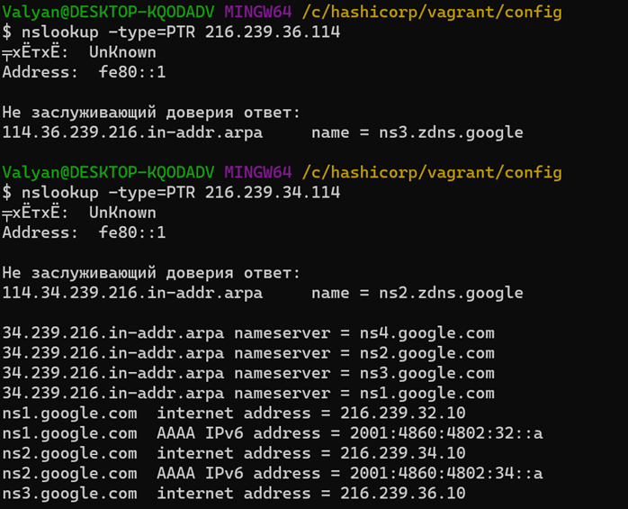

## Домашнее задание к занятию "3.6. Компьютерные сети, лекция 1"
1. Работа c HTTP через телнет.

 Подключитесь утилитой телнет к сайту stackoverflow.com
 telnet stackoverflow.com 80

отправьте HTTP запрос:

GET /questions HTTP/1.0

HOST: stackoverflow.com

[press enter]

[press enter]

В ответе укажите полученный HTTP код, что он означает?

Запрос GET /questions HTTP/1.0 HOST: stackoverflow.com 
- IP адрес stackoverflow.com 151.101.65.69
- Используемый на удаленном хосте протокол HTTP версии 1.1
- Отключено использование микрофона и наушников
- Включена поддержка «запросов по кускам», т.е браузер может попытаться возобновить прерванную загрузку
- Указана дата и время подключения к удаленному хосту (часовой пояс на удаленном хосте GMT +0)
- В пятницу 1.01.2055 истечет срок действия сертификата для домена stackoverflow.com

2. Повторите задание 1 в браузере, используя консоль разработчика F12.

* откройте вкладку Network
* отправьте запрос http://stackoverflow.com
* найдите первый ответ HTTP сервера, откройте вкладку Headers
* укажите в ответе полученный HTTP код.
* проверьте время загрузки страницы, какой запрос обрабатывался дольше всего?
* приложите скриншот консоли браузера в ответ.

Запрос http://stackoverflow.com в консоли разработчик google chrome 
Код ответа 309 для первого GET запроса 

Общее описание запроса 

3. Какой IP адрес у вас в интернете?

Запрос серого ip на 2ip.ru 
Провайдер выдает белый ip динамически, из-за чего он может меняться время от времени (когда истечет срок действия аренды адреса, зачастую назначается тот же адрес, что и во время действия предыдущей аренды, но не всегда)

4. Какому провайдеру принадлежит ваш IP адрес? Какой автономной системе AS? Воспользуйтесь утилитой whois

% Information related to '95.71.72.0/21AS12389'

route:          95.71.72.0/21  
descr:          Rostelecom networks  
origin:         AS12389  
mnt-by:         ROSTELECOM-MNT  
created:        2018-10-25T14:23:29Z  
last-modified:  2018-10-25T14:23:29Z  
source:         RIPE # Filtered  
Провайдер  - РОСТЕЛЕКОМ  
Автономная система AS12389  
(Весь вывод команды не прикреплял, там много всего)  

5. Через какие сети проходит пакет, отправленный с вашего компьютера на адрес 8.8.8.8? Через какие AS? Воспользуйтесь утилитой traceroute

Попытки трассировать маршрут   

Если оставить дефолтные параметры ВМ, то трасер не будет показывать ничего, это из за того, что сетевой адаптер ВМ в виртуалбоксе переключен в режим NAT, если поменять на режим network bridge, то утилита сразу начинает работать, только vagrant ssh не подключит из хостовой машины к ВМ, т.к адрес ВМ сменится на адрес, выдаваемый домашним маршрутизатором с 127.0.01 на какой то( в моем случае 192.168.0.14), подключиться можно будет только используя id созданной в вагранте машины

Вывод traceroute с номерами AS 

Это задание смотрел в окне гипервизора.
Согласно выводу Traceroute echo запрос прошел через AS12389, AS15169. 6, 12-19 хопы были через хосты, которые скрыли отображение параметров сети по соображениям безопасности

6. Повторите задание 5 в утилите mtr. На каком участке наибольшая задержка - delay?

Утилита mtr в окне гипервизора 

Если смотреть по среднему значению (avg) то наибольшая задержка была на AS15169 Хост 172.253.65.82, максимальное значение задержки 97.4 пришлось на ту же AS и на тот же хост, однако, утилита MTR реалтаймовая и каждый раз после обновления значения могут меняться.

7. Какие DNS сервера отвечают за доменное имя dns.google? Какие A записи? воспользуйтесь утилитой dig

$ nslookup -type=ns dns.google  
╤хЁтхЁ:  UnKnown  
Address:  fe80::1  

Не заслуживающий доверия ответ:  
dns.google      nameserver = ns3.zdns.google  
dns.google      nameserver = ns1.zdns.google  
dns.google      nameserver = ns2.zdns.google  
dns.google      nameserver = ns4.zdns.google  

ns1.zdns.google internet address = 216.239.32.114  
ns1.zdns.google AAAA IPv6 address = 2001:4860:4802:32::72  
ns2.zdns.google internet address = 216.239.34.114  
ns2.zdns.google AAAA IPv6 address = 2001:4860:4802:34::72  
ns3.zdns.google internet address = 216.239.36.114  
ns3.zdns.google AAAA IPv6 address = 2001:4860:4802:36::72  
ns4.zdns.google internet address = 216.239.38.114  
ns4.zdns.google AAAA IPv6 address = 2001:4860:4802:38::72  

В соответствии с выводом  серверам ns1-4.zdnx.google соответствуют A записи 216.239.32-38.114

8. Проверьте PTR записи для IP адресов из задания 7. Какое доменное имя привязано к IP? воспользуйтесь утилитой dig

PTR для 216.239.38.114   

PTR  для 216.239.36.114 и 216.239.34.114   
Windows terminal, конечно, не радует своей стабильностью (вывод через раз нормальный), однако при помощи утилиты  nslookup (аналог dig) удалось на хостовой машине вытащить PTR, NS и A записи гугловых серверов  
ns1.google.com    PTR 114.32.239.216.in-addr.arpa  
ns2.google.com    PTR 114.34.239.216.in-addr.arpa  
ns3.google.com    PTR 114.36.239.216.in-addr.arpa  
ns4.google.com    PTR 114.38.239.216.in-addr.arpa  