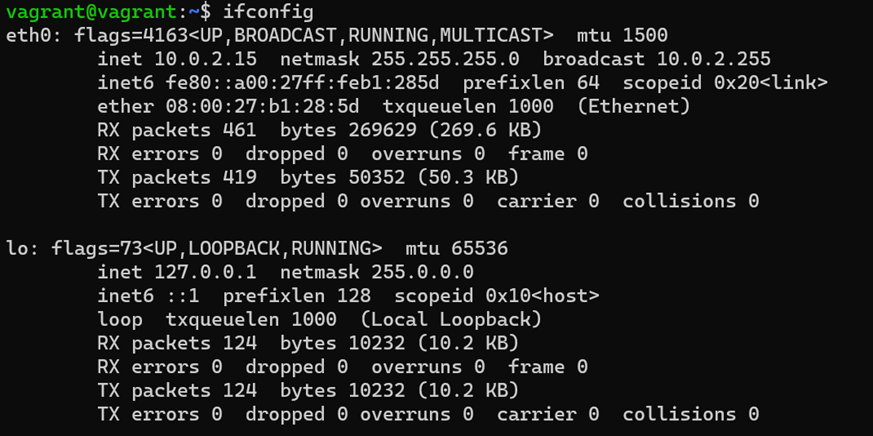

# Компьютерные сети, лекция 2
1. Проверьте список доступных сетевых интерфейсов на вашем компьютере. Какие команды есть для этого в Linux и в Windows?  
 
В windows список доступных сетевых интерфейсов (в том числе виртуальных адаптеров и Bluetooth) можно увидеть в выводе команды ipconfig /all

Вывод ipconfig /all на машине с windows 

-виртуальный сетевой интерфейс virtual box  
-адаптер wifi Ноутбука  
-адаптер Bluetooth  
-виртуальный адаптер для ВПН   

Вывод ifconfig на машине с linux 

В выводе ifconfig видно 2 доступных интерфейса:  
-lo – loopback interface  
-eth0 – ethernet  

2. Какой протокол используется для распознавания соседа по сетевому интерфейсу? Какой пакет и команды есть в Linux для этого?  

LLDP – протокол для обмена информацией между соседними устройствами, позволяет определить к какому порту коммутатора подключен сервер.
Для использования функций lldp нужно установить пакет lldpd
Доступный синтаксис по lldp из страницы man:

ldpd [-dxcseiklrv] [-D debug] [-S description] [-P platform] [-X socket] [-m management] [-u file] [-I interfaces] [-C interfaces] [-M class] [-H hide] [-L lldpcli]

Чтобы увидеть соседей по сетевому интерфейсу, можно использовать команду lldpctl, однако, т.к ВМ подключена к виртуальному интерфейсу в единственном экземпляре, то команда вернет в информации по соседям по интерфейсу пустое значение:

Вывод lldpctl 

3. Какая технология используется для разделения L2 коммутатора на несколько виртуальных сетей? Какой пакет и команды есть в Linux для этого? Приведите пример конфига.  

Технология для разделения одного физического интерфейса на несколько логических сегментов называется VLAN (virtual LAN)
Для создания VLAN на интерфейсе существует несколько способов:  
-Преимущества VLAN следующие:   
-Производительность   
-Простота управления   
-Безопасность   
-Магистральные cоединения (trunk)   
-Возможность разделения внутри локальной сети из соображений безопасности -Отсутствие необходимости настройки аппаратных средств при физическом переносе сервера в другое место.  
Настроить VLAN средствами Linux можно несколькими способами:  

1) Отрываем файл /etc/network/interfaces  
Вносим в файл что то наподобие:  

vlan с ID-100 для интерфейса eth0 with ID - 100 в Debian/Ubuntu Linux##  
 auto eth0.100   
iface eth0.100 inet static   
address 192.168.1.200   
netmask 255.255.255.0   
vlan-raw-device eth0  

auto eth0.100 — «поднимать» интерфейс при запуске сетевой службы  
 iface eth0.100 — название интерфейса   
vlan-raw-device— указывает на каком физическом интерфейсе создавать VLAN  

После внесения данных файл и сохранения перезапускаем сеть командой  
systemctl restart network  

2) Более молодежный способ – воспользоваться утилитой ip:  

ip link add link eth0 name eth0.10 type vlan id 10   
ip -d link show eth0.10  
ip addr add 192.168.1.200/24 brd 192.168.1.255 dev eth0.10 # ip link set dev eth0.10 up  
После создания интерфейса с VLAN и назначения ему адреса и маски получаем в списке доступных интерфейсов еще один с пометкой в виде номера VLAN:

Созданный интерфейс с vlan-id 

Весь трафик пойдет через интерфейс eth0 с тегом VLAN 10. Его смогут принять только устройства, которым сообщено о VLAN, остальные будут отклонять трафик.  

Удалить созданный VLAN можно при помощи:  
ip link set dev eth0.10 down  
ip link delete eth0.10  
Удаление созданного интерфейса с vlan-id 

4. Какие типы агрегации интерфейсов есть в Linux? Какие опции есть для балансировки нагрузки? Приведите пример конфига.  

Объединение сетевых карт в Linux можно осуществить с помощью драйвера bonding, он предоставляет методы для агрегирования нескольких сетевых интерфейсов в один логический. Поведение связанных интерфейсов зависит от режима. В общем случае, объединенные интерфейсы могут работать в режиме горячего резерва (отказоустойчивости) или в режиме балансировки нагрузки. Многие ядра в популярных дистрибутивах Linux имеют этот драйвер в виде модуля bonding и утилиты пользовательского уровня ifenslave для управления им. 
Утилита ifenslave может не быть установлена, тогда её нужно установить отдельно. Если ядро без поддержки bonding, то для его использования, необходимо сконфигурировать (при конфигурировании ядра командами «make menuconfig» или «make xconfig» или «make config«, в секци «Network device support» выбрать «Bonding driver support«), собрать и установить ядро. После установить утилиту ifenslave. 
Драйвер bonding имеет опции. Эти опции можно задать как аргументы в командах insmod или modprobe, обычно их задают в файле «/etc/modules.conf» или в файле «/etc/modprobe.conf», так же опции могут задаваться в специфичных конфигурационных файлах для определённых дистрибутивов.
Основные опции бондинга в Linux перечислены ниже:

mode=0 (balance-rr)  
Этот режим используется по-умолчанию, если в настройках не указано другое. balance-rr обеспечивает балансировку нагрузки и отказоустойчивость. В данном режиме пакеты отправляются "по кругу" от первого интерфейса к последнему и сначала. Если выходит из строя один из интерфейсов, пакеты отправляются на остальные оставшиеся.При подключении портов к разным коммутаторам, требует их настройки.  
mode=1 (active-backup)  
При active-backup один интерфейс работает в активном режиме, остальные в ожидающем. Если активный падает, управление передается одному из ожидающих. Не требует поддержки данной функциональности от коммутатора.  
mode=2 (balance-xor)  
Передача пакетов распределяется между объединенными интерфейсами по формуле ((MAC-адрес источника) XOR (MAC-адрес получателя)) % число интерфейсов. Один и тот же интерфейс работает с определённым получателем. Режим даёт балансировку нагрузки и отказоустойчивость.  
mode=3 (broadcast)    
Происходит передача во все объединенные интерфейсы, обеспечивая отказоустойчивость.  
mode=4 (802.3ad)     
Это динамическое объединение портов. В данном режиме можно получить значительное увеличение пропускной способности как входящего так и исходящего трафика, используя все объединенные интерфейсы. Требует поддержки режима от коммутатора, а так же (иногда) дополнительную настройку коммутатора.  
mode=5 (balance-tlb)    
Адаптивная балансировка нагрузки. При balance-tlb входящий трафик получается только активным интерфейсом, исходящий - распределяется в зависимости от текущей загрузки каждого интерфейса. Обеспечивается отказоустойчивость и распределение нагрузки исходящего трафика. Не требует специальной поддержки коммутатора.  
mode=6 (balance-alb)  
Адаптивная балансировка нагрузки (более совершенная). Обеспечивает балансировку нагрузки как исходящего (TLB, transmit load balancing), так и входящего трафика (для IPv4 через ARP). Не требует специальной поддержки коммутатором, но требует возможности изменять MAC-адрес устройства.  
Настройку bonding можно провести используя скрипты инициализации сети ( initscripts, sysconfig или interfaces ), либо вручную используя ifenslave и sysfs. Определить какая система инициализации сети используется можно следующим способом: — Если в директории «/etc/network» присутствует файл «interfaces», то в системе используется interfaces для инициализации сети — Выполнить команду «rpm -qf /sbin/ifup» на экране отобразится название пакета, название начинается на «initscripts» либо на «sysconfig». Этот пакет и предоставляет скрипты инициализации сети.  

Настройка bonding через interfaces Такой вид настройки применим к дистрибутивам linux, конфигурация сети в которых, настраивается с помощью файла «/etc/network/interfaces» (например Debian linux и дистрибутивы на его основе). В Debian команды ifup и ifdown не поддерживают работу с bond интерфейсами. Для поддержки bonding необходимо установить пакет ifenslave-2.6. Этот пакет дает возможность задавать параметры для bond интерфейса в файле «/etc/network/interfaces». Параметры задаются в виде: «bond-option value« (например: bond-mode active-backup). Кавычки в файле указывать не надо. Пакет ifenslave-2.6 будет сам загружать модуль драйвера bonding и использовать команду ifenslave, когда это необходимо. Пример настройки интерфейсов eth0 и eth1 в режиме active-backup в файле «/etc/network/interfaces»:
auto bond0 iface  
 bond0 inet dhcp  
 bond-slaves eth0 eth1  
 bond-mode active-backup  
 bond-miimon 100  
 bond-primary eth0 eth1  
При такой конфигурации описывать интерфейсы eth0 и eth1 в файле ( «/etc/network/interfaces») не нужно  

Настройка bonding через sysconfig Этот вид настройки, предназначен для дистрибутивов Linux, скрипты инициализации сети у которых основаны на sysconfig. Примером такого дистрибутива является SuSE Linux Enterprise Server. Система конфигурации сети в SuSE Linux Enterprise Server поддерживает bonding в  9-й версии. Однако, утилита конфигурирования системы YaST не умеет работать с bond интерфейсами, они должны быть сконфигурированы вручную. Первым делом необходимо сконфигурировать каждый интерфейс, который будет участвовать в объединении. Что бы самому не создавать файлы конфигурации для каждого физического интерфейса, можно запустить утилиту конфигурации системы YaST и указать в ней настройку сети по DHCP,  в результате она создаст файлы с именем ifcfg-id-xx:xx:xx:xx:xx:xx для каждого интерфейса (xx:xx…- это MAC адрес сетевой карты). Файлы примерно такого содержания:  
BOOTPROTO=’dhcp’  
STARTMODE=’on’  
USERCTL=’no’  
UNIQUE=’XNzu.WeZGOGF+4wE’  
_nm_name=’bus-pci-0001:61:01.0′  
Теперь необходимо отредактировать их. Значения параметров BOOTPROTO и STARTMODE следует заменить на:   
BOOTPROTO=’none’  
 STARTMODE=’off’  
 Значения параметров UNIQUE и _nm_name следует оставить без изменения Остальные параметры (USERCTL и пр.) следует удалить
После того как все файлы вида ifcfg-id-xx:xx:xx:xx:xx:xx будут изменены по аналогии с первым, можно создать файл для bond интерфейса. Файл должен иметь имя: ifcfg-bondX (X — номер интерфейса, начинается с 0). Файлы создаются в директории: «/etc/sysconfig/network/». Пример содержания такого файла:  
 BOOTPROTO=»static»  
 BROADCAST=»192.168.0.255″  
 IPADDR=»192.168.0.1″  
 NETMASK=»255.255.255.0″  
 NETWORK=»192.168.0.0″  
 REMOTE_IPADDR=»»  
 STARTMODE=»onboot»  
 BONDING_MASTER=»yes»  
 BONDING_MODULE_OPTS=»mode=active-backup    
 miimon=100″    
 BONDING_SLAVE0=»eth0″    
 BONDING_SLAVE1=»bus-pci-0000:06:08.1″    
 Параметр STARTMODE указывает когда следует поднимать интерфейс. Возможные значения: onboot —  интерфейс поднимается во время загрузки системы (рекомендуется) manual — интерфейс поднимается вручную hotplug — интерфейс поднимается при возникновении события hotplug (не рекомендуется для bond интерфейса) off или ignore — конфигурация интерфейса игнорируется и он не используется Параметр BONDING_MASTER=’yes’ указывает что это bond интерфейс, является главным (master). Возможные значения: «yes« Параметр BONDING_MODULE_OPTS определяет опции и их значения для модуля bonding. Возможные параметры для модуля bonding описаны выше. Параметр BONDING_SLAVEn=»slave device» задает, какое устройство (сетевой интерфейс) будет участвовать в объединении. Значением может быть как имя сетевого интерфейса, например eth0, eth1 и т.д., так и по идентификатору устройства, например bus-pci-0000:06:08.1. После того, как все нужные конфигурационные файлы созданы и отредактированы, нужно перезапустить сетевую подсистему. Можно сделать командой: # /etc/init.d/network restart  

5. Сколько IP адресов в сети с маской /29 ? Сколько /29 подсетей можно получить из сети с маской /24. Приведите несколько примеров /29 подсетей внутри сети 10.10.10.0/24.  

32-29=3 бита под адреса хостов внутри подсети
Т.е получается 23=8 (нумерация степеней начинается  в табличке не с 1 а с 0) адресов (минус все 0 = адрес сетки и все 1= broadcoast) итого 8-2=6 адресов хостов будет доступно в подсети с маской 29.
В табличке снизу справа налево по возрастанию идут биты, соответствующие степени двойки (т.к система счисления используется двоичная в ip адресах, которая для наглядности потом переводится в десятичную то 255 в десятичной это 11111111(при условии, что нумерация степеней идет с 0 а не с 1) в двоичной), всего битов 8, поэтому 255 (т.е все 1 в нижней строке это 27+26+25+24+23+22+21+20=128+64+32+16+8+4+2+1=255)
29 маска означает, что для адресации хостов нам доступно всего лишь 3   бита Y (из общего числа 32, если это ipv4) (XXXXXXXX.XXXXXXXX.XXXXXXXX.XXXXXYYY)
При помощи 3 битов YYY можно сохранить 8 значений адресов  с 0.0.0 по 1.1.1, но из этих 8 значений для адресации хостов мы можем использовать только 6, потому что все 1.1.1 в каждой подсети будут широковещательным адресом для этой подсети (1.1.1.1.1.1.1.1 в последнем октете) а все 0.0.0 будет адресом подсети (1.1.1.1.1.0.0.0 в последнем октете)

Таблица 1 – Адреса хостов в подсети /29(последние 3 бита в октете)

| Степень двойки | 2 | 1 | 0 | В десятичной СС |  
|----------------|---|---|---|-----------------|  
| SUBNET         | 0 | 0 | 0 |       0         |  
| Хосты с 1 по 7 | 0 | 0 | 1 |       1         |  
|                | 0 | 1 | 0 |       2         |  
|                | 0 | 1 | 1 |       3         |  
|                | 1 | 0 | 0 |       4         |  
|                | 1 | 0 | 1 |       5         |  
|                | 1 | 1 | 0 |       6         |  
|                | 1 | 1 | 1 |       7         |  

Пример:
192.168.255.1\29-192.168.255.6\29

/29 подсетей в сети с /24 можно высчитать  следующим образом:
Если мы используем 29 маску, то для адресации хостов выделено 3 правых бита под адреса(белые в табличке), как мы выяснили ранее, если мы будем использовать сеть /24, то допустимо использовать в качестве адреса подсети  оставшиеся 5 битов, отмеченные желтым. Адресация подсетей будет начинаться с:
192.168.255.8/29-192.168.255.248/29
 ,с шагом в последнем октете в 8(т.к в каждой такой подсети будет 8 адресов)
 т.е биты для адреса подсети будут назначаться с 4 бита по 8(справа налево) из таблички выше, отмеченные желтым

Итого получим подсети /29:  
192.168.255.8/29  
192.168.255.16/29  
192.168.255.24/29  
192.168.255.32/29  
192.168.255.40/29  
192.168.255.48/29  
192.168.255.56/29  
………………….  
192.168.255.248/29  
Всего таких подсетей будет 248\8=31 (+1 это собственно сама .248 подсеть, включающая 6 хостов, broadcoast и netaddr) 
итого в сети с маской /24 можно организовать 32 подсети с маской /29 по 6 хостов в каждой

6. Задача: вас попросили организовать стык между 2-мя организациями. Диапазоны 10.0.0.0/8, 172.16.0.0/12, 192.168.0.0/16 уже заняты. Из какой подсети допустимо взять частные IP адреса? Маску выберите из расчета максимум 40-50 хостов внутри подсети.  

Не понятна постановка «стык между 2-мя организациями»: если у них разные частные подсети, то в качестве стыка нужно ставить маршрутизатор и либо прописать вручную маршруты в обе стороны либо включить динамику (OSPF или RIP, хоть там и будет всего пара маршрутов)  

Если говорить про еще один доступный диапазон, то это 
100.64.0.0/10 — 100.127.255.255/10 (не встречал этот диапазон на практике, однако в лекции про него говорилось, пускай будет он)  

40-50 хостов это минимум 64, т.е 26 (6 битов под хосты), так же как и в предыдущем задании разбиваем на подсети и получим:
100.64.0.0/10 — 100.127.255.192/10  

7. Как проверить ARP таблицу в Linux, Windows? Как очистить ARP кеш полностью? Как из ARP таблицы удалить только один нужный IP?

Вывод arp -a в windows 

Очистить кэш в windows можно при помощи:
- netsh interface ip delete arpcache – полностью очищает ARP-кэш для всех интерфейсов   
- arp -d x.x.x.x – удаляет указанную запись из ARP-кэша, где х.х.х.х ipv4 адрес( можно вписать и ipv6)  

В linux(в частности - ubuntu) для просмотра ARP таблицы используется команда arp -a:  
Вывод arp -a на ubuntu 

В linux же полностью очистить кэш можно при помощи:  
 - sudo ip neigh flush all  
 - ip link set arp off dev eth0; ip link set arp on dev eth0  
 Удалить определенную запись можно при помощи:  
- sudo arp -d x.x.x.x, где x.x.x.x ipv4 адрес (можно так же удалить ipv6)  