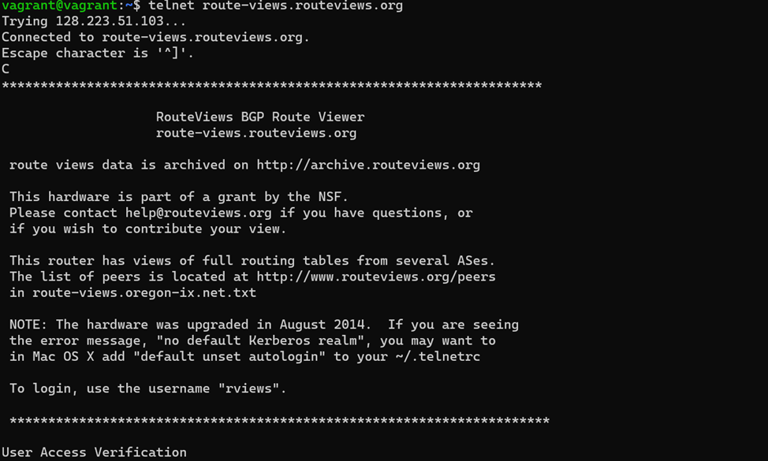
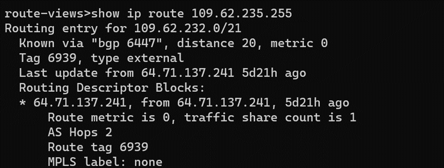
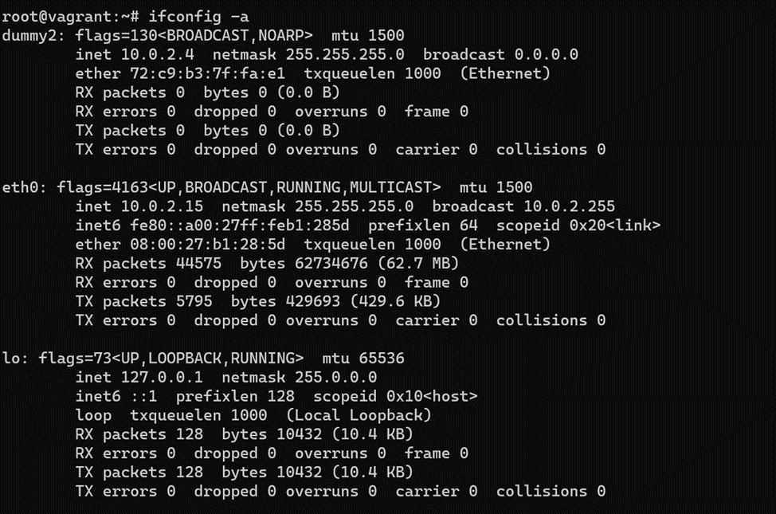
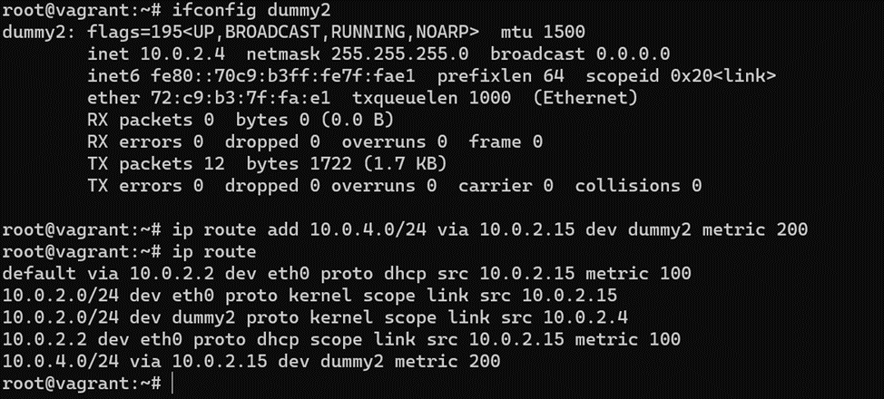
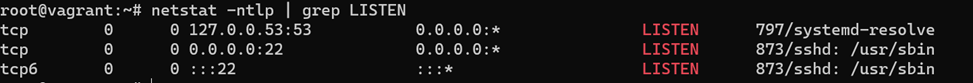
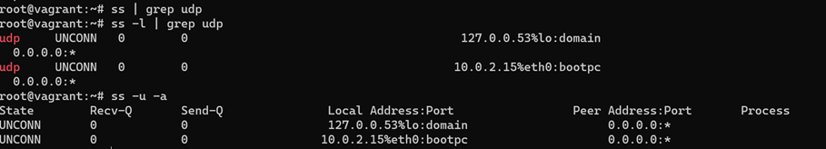
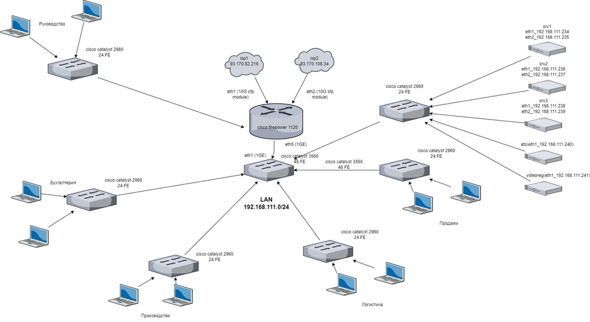

# Компьютерные сети, лекция 3

1. Подключитесь к публичному маршрутизатору в интернет. Найдите маршрут к вашему публичному IP
telnet route-views.routeviews.org  
Username: rviews  
show ip route x.x.x.x/32  
show bgp x.x.x.x/32  

Подключение к 128.223.51.103 

Маршрут к публичному ip 109.62.235.255 

Вывод BGP таблицы  к 109.62.235.255 ниже:  
route-views>show bgp 109.62.235.255  
BGP routing table entry for 109.62.232.0/21, version 307638052  
Paths: (23 available, best #17, table default)  
  Not advertised to any peer  
  Refresh Epoch 1  
  8283 1299 12389  
    94.142.247.3 from 94.142.247.3 (94.142.247.3)  
      Origin incomplete, metric 0, localpref 100, valid, external  
      Community: 1299:30000 8283:1 8283:101 8283:103  
      unknown transitive attribute: flag 0xE0 type 0x20 length 0x24  
        value 0000 205B 0000 0000 0000 0001 0000 205B  
              0000 0005 0000 0001 0000 205B 0000 0005  
              0000 0003  
      path 7FE0A48FEC70 RPKI State valid  
      rx pathid: 0, tx pathid: 0  
  Refresh Epoch 1  
  1351 6939 12389  
    132.198.255.253 from 132.198.255.253 (132.198.255.253)  
      Origin IGP, localpref 100, valid, external  
      path 7FE0E5522090 RPKI State valid  
      rx pathid: 0, tx pathid: 0  
  Refresh Epoch 1  
  852 3356 12389  
    154.11.12.212 from 154.11.12.212 (96.1.209.43)  
      Origin IGP, metric 0, localpref 100, valid, external  
      path 7FE134C2A328 RPKI State valid  
      rx pathid: 0, tx pathid: 0  
  Refresh Epoch 1  
  57866 3356 12389  
    37.139.139.17 from 37.139.139.17 (37.139.139.17)  
      Origin IGP, metric 0, localpref 100, valid, external  
      Community: 3356:2 3356:22 3356:100 3356:123 3356:501 3356:901 3356:2065  
      path 7FE12F331E00 RPKI State valid  
      rx pathid: 0, tx pathid: 0  
  Refresh Epoch 1  
  20130 6939 12389  
    140.192.8.16 from 140.192.8.16 (140.192.8.16)  
      Origin IGP, localpref 100, valid, external  
      path 7FE03FB00840 RPKI State valid  
      rx pathid: 0, tx pathid: 0  
  Refresh Epoch 1  
  3333 1103 12389  
    193.0.0.56 from 193.0.0.56 (193.0.0.56)  
      Origin incomplete, localpref 100, valid, external  
      path 7FE127C258E0 RPKI State valid  
      rx pathid: 0, tx pathid: 0  
  Refresh Epoch 1  
  3549 3356 12389  
    208.51.134.254 from 208.51.134.254 (67.16.168.191)  
      Origin IGP, metric 0, localpref 100, valid, external  
      Community: 3356:2 3356:22 3356:100 3356:123 3356:501 3356:901 3356:2065 3549:2581 3549:30840  
      path 7FE1161BEE68 RPKI State valid  
      rx pathid: 0, tx pathid: 0  
  Refresh Epoch 1  
  53767 14315 6453 6453 3356 12389  
    162.251.163.2 from 162.251.163.2 (162.251.162.3)  
      Origin IGP, localpref 100, valid, external  
      Community: 14315:5000 53767:5000  
      path 7FE0F0EA8368 RPKI State valid  
      rx pathid: 0, tx pathid: 0  
  Refresh Epoch 1  
  701 1273 12389  
    137.39.3.55 from 137.39.3.55 (137.39.3.55)  
      Origin incomplete, localpref 100, valid, external  
      path 7FE12194B040 RPKI State valid  
      rx pathid: 0, tx pathid: 0  
  Refresh Epoch 1  
  3356 12389  
    4.68.4.46 from 4.68.4.46 (4.69.184.201)  
      Origin IGP, metric 0, localpref 100, valid, external  
      Community: 3356:2 3356:22 3356:100 3356:123 3356:501 3356:901 3356:2065  
      path 7FE151025840 RPKI State valid  
      rx pathid: 0, tx pathid: 0  
  Refresh Epoch 1  
  4901 6079 3356 12389  
    162.250.137.254 from 162.250.137.254 (162.250.137.254)  
      Origin IGP, localpref 100, valid, external  
      Community: 65000:10100 65000:10300 65000:10400  
      path 7FE188429628 RPKI State valid  
      rx pathid: 0, tx pathid: 0  
  Refresh Epoch 1  
  20912 3257 3356 12389  
    212.66.96.126 from 212.66.96.126 (212.66.96.126)  
      Origin IGP, localpref 100, valid, external  
      Community: 3257:8070 3257:30515 3257:50001 3257:53900 3257:53902 20912:65004  
      path 7FE0124DA908 RPKI State valid  
      rx pathid: 0, tx pathid: 0  
  Refresh Epoch 1  
  3303 12389  
    217.192.89.50 from 217.192.89.50 (138.187.128.158)  
      Origin incomplete, localpref 100, valid, external  
      Community: 3303:1004 3303:1006 3303:1030 3303:3056  
      path 7FE0B3C0F7F0 RPKI State valid  
      rx pathid: 0, tx pathid: 0  
  Refresh Epoch 1  
  101 3356 12389  
    209.124.176.223 from 209.124.176.223 (209.124.176.223)  
      Origin IGP, localpref 100, valid, external  
      Community: 101:20100 101:20110 101:22100 3356:2 3356:22 3356:100 3356:123 3356:501 3356:901 3356:2065  
      Extended Community: RT:101:22100  
      path 7FE0C8F6D0D0 RPKI State valid  
      rx pathid: 0, tx pathid: 0  
  Refresh Epoch 1  
  7018 3356 12389  
    12.0.1.63 from 12.0.1.63 (12.0.1.63)  
      Origin IGP, localpref 100, valid, external  
      Community: 7018:5000 7018:37232  
      path 7FE0D5400548 RPKI State valid  
      rx pathid: 0, tx pathid: 0  
  Refresh Epoch 1  
  3561 3910 3356 12389  
    206.24.210.80 from 206.24.210.80 (206.24.210.80)  
      Origin IGP, localpref 100, valid, external  
      path 7FE0AE1E7C10 RPKI State valid  
      rx pathid: 0, tx pathid: 0  
  Refresh Epoch 1  
  6939 12389  
    64.71.137.241 from 64.71.137.241 (216.218.252.164)  
      Origin IGP, localpref 100, valid, external, best  
      path 7FE0FBB943E8 RPKI State valid  
      rx pathid: 0, tx pathid: 0x0  
  Refresh Epoch 2  
  2497 12389  
    202.232.0.2 from 202.232.0.2 (58.138.96.254)  
      Origin incomplete, localpref 100, valid, external  
      path 7FE1245463E8 RPKI State valid  
      rx pathid: 0, tx pathid: 0  
  Refresh Epoch 1  
  7660 2516 12389  
    203.181.248.168 from 203.181.248.168 (203.181.248.168)  
      Origin incomplete, localpref 100, valid, external  
      Community: 2516:1050 7660:9001  
      path 7FE114B1D950 RPKI State valid  
      rx pathid: 0, tx pathid: 0  
  Refresh Epoch 1  
  49788 12552 12389  
    91.218.184.60 from 91.218.184.60 (91.218.184.60)  
      Origin incomplete, localpref 100, valid, external  
      Community: 12552:12000 12552:12100 12552:12101 12552:22000  
      Extended Community: 0x43:100:1  
      path 7FE15C175B20 RPKI State valid  
      rx pathid: 0, tx pathid: 0  
  Refresh Epoch 1  
  1221 4637 12389  
    203.62.252.83 from 203.62.252.83 (203.62.252.83)  
      Origin incomplete, localpref 100, valid, external  
      path 7FE1594AB780 RPKI State valid  
      rx pathid: 0, tx pathid: 0  
  Refresh Epoch 1  
  3257 3356 12389  
    89.149.178.10 from 89.149.178.10 (213.200.83.26)  
      Origin IGP, metric 10, localpref 100, valid, external  
      Community: 3257:8794 3257:30043 3257:50001 3257:54900 3257:54901  
      path 7FE01A788128 RPKI State valid  
      rx pathid: 0, tx pathid: 0  
  Refresh Epoch 1    
  19214 174 12389  
    208.74.64.40 from 208.74.64.40 (208.74.64.40)  
      Origin incomplete, localpref 100, valid, external  
      Community: 174:21101 174:22005  
      path 7FE0E6E4E3A0 RPKI State valid  
      rx pathid: 0, tx pathid: 0  

2. Создайте dummy0 интерфейс в Ubuntu. Добавьте несколько статических маршрутов. Проверьте таблицу маршрутизации.

Вручную добавлен интерфейс dummy2 с адресом 10.0.2.4\24 

Добавил статический маршрут на dummy2 Интерфейс 

3. Проверьте открытые TCP порты в Ubuntu, какие протоколы и приложения используют эти порты? Приведите несколько примеров.

Прослушиваемые tcp порты на тестовой ВМ 

Из вывода команды netstat видно, что на данный момент в ВМ открыты порты 22 и 53, так же указано, какие службы используют эти порты, в данном случае 22 tcp порт используется для ssh сессии, посредством которой я подключен к ВМ, а 53 tcp порт используется службой DNS для преобразования адресов в имена и наоборот при работе ВМ с внешней (по отношению к ВМ) сетью, без DNS ВМ не сможет достучаться в интернет через адаптер virtualbox-а.

4. Проверьте используемые UDP сокеты в Ubuntu, какие протоколы и приложения используют эти порты?

Используемые udp-порты 

bootpc  - сетевой протокол прикладного уровня на основном сетевом интерфейсе ВМ eth0 используется для автоматического получения клиентом ip адреса  
domain – сетевая служба ДНС для преобразования адресов в имена и наоборот, работает, судя по выводу на интерфейсе lo  

5. Используя diagrams.net, создайте L3 диаграмму вашей домашней сети или любой другой сети, с которой вы работали.

В качестве примера привел схему сети одного из предприятий, на котором работал когда-то (схема упрощенная в 100500 раз, ибо там была куча хостов, точек доступа, камер, свичей-мыльниц и т.д, не вижу смысла подробно расписывать, но инструмент diagrams.net очень крутой, работая на предприятии я рисовал схему в splan (мучался дней 6 суммарно, но все получилось красиво, знай бы тогда про diagrams.net, время рисования можно было бы сократить вдвое а то и втрое)

Схема сети одного из предприятий 

