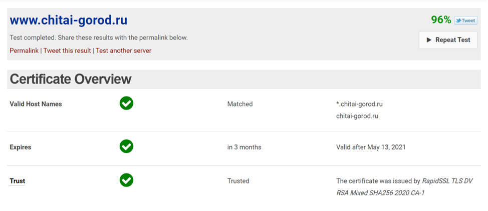
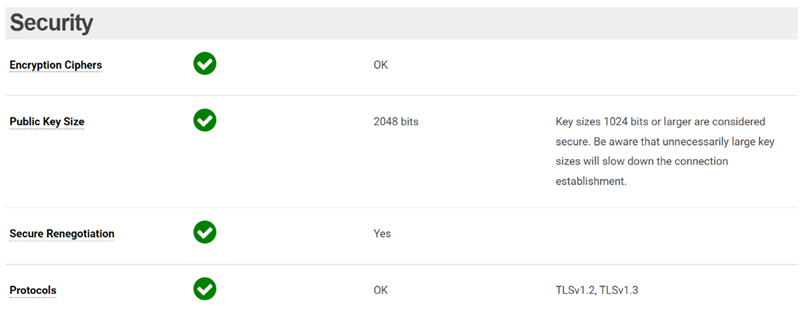
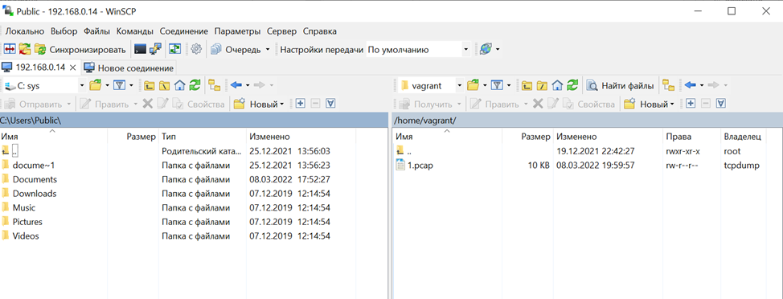

# Элементы безопасности информационных систем

1. Установите Bitwarden плагин для браузера. Зарегестрируйтесь и сохраните несколько паролей.

Сохраненный в bitwarden пароль 

2. Установите Google authenticator на мобильный телефон. Настройте вход в Bitwarden акаунт через Google authenticator OTP.

Запрос 6-значного кода при двухфакторной аутентификации при входе в bitwarden 

Настройка двухфакторной аутентификации в bitwarden 

3. Установите apache2, сгенерируйте самоподписанный сертификат, настройте тестовый сайт для работы по HTTPS.  

Страничка по умолчанию веб-сервера apache  

Подключение к веб-серверу по https и отображение самоподписанного сертификата  

Параметры самоподписанного сертификата  

4. Проверьте на TLS уязвимости произвольный сайт в интернете (кроме сайтов МВД, ФСБ, МинОбр, НацБанк, РосКосмос, РосАтом, РосНАНО и любых госкомпаний, объектов КИИ, ВПК ... и тому подобное).

В качестве «подопытного» взял сайт www.chitai-gorod.ru
Инструментов для проверки уязвимости и надежности веб-серверов нашел много, выбрал в качестве примера инструмент https://www.wormly.com, который проверяет сразу несколько параметров веб-сервера:  

Обзор параметров ssl-сертификата     

Проверка ключа и версии протокола TLS   

Проверка производительности веб-сервера 

Параметры используемых алгоритмов шифрования 

Предложенный в презентации инструмент для проверки уязвимостей tls выдал следующее:    
[1m  

    testssl.sh       3.1dev from [m[1mhttps://testssl.sh/dev/[m  
[1m    ([m[1;30mf73bc44 2022-03-02 17:13:41 -- [m[1m)[m  
[1m  
      This program is free software. Distribution and  
             modification under GPLv2 permitted.  
      USAGE w/o ANY WARRANTY. USE IT AT YOUR OWN RISK!  
       Please file bugs @ [m[1mhttps://testssl.sh/bugs/[m  
[1m  
 Using "OpenSSL 1.0.2-chacha (1.0.2k-dev)" [~183 ciphers]  
 on vagrant:./bin/openssl.Linux.x86_64  
 (built: "Jan 18 17:12:17 2019", platform: "linux-x86_64")  
[7m Start 2022-03-08 18:14:44        -->> 192.230.96.152:443 (www.chitai-gorod.ru) <<--[m  
 rDNS (192.230.96.152):  192.230.96.152.ip.incapdns.net.  
 Service detected:       HTTP  
[1m[4m Testing all 183 locally available ciphers against the server, ordered by encryption strength [m  
Hexcode  Cipher Suite Name (OpenSSL)       KeyExch.   Encryption  Bits     Cipher Suite Name (IANA/RFC)  
-----------------------------------------------------------------------------------------------------------------------------
 xc030   ECDHE-RSA-AES256-GCM-SHA384       ECDH[0;32m 256[m   AESGCM      256      TLS_ECDHE_RSA_WITH_AES_256_GCM_SHA384                
 xc028   ECDHE-RSA-AES256-SHA384           ECDH[0;32m 256[m   AES         256      TLS_ECDHE_RSA_WITH_AES_256_CBC_SHA384                
 xc014   ECDHE-RSA-AES256-SHA              ECDH[0;32m 256[m   AES         256      TLS_ECDHE_RSA_WITH_AES_256_CBC_SHA                   
 x9d     AES256-GCM-SHA384                 RSA        AESGCM      256      TLS_RSA_WITH_AES_256_GCM_SHA384                        
 x3d     AES256-SHA256                     RSA        AES         256      TLS_RSA_WITH_AES_256_CBC_SHA256                      
 x35     AES256-SHA                        RSA        AES         256      TLS_RSA_WITH_AES_256_CBC_SHA                         
 x84     CAMELLIA256-SHA                   RSA        Camellia    256      TLS_RSA_WITH_CAMELLIA_256_CBC_SHA                    
 xc02f   ECDHE-RSA-AES128-GCM-SHA256       ECDH[0;32m 256[m   AESGCM      128      TLS_ECDHE_RSA_WITH_AES_128_GCM_SHA256                
 xc027   ECDHE-RSA-AES128-SHA256           ECDH[0;32m 256[m   AES         128      TLS_ECDHE_RSA_WITH_AES_128_CBC_SHA256                
 xc013   ECDHE-RSA-AES128-SHA              ECDH[0;32m 256[m   AES         128      TLS_ECDHE_RSA_WITH_AES_128_CBC_SHA                   
 x9c     AES128-GCM-SHA256                 RSA        AESGCM      128      TLS_RSA_WITH_AES_128_GCM_SHA256                      
 x3c     AES128-SHA256                     RSA        AES         128      TLS_RSA_WITH_AES_128_CBC_SHA256                      
 x2f     AES128-SHA                        RSA        AES         128      TLS_RSA_WITH_AES_128_CBC_SHA                         
 x41     CAMELLIA128-SHA                   RSA        Camellia    128      TLS_RSA_WITH_CAMELLIA_128_CBC_SHA                    
[7m Done 2022-03-08 18:14:56 [  16s] -->> 192.230.96.152:443 (www.chitai-gorod.ru) <<--[m  

В принципе, результат проверки схож с результатом проверки предыдущего инструмента, практически все те-же параметры отображает инструмент из презентации  

5. Установите на Ubuntu ssh сервер, сгенерируйте новый приватный ключ. Скопируйте свой публичный ключ на другой сервер. Подключитесь к серверу по SSH-ключу.

Для выполнения задания:  
-разворачиваем еще одну машину с ubuntu  (node2)  
-на  node2 устанавливаем openssh-server и генерим связку ключей приватный+закрытый    
-затем при помощи ssh-copy-id копируем публичный ключ с node2 на сервер, к которому будем подключаться в файл ~/.ssh/authorized_keys  
После чего при первом подключении система спросит пароль и предложит сохранить отпечаток ключа и записать данные о машине в файлик known_hosts. При повторном подключении пароль при наличии открытой части ключа запрашиваться уже не будет, результат ниже:  
  
На рисунке видно, что подключение производилось без ввода пароля, дополнительно вывел содержимое приватного ключа на node2(откдуа подключаемся) и содержимое файла authorized_keys (куда подключаемся)  

6. Переименуйте файлы ключей из задания 5. Настройте файл конфигурации SSH клиента, так чтобы вход на удаленный сервер осуществлялся по имени сервера.

Для этого добавляем в файл /etc/hosts запись о необходимой нам машине:    
  
И раскоментируем строку в файле /etc/ssh/sshd_config #UseDNS yes

После чего перезапускаем службу ssh (service ssh restart) и подключение заработает по имени сервера а не по ip (ip Иногда может меняться и это пригодится в таком случае)  
  

7. Соберите дамп трафика утилитой tcpdump в формате pcap, 100 пакетов. Откройте файл pcap в Wireshark.

Для получения .pcap файла пришлось изрядно провозиться, т.к scp на расшаренную на хостовой машине папку копировать файлик не хотел, пришлось подключаться к ВМ при помощи winscp:  

Подключение к ВМ при помощи winscp  

Далее стянул файлик 1.pcap на хостовую машину и уже открыл его в wireshark 

Дамп содержит информацию только о ssh подключении к вм с хостовой машины, т.к более никаких пакетов во внешнюю сеть не ходило

8. Просканируйте хост scanme.nmap.org. Какие сервисы запущены?

Starting Nmap 7.80 ( https://nmap.org ) at 2022-03-08 18:57 UTC  
Nmap scan report for scanme.nmap.org (45.33.32.156)  
Host is up (0.21s latency).  
Other addresses for scanme.nmap.org (not scanned): 2600:3c01::f03c:91ff:fe18:bb2f  
Not shown: 996 closed ports  
PORT      STATE SERVICE    VERSION    
22/tcp    open  ssh        OpenSSH 6.6.1p1 Ubuntu 2ubuntu2.13 (Ubuntu Linux; protocol 2.0)  
| ssh-hostkey:   
|   1024 ac:00:a0:1a:82:ff:cc:55:99:dc:67:2b:34:97:6b:75 (DSA)  
|   2048 20:3d:2d:44:62:2a:b0:5a:9d:b5:b3:05:14:c2:a6:b2 (RSA)  
|   256 96:02:bb:5e:57:54:1c:4e:45:2f:56:4c:4a:24:b2:57 (ECDSA)  
|_  256 33:fa:91:0f:e0:e1:7b:1f:6d:05:a2:b0:f1:54:41:56 (ED25519)  
80/tcp    open  http       Apache httpd 2.4.7 ((Ubuntu))  
|_http-server-header: Apache/2.4.7 (Ubuntu)  
|_http-title: Go ahead and ScanMe!  
9929/tcp  open  nping-echo Nping echo  
31337/tcp open  tcpwrapped  
Aggressive OS guesses: HP P2000 G3 NAS device (93%), MikroTik RouterOS 6.36 (93%), Linux 2.6.32 (92%), Linux 4.0 (92%), Infomir MAG-250 set-top box (92%), Linux 3.7 (92%), Ubiquiti AirOS 5.5.9 (92%), Linux 2.6.32 - 3.13 (92%), Linux 3.3 (92%), Ubiquiti AirMax NanoStation WAP (Linux 2.6.32) (91%)  
No exact OS matches for host (test conditions non-ideal).  
Network Distance: 13 hops  
Service Info: OS: Linux; CPE: cpe:/o:linux:linux_kernel  

TRACEROUTE (using port 256/tcp)  
HOP RTT       ADDRESS  
1   2.83 ms   _gateway (192.168.0.1)  
2   3.33 ms   95.71.16.1  
3   3.30 ms   87.226.146.40  
4   22.42 ms  188.254.25.77  
5   63.26 ms  217.161.68.34  
6   61.34 ms  217.161.68.33  
7   221.10 ms ae36-xcr1.ltw.cw.net (195.2.2.73)  
8   206.71 ms ae29-xcr2.ash.cw.net (195.2.24.245)  
9   206.72 ms ae5-xcr2.lax.cw.net (195.2.2.153)  
10  210.87 ms ae13-xcr1.pal.cw.net (195.2.2.150)  
11  207.70 ms linode-gw-xcr1.sje.cw.net (195.2.14.206)  
12  231.59 ms if-2-4.csw6-fnc1.linode.com (173.230.159.87)  
13  204.89 ms scanme.nmap.org (45.33.32.156)  

OS and Service detection performed. Please report any incorrect results at https://nmap.org/submit/ .  
Nmap done: 1 IP address (1 host up) scanned in 50.15 seconds  
Вывод утилиты nmap показал, что на хосте scanme.nmap.org запущены сервисы:  
-ssh 22 tcp порт  
-http 80 tcp порт  
-nping 9929 tcp порт  
-tcpwrapped 3137 tcp порт  

9. Установите и настройте фаервол ufw на web-сервер из задания 3. Откройте доступ снаружи только к портам 22,80,443

Результирующий набор правил получился следующий 
