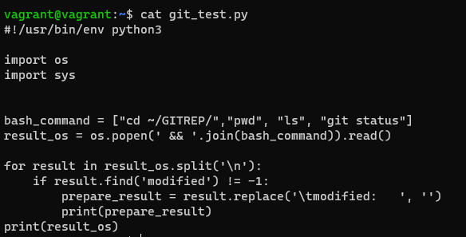
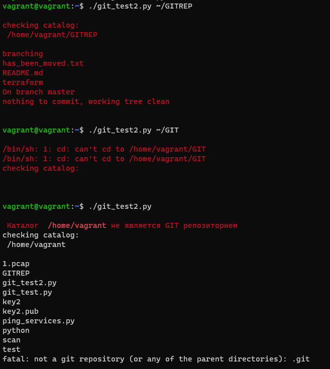
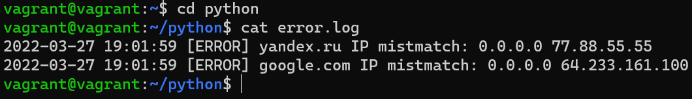

# Домашнее задание к занятию "4.2. Использование Python для решения типовых DevOps задач"

## Обязательная задача 1

Есть скрипт:
```python
#!/usr/bin/env python3
a = 1
b = '2'
c = a + b
```

### Вопросы:
| Вопрос  | Ответ |
| ------------- | ------------- |
| Какое значение будет присвоено переменной `c`?  | из-за разных типов данных будет ошибка  |
| Как получить для переменной `c` значение 12?  | преобразовать 'a' в строковый тип и потом сложить с 'b' c=str(a) + b  |
| Как получить для переменной `c` значение 3?  | преобразовать 'b' в строковый тип и потом сложить с 'a' c=int(b) + a  |

## Обязательная задача 2
Мы устроились на работу в компанию, где раньше уже был DevOps Engineer. Он написал скрипт, позволяющий узнать, какие файлы модифицированы в репозитории, относительно локальных изменений. Этим скриптом недовольно начальство, потому что в его выводе есть не все изменённые файлы, а также непонятен полный путь к директории, где они находятся. Как можно доработать скрипт ниже, чтобы он исполнял требования вашего руководителя?

```python
#!/usr/bin/env python3

import os

bash_command = ["cd ~/netology/sysadm-homeworks", "git status"]
result_os = os.popen(' && '.join(bash_command)).read()
is_change = False
for result in result_os.split('\n'):
    if result.find('modified') != -1:
        prepare_result = result.replace('\tmodified:   ', '')
        print(prepare_result)
        break
```

### Ваш скрипт:
```python
#!/usr/bin/env python3

import os
import sys


bash_command = ["cd ~/GITREP/","pwd", "ls", "git status"]
result_os = os.popen(' && '.join(bash_command)).read()

for result in result_os.split('\n'):
    if result.find('modified') != -1:
        prepare_result = result.replace('\tmodified:   ', '')
        print(prepare_result)
print(result_os)
```

### Вывод скрипта при запуске при тестировании:


## Обязательная задача 3
Доработать скрипт выше так, чтобы он мог проверять не только локальный репозиторий в текущей директории, а также умел воспринимать путь к репозиторию, который мы передаём как входной параметр. Мы точно знаем, что начальство коварное и будет проверять работу этого скрипта в директориях, которые не являются локальными репозиториями.

### Ваш скрипт:
```python
#!/usr/bin/env python3

import os
import sys

cmd = os.getcwd()

if len(sys.argv)>=2:
    cmd = sys.argv[1]
bash_command = ["cd "+cmd, "ls", "git status 2>&1"]
bash_command2 = ["cd "+cmd, "pwd "+cmd]

print('\033[31m')
result_os = os.popen(' && '.join(bash_command)).read()
result_os2 = os.popen(' && '.join(bash_command2)).read()

for result in result_os.split('\n'):
    if result.find('fatal') != -1:
        print('\033[31m Каталог \033[1m '+cmd+'\033[0m\033[31m не является GIT репозиторием\033[0m')
    if result.find('modified') != -1:
        prepare_result = result.replace('\tmodified: ', '')
        print(cmd+prepare_result)
print("checking catalog:", "\n", result_os2)
print(result_os)


print('\033[0m')
```

### Вывод скрипта при запуске при тестировании:



## Обязательная задача 4
Наша команда разрабатывает несколько веб-сервисов, доступных по http. Мы точно знаем, что на их стенде нет никакой балансировки, кластеризации, за DNS прячется конкретный IP сервера, где установлен сервис. Проблема в том, что отдел, занимающийся нашей инфраструктурой очень часто меняет нам сервера, поэтому IP меняются примерно раз в неделю, при этом сервисы сохраняют за собой DNS имена. Это бы совсем никого не беспокоило, если бы несколько раз сервера не уезжали в такой сегмент сети нашей компании, который недоступен для разработчиков. Мы хотим написать скрипт, который опрашивает веб-сервисы, получает их IP, выводит информацию в стандартный вывод в виде: <URL сервиса> - <его IP>. Также, должна быть реализована возможность проверки текущего IP сервиса c его IP из предыдущей проверки. Если проверка будет провалена - оповестить об этом в стандартный вывод сообщением: [ERROR] <URL сервиса> IP mismatch: <старый IP> <Новый IP>. Будем считать, что наша разработка реализовала сервисы: `yandex.ru`, `google.com`.

### Ваш скрипт:
```python
#!/usr/bin/env python3

import socket as s
import time as t
import datetime as dt

# set variables

i     = 1
wait  = 2 # интервал проверок в секундах
srv   = {'yandex.ru' : '0.0.0.0', 'google.com':'0.0.0.0'}
init  = 0
fpath = "/home/vagrant/python/" #путь к файлам для выгрузки
flog  = "/home/vagrant/python/error.log" #путь к файлу логов

# Сообщение при старте скрипта
print('*** start checking ***')
print(srv)
print('********************')

while 1 == 1 : # для бесконечного цикла, else  установить условие i >= числу требуемых итераций
  for host in srv:
    is_error = False
    ip = s.gethostbyname(host)
    if ip != srv[host]:
      if i==1 and init !=1: # выведем ошибку, если нет инициализации или есть иниц. и не первый шаг
        is_error=True
        # вывод ошибок в файл
        with open(flog,'a') as fl:
          print(str(dt.datetime.now().strftime("%Y-%m-%d %H:%M:%S")) +' [ERROR] ' + str(host) +' IP mistmatch: '+srv[host]+' '+ip,file=fl)
        #*********
  # print(i) # вывод шага итерации для отладки
  i+=1 # счетчик итераций
  if i >=20 : # число итераций для выхода из цикла для отладки
    break
  t.sleep(wait) # задержка на итерации
```

### Вывод результата работы скрипта при запуске:  

```