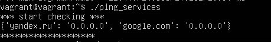
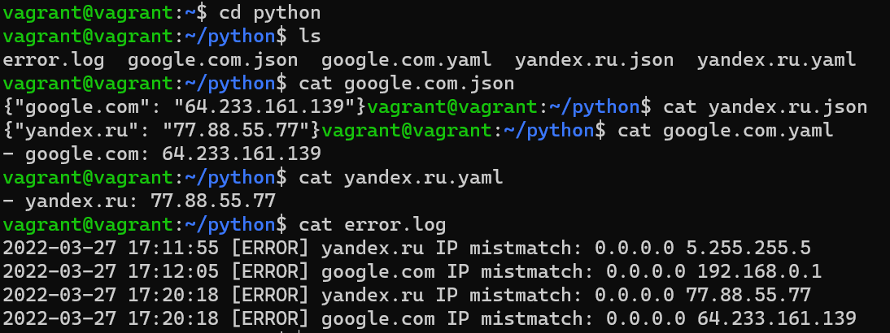

# Домашнее задание к занятию "4.3. Языки разметки JSON и YAML"


## Обязательная задача 1
Мы выгрузили JSON, который получили через API запрос к нашему сервису:
```
    { "info" : "Sample JSON output from our service\t",
        "elements" :[
            { "name" : "first",
            "type" : "server",
            "ip" : 7175 
            }
            { "name" : "second",
            "type" : "proxy",
            "ip : 71.78.22.43
            }
        ]
    }
```
  Нужно найти и исправить все ошибки, которые допускает наш сервис  
-Не хватает двойных кавычек в строках с значением ip  
-Не хватает разделителя элементов внутри массива  
```
{ "info" : "Sample JSON output from our service\t",  
        "elements" :[  
            { "name" : "first",  
            "type" : "server",  
            "ip" : "7175"         #здесь добавляем кавычки
            },                    #Здесь добавляем ',' т.к нет пробела или таба между элементами массива  
            { "name" : "second",  
            "type" : "proxy",  
            "ip" : "71.78.22.43"  #здесь добавляем кавычки
            }  
        ]  
    }  
```
## Обязательная задача 2
В прошлый рабочий день мы создавали скрипт, позволяющий опрашивать веб-сервисы и получать их IP. К уже реализованному функционалу нам нужно добавить возможность записи JSON и YAML файлов, описывающих наши сервисы. Формат записи JSON по одному сервису: `{ "имя сервиса" : "его IP"}`. Формат записи YAML по одному сервису: `- имя сервиса: его IP`. Если в момент исполнения скрипта меняется IP у сервиса - он должен так же поменяться в yml и json файле.

### Ваш скрипт:
```python
# !/usr/bin/env python3  

import socket as s  
import time as t  
import datetime as dt  
import json  
import yaml  

# set variables   

i     = 1  
wait  = 4 # интервал проверок в секундах  
srv   = {'yandex.ru' : '0.0.0.0', 'google.com':'0.0.0.0'}  
init  = 0  
fpath = "/home/vagrant/python/" #путь к файлам для выгрузки  
flog  = "/home/vagrant/python/error.log" #путь к файлу логов  

# Сообщение при старте скрипта
print('*** start checking ***')  
print(srv)  
print('********************')  

while 1 == 1 : # для бесконечного цикла, else  установить условие i >= числу требуемых итераций  
  for host in srv:  
    is_error = False  
    ip = s.gethostbyname(host)  
    if ip != srv[host]:  
      if i==1 and init !=1: # выведем ошибку, если нет инициализации или есть иниц. и не первый шаг  
        is_error=True  
        # вывод ошибок в файл  
        with open(flog,'a') as fl:  
          print(str(dt.datetime.now().strftime("%Y-%m-%d %H:%M:%S")) +' [ERROR] ' + str(host) +' IP mistmatch: '+srv[host]+' '+ip,file=fl)  
        #******************************************  
        # запись в json и yaml  
        #vvvvvvvvvvvvvvvvvvvvvvvvvvvvvvvvvvvvvvvvvv  

        # json  
        with open(fpath+host+".json",'w') as jsf:  
          json_data= json.dumps({host:ip})  
          jsf.write(json_data)  
        # yaml  
        with open(fpath+host+".yaml",'w') as ymf:  
          yaml_data= yaml.dump([{host : ip}])  
          ymf.write(yaml_data)  

  # print(i) # вывод шага итерации для отладки  
  i+=1 # счетчик итераций для отладки   
  if i >=40 : # число итераций для выхода из цикла для отладки  
    break  
  t.sleep(wait) # задержка на итерации
```

### Вывод скрипта при запуске при тестировании:



### json-файл(ы) и yml-файл(ы) который(е) записал ваш скрипт:



## Дополнительное задание (со звездочкой*) - необязательно к выполнению

Так как команды в нашей компании никак не могут прийти к единому мнению о том, какой формат разметки данных использовать: JSON или YAML, нам нужно реализовать парсер из одного формата в другой. Он должен уметь:
   * Принимать на вход имя файла
   * Проверять формат исходного файла. Если файл не json или yml - скрипт должен остановить свою работу
   * Распознавать какой формат данных в файле. Считается, что файлы *.json и *.yml могут быть перепутаны
   * Перекодировать данные из исходного формата во второй доступный (из JSON в YAML, из YAML в JSON)
   * При обнаружении ошибки в исходном файле - указать в стандартном выводе строку с ошибкой синтаксиса и её номер
   * Полученный файл должен иметь имя исходного файла, разница в наименовании обеспечивается разницей расширения файлов

### Ваш скрипт:
```python
???
```

### Пример работы скрипта:
???