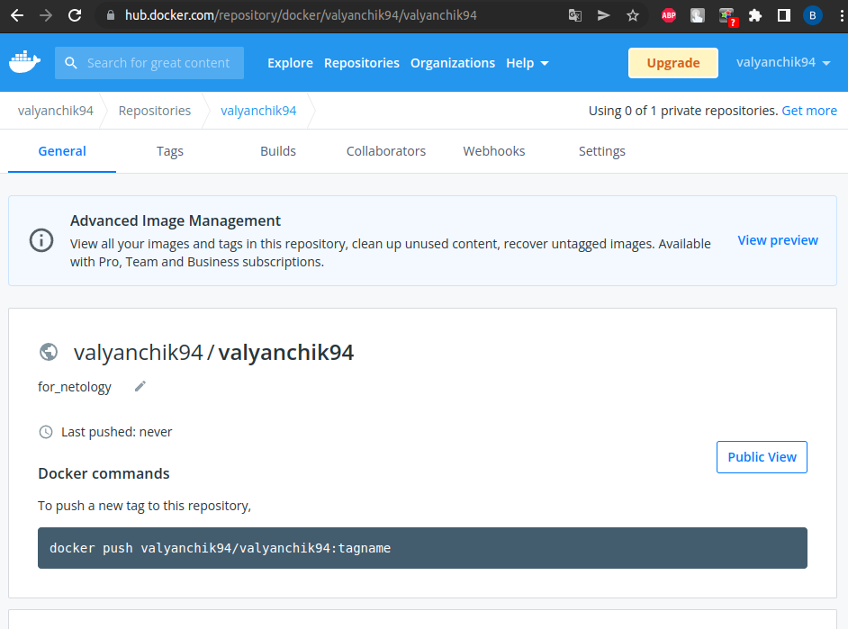
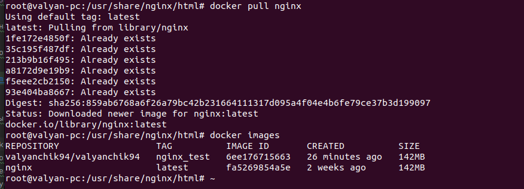
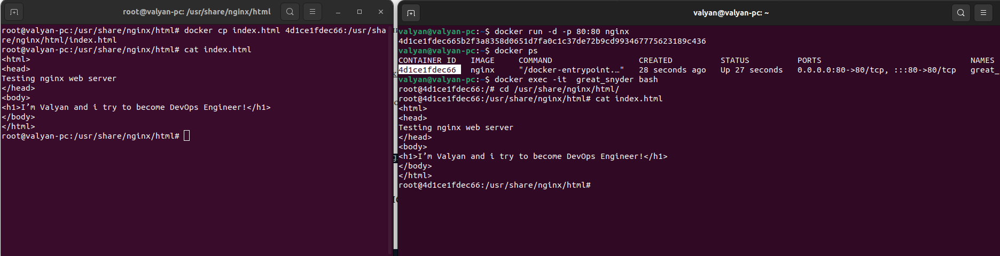
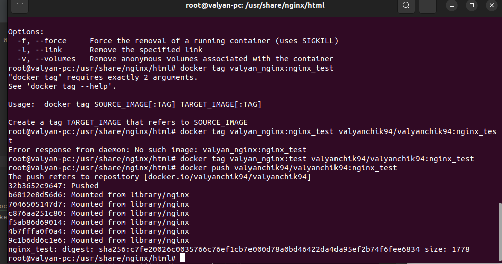
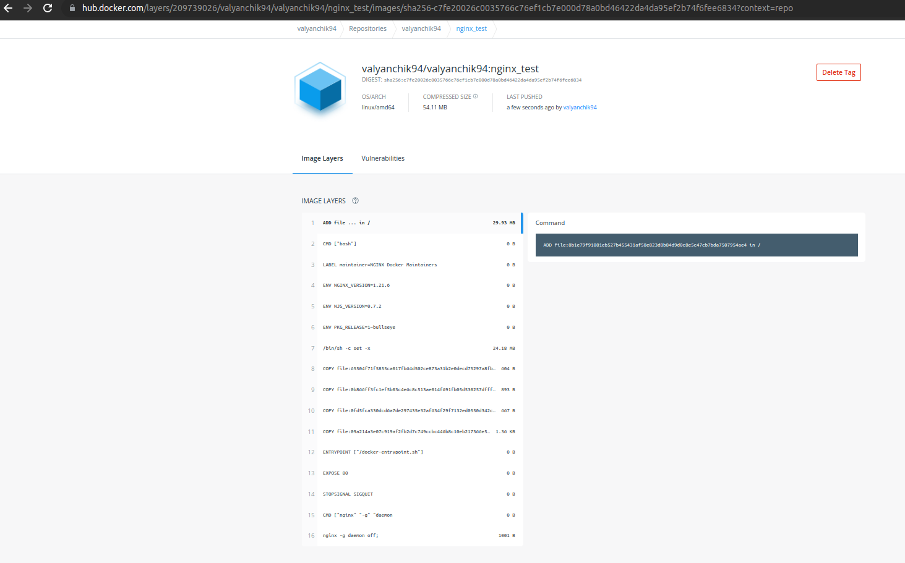
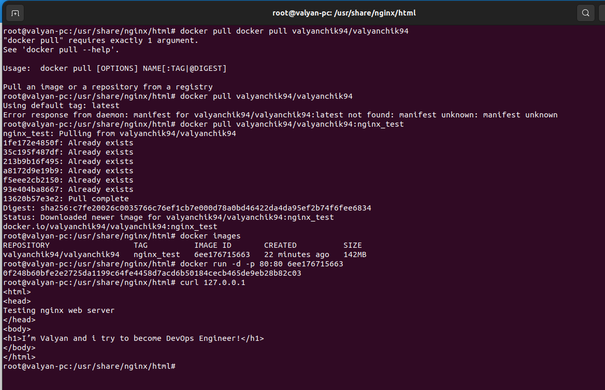

# Домашнее задание к занятию "5.3. Введение. Экосистема. Архитектура. Жизненный цикл Docker контейнера"

## Задача 1

Сценарий выполения задачи:

- создайте свой репозиторий на https://hub.docker.com;  




- выберете любой образ, который содержит веб-сервер Nginx;

docker pull nginx   

  


- создайте свой fork образа;


- реализуйте функциональность:
запуск веб-сервера в фоне с индекс-страницей, содержащей HTML-код ниже:
```
<html>
<head>
Hey, Netology
</head>
<body>
<h1>I’m DevOps Engineer!</h1>
</body>
</html>
```

Копируем с заменой в запущенный контейнер файл index.html   
    

После чего пушим локальные изменения на репозиторий на докрхабе:  
  


Опубликуйте созданный форк в своем репозитории и предоставьте ответ в виде ссылки на https://hub.docker.com/username_repo.

Ссылка на созданный форк:  
docker pull valyanchik94/valyanchik94:nginx_test  




Удаляем все локальные образы, скачиваем созданный форк по ссылке и проверяем, что изменения внесены в дефолтный образ nginx:  

  


## Задача 2

Посмотрите на сценарий ниже и ответьте на вопрос:
"Подходит ли в этом сценарии использование Docker контейнеров или лучше подойдет виртуальная машина, физическая машина? Может быть возможны разные варианты?"

Детально опишите и обоснуйте свой выбор.

--

Сценарий:

- Высоконагруженное монолитное java веб-приложение;    

Монолитное - в микросерверах не реализуемо без изменения кода,
и так как высоконагруженное -  необходим быстрый доступ к ресурсами сервера, оптимальным будет использование физического сервера

- Nodejs веб-приложение;  

Подойдет реализация в докер контейнере: легко будет переносить на ризличные платформы(нет требований к доступу к ресурсам)  

- Мобильное приложение c версиями для Android и iOS;

ПОдойдет как использование  двух виртуальных машин так и использование контейнеров, нужно будет тянуть одинаковые настройки и одну и ту же БД из общего конфига, только под разной оберткой(движок и особенности фронта будут разные)  

- Шина данных на базе Apache Kafka; 

Если потеря данных критична то виртуальная машина, если не критична, то можно и  в контейнере  

- Elasticsearch кластер для реализации логирования продуктивного веб-приложения - три ноды elasticsearch, два logstash и две ноды kibana;  

Эластик можно развернуть на виртуалках, чтобы потом реализовать отказоустойчивость на кластере.  
Кибана  - это красивая и удобная обертка для поиска, ее можно разворачивать на контейнере, критичных настроек там особо и нету.  
Логсташ, наверное, лучше поднимать так же на виртуалке, хотя, если логирование настраивать отдельно в конфиге, то можно логсташ развернуть в оркестраторе и прописать пути к конфигам с логированием.  

- Мониторинг-стек на базе Prometheus и Grafana;
Данные системы не хранят данных, развертывание в контейнере позволит легко масштабировать существующий мониторинг и как и в случае с логсташем, можно подгружать в оркестраторе конфиг при развертывании.  

  
- MongoDB, как основное хранилище данных для java-приложения;  
Оптимально будет использование ВМ, т.к забирать весь сервер это дороговато, а контейнер не подойдет для хранения данных  

- Gitlab сервер для реализации CI/CD процессов и приватный (закрытый) Docker Registry.
приватный registry предусматривает локальное хранение образов  - подойдет ВМ, т.к весь сервер забирать дороговато да и скорости особой не нужно.  
CI\CD наверное, оптимально было бы реализовать на ВМ, т.к физический сервер не особо нужен а остановка или случайные манипуляции с контейнерами могут нарушить цепочку поставки ПО.  


## Задача 3  
Для начала создаем на хостовой машине в домашней папке пользователя папку data и в ней создаем файл hostfile  
```bash
valyan@valyan-pc:~$ mkdir data
valyan@valyan-pc:~$ ls
 2022-05-02-16-11-31.028-VBoxSVC-57237.log        data        Music             snap       'VirtualBox VMs'
 2022-05-02-16-11-31.073-VBoxHeadless-58255.log   Desktop     Pictures          Templates
 2022-05-04-06-23-07.049-VBoxSVC-5218.log         Documents   Public            vagrant
 2022-05-04-06-23-07.064-VBoxHeadless-5905.log    Downloads   PycharmProjects   Videos
valyan@valyan-pc:~$ cd data
valyan@valyan-pc:~/data$ ls
valyan@valyan-pc:~/data$ touch hostfile
```

- Запустите первый контейнер из образа ***centos*** c любым тэгом в фоновом режиме, подключив папку ```/data``` из текущей рабочей директории на хостовой машине в ```/data``` контейнера;

```bash
root@valyan-pc:/usr/share/nginx/html# docker pull centos
Using default tag: latest
latest: Pulling from library/centos
a1d0c7532777: Pull complete 
Digest: sha256:a27fd8080b517143cbbbab9dfb7c8571c40d67d534bbdee55bd6c473f432b177
Status: Downloaded newer image for centos:latest
docker.io/library/centos:latest

valyan@valyan-pc:~/data$ docker run --name centos -d -v /home/valyan/data:/data centos
869fb82c15337e8ff3954b6e580e7f7c65b79551f6ce4955832b365998769ae5
```

- Запустите второй контейнер из образа ***debian*** в фоновом режиме, подключив папку ```/data``` из текущей рабочей директории на хостовой машине в ```/data``` контейнера;

```bash
root@valyan-pc:/usr/share/nginx/html# docker pull debian
Using default tag: latest
latest: Pulling from library/debian
6aefca2dc61d: Pull complete 
Digest: sha256:6846593d7d8613e5dcc68c8f7d8b8e3179c7f3397b84a47c5b2ce989ef1075a0
Status: Downloaded newer image for debian:latest
docker.io/library/debian:latest
root@valyan-pc:/usr/share/nginx/html# docker images
REPOSITORY   TAG       IMAGE ID       CREATED        SIZE
debian       latest    a11311205db1   2 weeks ago    124MB
centos       latest    5d0da3dc9764   7 months ago   231MB
alyan@valyan-pc:~$ docker run --name debian -d -v /home/valyan/data:/data -it  debian bash
f2c209cbd5c53ce4158d5909f05a75fe880710bdf726c6b1c1a5f6816663a95d
```

- Подключитесь к первому контейнеру с помощью ```docker exec``` и создайте текстовый файл любого содержания в ```/data```;

```bash
docker exec -it centos bash
[root@2319693afb22 /]# ls
bin  data  dev	etc  home  lib	lib64  lost+found  media  mnt  opt  proc  root	run  sbin  srv	sys  tmp  usr  var
[root@2319693afb22 /]# cd data
[root@2319693afb22 data]# ls
hostfile
[root@2319693afb22 data]# touch centosfile
[root@2319693afb22 data]# ls
centosfile  hostfile
[root@2319693afb22 data]# touch centosfile
[root@2319693afb22 data]# ls
centosfile  hostfile
```

- Добавьте еще один файл в папку ```/data``` в контейнере с debian;  
```bash
root@f2c209cbd5c5:/data# ls
centosfile  hostfile
root@f2c209cbd5c5:/data# touch debianfile
root@f2c209cbd5c5:/data# ls
centosfile  debianfile	hostfile
```

- Подключитесь во второй контейнер и отобразите листинг и содержание файлов в ```/data``` контейнера.

```bash
[root@2319693afb22 data]# ls
centosfile  hostfile
[root@2319693afb22 data]# ls
centosfile  debianfile	hostfile
[root@2319693afb22 data]# ^C
[root@2319693afb22 data]# ls
centosfile  debianfile	hostfile
[root@2319693afb22 data]# 
```

На хостовой машине после всех манипуляций внутри контейнеров отображаются все 3 созданных файла:  
```bash
valyan@valyan-pc:~/data$ docker run --name centos -d -v /home/valyan/data:/data -it  centos bash
2319693afb2228f542ec3f978f0bf569bcc8c20fa5b9dc97931d7e0d70af4ce6
valyan@valyan-pc:~/data$ ls
centosfile  debianfile  hostfile
valyan@valyan-pc:~/data$ ^C
valyan@valyan-pc:~/data$ ls
centosfile  debianfile  hostfile
```
После остановки контейнеров и удаления всех образов файлы в папке data на хостовой машине остались не смотря на то, что были создани внутри контейнеров:

```bash
valyan@valyan-pc:~$ docker rmi -f debian
Untagged: debian:latest
Untagged: debian@sha256:6846593d7d8613e5dcc68c8f7d8b8e3179c7f3397b84a47c5b2ce989ef1075a0
Deleted: sha256:a11311205db1d20ae0c5373473525e45ff36ec83f472b276f283b34173af5513
valyan@valyan-pc:~$ docker rmi -f centos
Untagged: centos:latest
Untagged: centos@sha256:a27fd8080b517143cbbbab9dfb7c8571c40d67d534bbdee55bd6c473f432b177
Deleted: sha256:5d0da3dc976460b72c77d94c8a1ad043720b0416bfc16c52c45d4847e53fadb6
valyan@valyan-pc:~$ ls
 2022-05-02-16-11-31.028-VBoxSVC-57237.log        Desktop     Public            Videos
 2022-05-02-16-11-31.073-VBoxHeadless-58255.log   Documents   PycharmProjects  'VirtualBox VMs'
 2022-05-04-06-23-07.049-VBoxSVC-5218.log         Downloads   snap
 2022-05-04-06-23-07.064-VBoxHeadless-5905.log    Music       Templates
 data                                             Pictures    vagrant
valyan@valyan-pc:~$ docker images
REPOSITORY   TAG       IMAGE ID   CREATED   SIZE
valyan@valyan-pc:~$ cd data
valyan@valyan-pc:~/data$ ls
centosfile  debianfile  hostfile
valyan@valyan-pc:~/data$ 
```

## Задача 4 (*)

Воспроизвести практическую часть лекции самостоятельно.

Соберите Docker образ с Ansible, загрузите на Docker Hub и пришлите ссылку вместе с остальными ответами к задачам.


