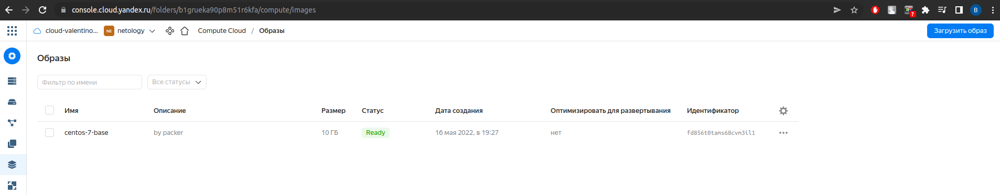
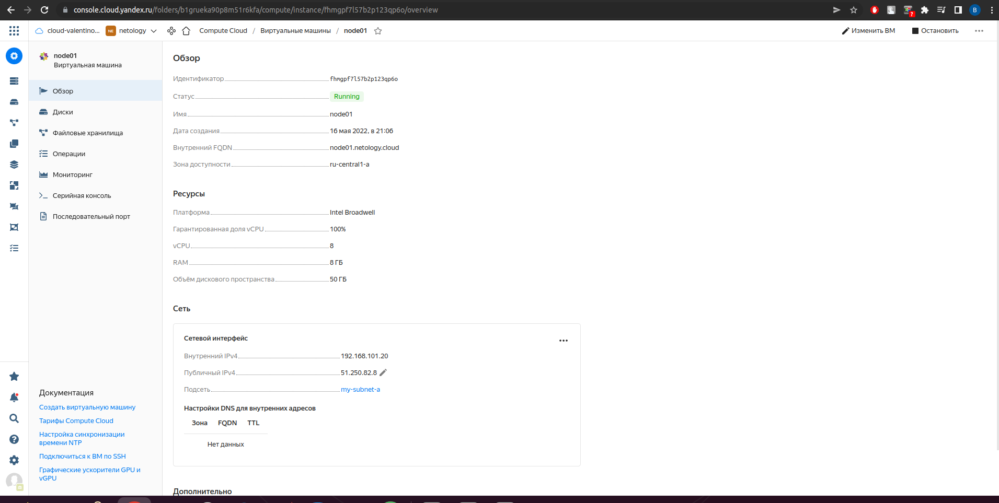
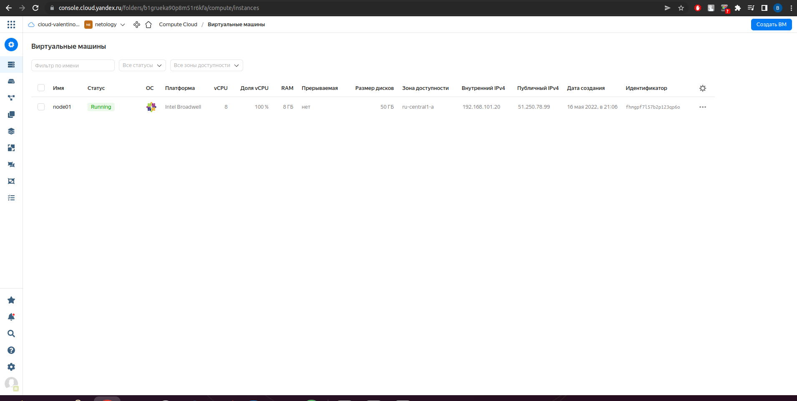
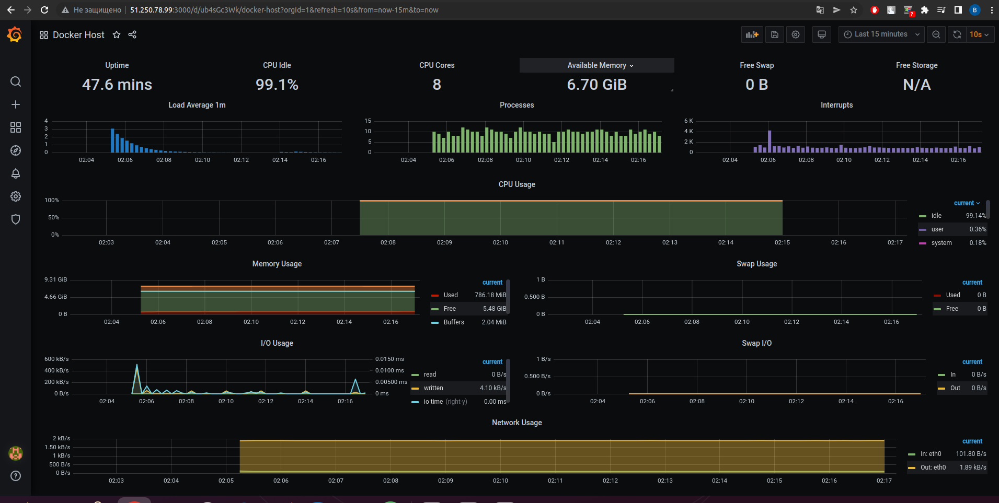
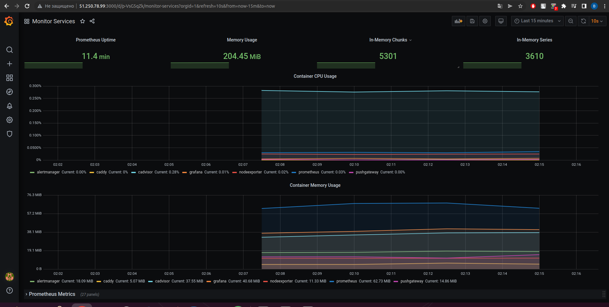

# Домашнее задание к занятию "5.4. Оркестрация группой Docker контейнеров на примере Docker Compose"

## Задача 1

Создать собственный образ операционной системы с помощью Packer.

Для получения зачета, вам необходимо предоставить:
- Скриншот страницы, как на слайде из презентации (слайд 37).


Для выполнения задания необходимо:
-Зарегистрироваться на yandex.cloud  
-Установить утилиты packer и yc  

```bash
valyan@valyan-pc:~$ yc --version
Yandex Cloud CLI 0.91.0 linux/amd64
valyan@valyan-pc:~$ packer --version
1.8.0
```
Далее проходим процедуру создания фолдера, сети и подсети в yandex.cloud, токен облака, токен подсети и токен аутентификации после процедуры создания копируем в файлик centos-7-base.json  
Основные параметры перечислены ниже

```bash
valyan@valyan-pc:~$ yc vpc network list
+----------------------+---------+
|          ID          |  NAME   |
+----------------------+---------+
| enpf9rlrtbalico9g3i2 | net     |
| enpu5hlhr04plph2f0dh | default |
+----------------------+---------+

valyan@valyan-pc:~$ yc vpc subnet list
+----------------------+-----------------------+----------------------+----------------+---------------+-----------------+
|          ID          |         NAME          |      NETWORK ID      | ROUTE TABLE ID |     ZONE      |      RANGE      |
+----------------------+-----------------------+----------------------+----------------+---------------+-----------------+
| b0c8ko6l0cq2t97laleb | default-ru-central1-c | enpu5hlhr04plph2f0dh |                | ru-central1-c | [10.130.0.0/24] |
| e2ldrjia1thiodqrarst | default-ru-central1-b | enpu5hlhr04plph2f0dh |                | ru-central1-b | [10.129.0.0/24] |
| e9b9s9oushahrer7dn2s | my-subnet-a           | enpf9rlrtbalico9g3i2 |                | ru-central1-a | [10.1.2.0/24]   |
| e9bd2dfna7elal31tqk6 | default-ru-central1-a | enpu5hlhr04plph2f0dh |                | ru-central1-a | [10.128.0.0/24] |
+----------------------+-----------------------+----------------------+----------------+---------------+-----------------+

valyan@valyan-pc:~$ yc compute image list
+----------------------+---------------+--------+----------------------+--------+
|          ID          |     NAME      | FAMILY |     PRODUCT IDS      | STATUS |
+----------------------+---------------+--------+----------------------+--------+
| fd856t0tams68cvm3il1 | centos-7-base | centos | f2esd9f5o5i9p7pkkk8k | READY  |
+----------------------+---------------+--------+----------------------+--------+

```

После редактируем предложенный в материалах файл .json с конфигурацией образа ВМ заменив  внем 3 поля:
-subnet_id  
-token
-folder_id  

Проверяем после замены файл .json на правильность синтаксиса:

```bash
valyan@valyan-pc:~$ packer validate centos-7-base.json
The configuration is valid.
```

Файл корректный, запускаем сборку образа командой:  
packer build centos-7-base.json    

После чего будет длинный процесс сборки, который завершиться следующим:

```bash
Build 'yandex' finished after 5 minutes 49 seconds.

==> Wait completed after 5 minutes 49 seconds

==> Builds finished. The artifacts of successful builds are:
--> yandex: A disk image was created: centos-7-base (id: fd856t0tams68cvm3il1) with family name centos
valyan@valyan-pc:~$ yc compute image list
+----------------------+---------------+--------+----------------------+--------+
|          ID          |     NAME      | FAMILY |     PRODUCT IDS      | STATUS |
+----------------------+---------------+--------+----------------------+--------+
| fd856t0tams68cvm3il1 | centos-7-base | centos | f2esd9f5o5i9p7pkkk8k | READY  |
+----------------------+---------------+--------+----------------------+--------+
```

Все необходимые для создания образа параметры можно вывести командой yc config list   

 созданный образ

## Задача 2

Создать вашу первую виртуальную машину в Яндекс.Облаке.

Для этого у нас уже имеется образ с centos-7, который мы создали в предыдущем задании.  
Копируем файлы .tf и отдельно редактируем файл variables.tf(заменяем на наши параметры из яндекс-облака значения в файле):  

```bash
valyan@valyan-pc:~/terraform$ cat variables.tf
# Заменить на ID своего облака
# https://console.cloud.yandex.ru/cloud?section=overview
variable "yandex_cloud_id" {
  default = "b1g1tl9752nijen8v4mi"
}

# Заменить на Folder своего облака
# https://console.cloud.yandex.ru/cloud?section=overview
variable "yandex_folder_id" {
  default = "b1grueka90p8m51r6kfa"
}

# Заменить на ID своего образа
# ID можно узнать с помощью команды yc compute image list
variable "centos-7-base" {
  default = "fd856t0tams68cvm3il1"
```
Так же создаем сервисный аккаунт и ключ к нему и копируем ключ в облако(делал по гайду из https://cloud.yandex.ru/docs/cli/quickstart) 

После созданных файлов, сервисного аккаунта с ключем и образа пробуем создать ВМ проделывая следующие шаги:  
```bash
valyan@valyan-pc:~/terraform$ terraform init

Initializing the backend...

Initializing provider plugins...
- Finding latest version of yandex-cloud/yandex...
- Installing yandex-cloud/yandex v0.74.0...
- Installed yandex-cloud/yandex v0.74.0 (self-signed, key ID E40F590B50BB8E40)

Partner and community providers are signed by their developers.
If you'd like to know more about provider signing, you can read about it here:
https://www.terraform.io/docs/cli/plugins/signing.html

Terraform has created a lock file .terraform.lock.hcl to record the provider
selections it made above. Include this file in your version control repository
so that Terraform can guarantee to make the same selections by default when
you run "terraform init" in the future.

Terraform has been successfully initialized!

You may now begin working with Terraform. Try running "terraform plan" to see
any changes that are required for your infrastructure. All Terraform commands
should now work.

If you ever set or change modules or backend configuration for Terraform,
rerun this command to reinitialize your working directory. If you forget, other
commands will detect it and remind you to do so if necessary.
valyan@valyan-pc:~/terraform$ terraform validate
Success! The configuration is valid.

```

После чего можно посмотреть, что именно будет делать терраформ командой terraform plan    
Просмотрев план работ запускаем процесс создания ВМ при помощи terraform apply -auto-approve  


 созданная ВМ в яндекс облаке

## Задача 3

Создать ваш первый готовый к боевой эксплуатации компонент мониторинга, состоящий из стека микросервисов.

Для этого копируем содержимое папки ansible из репозитория с данными для домашней работы и меняем в файле inventory для ansible адрес удаленной ВМ(в моем случае после перезагрузки ВМ на yandex-cloud публичный адрес машины сменился на 51.250.78.99)  
Запускаем ansible-playbook provision.yaml и дожидаемся окончания установки на докер хост пака сервисов, описанных в docker-compose файле  
```bash
valyan@valyan-pc:~/ansible$ ansible-playbook provision.yml

PLAY [nodes] *******************************************************************

TASK [Gathering Facts] *********************************************************
The authenticity of host '51.250.78.99 (51.250.78.99)' can't be established.
ED25519 key fingerprint is SHA256:9ilfWoZxLMbNx3b9/VV5z7o6UiLh8/x8Pu+gRKYA2D0.
This key is not known by any other names
Are you sure you want to continue connecting (yes/no/[fingerprint])? yes
ok: [node01.netology.cloud]

TASK [Create directory for ssh-keys] *******************************************
ok: [node01.netology.cloud]

TASK [Adding rsa-key in /root/.ssh/authorized_keys] ****************************
changed: [node01.netology.cloud]

TASK [Checking DNS] ************************************************************
changed: [node01.netology.cloud]

TASK [Installing tools] ********************************************************
changed: [node01.netology.cloud] => (item=['git', 'curl'])

TASK [Add docker repository] ***************************************************
changed: [node01.netology.cloud]

TASK [Installing docker package] ***********************************************
changed: [node01.netology.cloud] => (item=['docker-ce', 'docker-ce-cli', 'containerd.io'])

TASK [Enable docker daemon] ****************************************************
changed: [node01.netology.cloud]

TASK [Install docker-compose] **************************************************
changed: [node01.netology.cloud]

TASK [Synchronization] *********************************************************
changed: [node01.netology.cloud]

TASK [Pull all images in compose] **********************************************
changed: [node01.netology.cloud]

TASK [Up all services in compose] **********************************************
changed: [node01.netology.cloud]

PLAY RECAP *********************************************************************
node01.netology.cloud      : ok=12   changed=10   unreachable=0    failed=0    skipped=0    rescued=0    ignored=0   
```

 параметры ВМ после перезагрузки

 экран в графане с  мониторингом докер-хоста

 экран в графане с мониторингом сервисов


## Задача 4 (*)

Создать вторую ВМ и подключить её к мониторингу развёрнутому на первом сервере.

Для получения зачета, вам необходимо предоставить:
- Скриншот из Grafana, на котором будут отображаться метрики добавленного вами сервера.
