# Домашнее задание к занятию "6.2. SQL"

## Задача 1

Используя docker поднимите инстанс PostgreSQL (версию 12) c 2 volume, 
в который будут складываться данные БД и бэкапы.

Приведите получившуюся команду или docker-compose манифест.

Запускаем в отдельной сессии терминала(можно все запустить и в рамках одной сесси если применить флаг -d):  
```bash
valyan@valyan-pc:~$ docker pull postgres:12
valyan@valyan-pc:~$ docker volume create vol1
valyan@valyan-pc:~$ docker volume create vol2
valyan@valyan-pc:~$ docker run --rm --name pg-docker1 -e POSTGRES_PASSWORD=postgres -ti -p 5432:5432 -v vol1:/var/lib/postgressql/data -v vol2:/var/lib/postgressql/backup postgres:12
```
Проверяем, что инстанс postgres запущен, и в нем есть системная БД:

```bash
valyan@valyan-pc:~$ docker ps
CONTAINER ID   IMAGE         COMMAND                  CREATED          STATUS          PORTS                                       NAMES
4a5587cc12b5   postgres:12   "docker-entrypoint.s…"   24 seconds ago   Up 23 seconds   0.0.0.0:5432->5432/tcp, :::5432->5432/tcp   pg-docker1
valyan@valyan-pc:~$ docker exec -it pg-docker1 bash
root@4a5587cc12b5:/# psql -U postgres
psql (12.11 (Debian 12.11-1.pgdg110+1))
Type "help" for help.

postgres=# \l
                                 List of databases
   Name    |  Owner   | Encoding |  Collate   |   Ctype    |   Access privileges   
-----------+----------+----------+------------+------------+-----------------------
 postgres  | postgres | UTF8     | en_US.utf8 | en_US.utf8 | 
 template0 | postgres | UTF8     | en_US.utf8 | en_US.utf8 | =c/postgres          +
           |          |          |            |            | postgres=CTc/postgres
 template1 | postgres | UTF8     | en_US.utf8 | en_US.utf8 | =c/postgres          +
           |          |          |            |            | postgres=CTc/postgres
(3 rows)

postgres=#
```


## Задача 2

В БД из задачи 1: 
- создайте пользователя test-admin-user и БД test_db
- в БД test_db создайте таблицу orders и clients (спeцификация таблиц ниже)
- предоставьте привилегии на все операции пользователю test-admin-user на таблицы БД test_db
- создайте пользователя test-simple-user  
- предоставьте пользователю test-simple-user права на SELECT/INSERT/UPDATE/DELETE данных таблиц БД test_db

Таблица orders:
- id (serial primary key)
- наименование (string)
- цена (integer)

Таблица clients:
- id (serial primary key)
- фамилия (string)
- страна проживания (string, index)
- заказ (foreign key orders)

Приведите:
- итоговый список БД после выполнения пунктов выше,
- описание таблиц (describe)
- SQL-запрос для выдачи списка пользователей с правами над таблицами test_db
- список пользователей с правами над таблицами test_db

```bash
#Создание БД test_db
postgres=# CREATE DATABASE test_db;

#Создание пользователя test-admin-user с правами суперюзера
postgres=# CREATE ROLE "test-admin-user" SUPERUSER NOCREATEDB NOCREATEROLE NOINHERIT LOGIN;
CREATE ROLE

#Cоздание пользователя test-simple-user
You are now connected to database "postgres" as user "postgres".
postgres=# CREATE ROLE "test-simple-user" NOSUPERUSER NOCREATEDB NOCREATEROLE NOINHERIT LOGIN;
CREATE ROLE

###Переключаемся на БД test_db 
postgres=# \c test_db
You are now connected to database "test_db" as user "postgres".

#Назначение пользователю test-simple-user прав
test_db=# GRANT SELECT, INSERT, UPDATE, DELETE ON ALL TABLES IN SCHEMA public TO "test-simple-user";
GRANT

#Назначение всех прав над таблицами пользователю test-admin-user
test_db=# GRANT ALL PRIVILEGES ON ALL TABLES IN SCHEMA public TO "test-admin-user";
GRANT

#Создание таблицы orders 
test_db=# CREATE TABLE orders (id integer PRIMARY KEY, name text, price integer);
CREATE TABLE

#Создание таблицы clients 
test_db=# CREATE TABLE clients (id integer PRIMARY KEY, lastname text, country text, zakaz integer, FOREIGN KEY (zakaz) REFERENCES orders (id));
CREATE TABLE
```

Список БД:
```bash
test_db=# \l
                                 List of databases
   Name    |  Owner   | Encoding |  Collate   |   Ctype    |   Access privileges   
-----------+----------+----------+------------+------------+-----------------------
 postgres  | postgres | UTF8     | en_US.utf8 | en_US.utf8 | 
 template0 | postgres | UTF8     | en_US.utf8 | en_US.utf8 | =c/postgres          +
           |          |          |            |            | postgres=CTc/postgres
 template1 | postgres | UTF8     | en_US.utf8 | en_US.utf8 | =c/postgres          +
           |          |          |            |            | postgres=CTc/postgres
 test_db   | postgres | UTF8     | en_US.utf8 | en_US.utf8 | 
(4 rows)
```

Список таблиц:
```bash 
test_db=# \dt
          List of relations
 Schema |  Name   | Type  |  Owner   
--------+---------+-------+----------
 public | clients | table | postgres
 public | orders  | table | postgres
(2 rows)
```

Список пользователей:
```bash 
test_db=# \du
                                       List of roles
    Role name     |                         Attributes                         | Member of 
------------------+------------------------------------------------------------+-----------
 postgres         | Superuser, Create role, Create DB, Replication, Bypass RLS | {}
 test-admin-user  | Superuser, No inheritance                                  | {}
 test-simple-user | No inheritance                                            | {}
```

Скрипт для вывод прав пользователей в текущей схеме:
```bash 
test_db=# SELECT * FROM information_schema.table_privileges WHERE grantee in ('test-admin-user', 'test-simple-user');
 grantor  |     grantee      | table_catalog | table_schema | table_name | privilege_type | is_grantable | with_hierarchy 
----------+------------------+---------------+--------------+------------+----------------+--------------+----------------
 postgres | test-simple-user | test_db       | public       | orders     | INSERT         | NO           | NO
 postgres | test-simple-user | test_db       | public       | orders     | SELECT         | NO           | YES
 postgres | test-simple-user | test_db       | public       | orders     | UPDATE         | NO           | NO
 postgres | test-simple-user | test_db       | public       | orders     | DELETE         | NO           | NO
 postgres | test-admin-user  | test_db       | public       | orders     | INSERT         | YES          | NO
 postgres | test-admin-user  | test_db       | public       | orders     | SELECT         | YES          | YES
 postgres | test-admin-user  | test_db       | public       | orders     | UPDATE         | YES          | NO
 postgres | test-admin-user  | test_db       | public       | orders     | DELETE         | YES          | NO
 postgres | test-admin-user  | test_db       | public       | orders     | TRUNCATE       | YES          | NO
 postgres | test-admin-user  | test_db       | public       | orders     | REFERENCES     | YES          | NO
 postgres | test-admin-user  | test_db       | public       | orders     | TRIGGER        | YES          | NO
 postgres | test-simple-user | test_db       | public       | clients    | INSERT         | NO           | NO
 postgres | test-simple-user | test_db       | public       | clients    | SELECT         | NO           | YES
 postgres | test-simple-user | test_db       | public       | clients    | UPDATE         | NO           | NO
 postgres | test-simple-user | test_db       | public       | clients    | DELETE         | NO           | NO
 postgres | test-admin-user  | test_db       | public       | clients    | INSERT         | YES          | NO
 postgres | test-admin-user  | test_db       | public       | clients    | SELECT         | YES          | YES
 postgres | test-admin-user  | test_db       | public       | clients    | UPDATE         | YES          | NO
 postgres | test-admin-user  | test_db       | public       | clients    | DELETE         | YES          | NO
 postgres | test-admin-user  | test_db       | public       | clients    | TRUNCATE       | YES          | NO
 postgres | test-admin-user  | test_db       | public       | clients    | REFERENCES     | YES          | NO

...skipping 1 line
(22 rows)

```
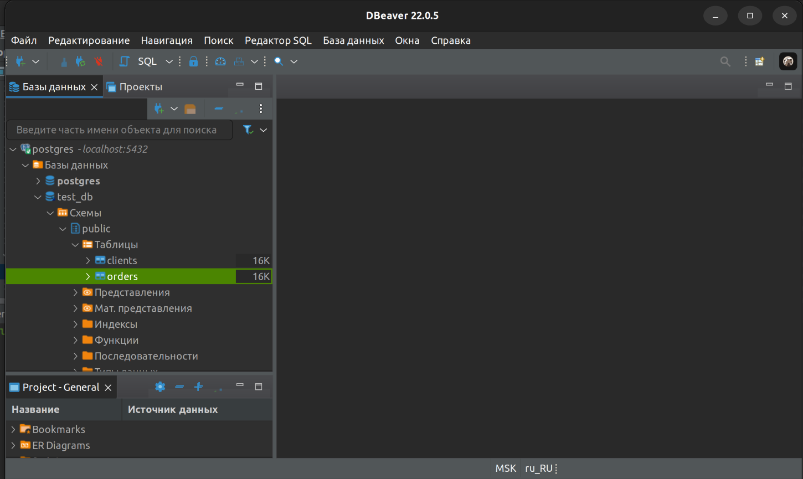 созданные таблицы в dbeaver
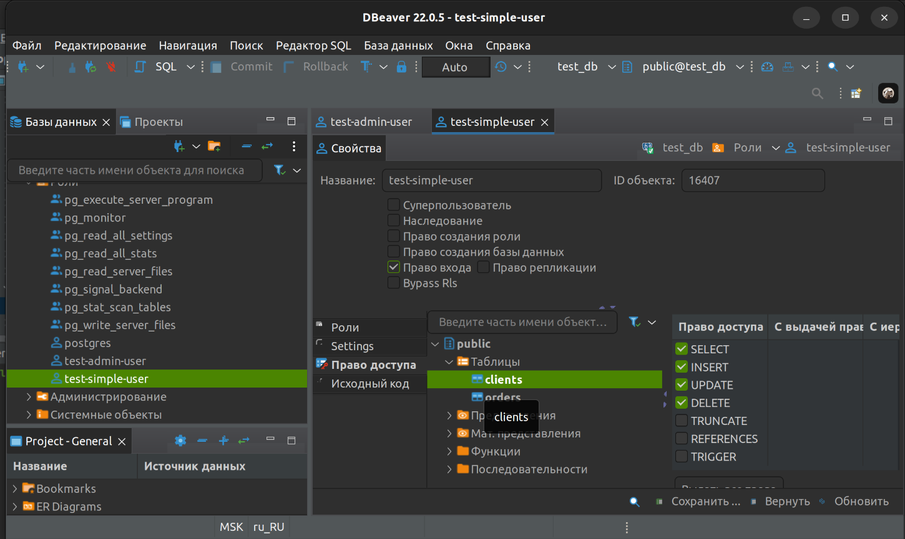 simpleuser
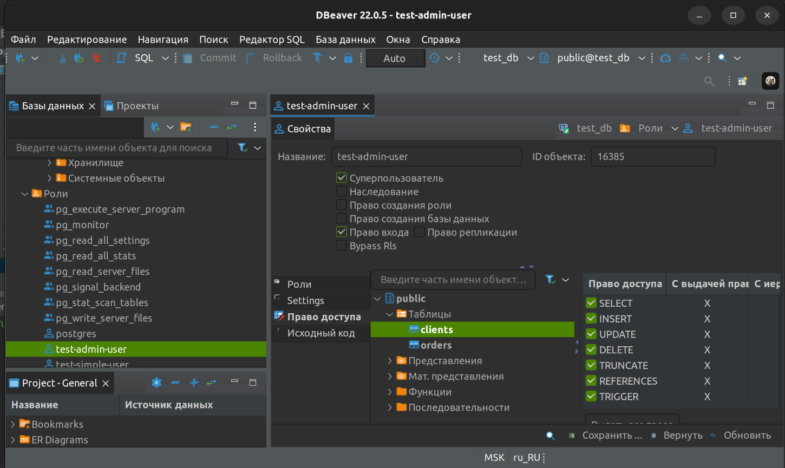 adminuser

## Задача 3

Используя SQL синтаксис - наполните таблицы следующими тестовыми данными:

Таблица orders

|Наименование|цена|
|------------|----|
|Шоколад| 10 |
|Принтер| 3000 |
|Книга| 500 |
|Монитор| 7000|
|Гитара| 4000|

```bash
test_db=# INSERT INTO  orders VALUES (1, 'Шоколад', 10), (2, 'Принтер', 3000), (3, 'Книга', 500), (4, 'Монитор', 7000), (5, 'Гитара', 4000);
INSERT 0 5

```
Таблица orders в dbeaver:
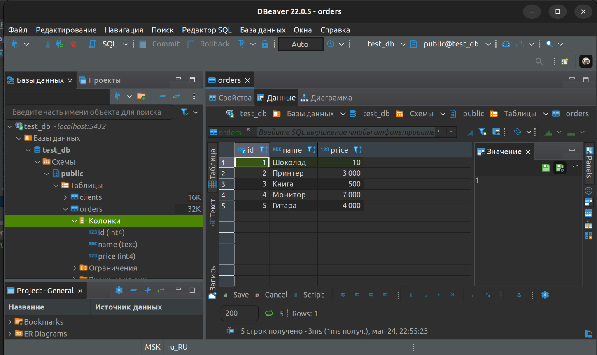

Таблица clients

|ФИО|Страна проживания|
|------------|----|
|Иванов Иван Иванович| USA |
|Петров Петр Петрович| Canada |
|Иоганн Себастьян Бах| Japan |
|Ронни Джеймс Дио| Russia|
|Ritchie Blackmore| Russia|

```bash
test_db=# INSERT INTO clients VALUES (1, 'Иванов Иван Иванович', 'USA'), (2, 'Петров Петр Петрович', 'Canada'), (3, 'Иоганн Себастьян Бах', 'Japan'), (4, 'Ронни Джеймс Дио', 'Russia'), (5, 'Ritchie Blackmore', 'Russia');
INSERT 0 5

```
Таблица clients в dbeaver:
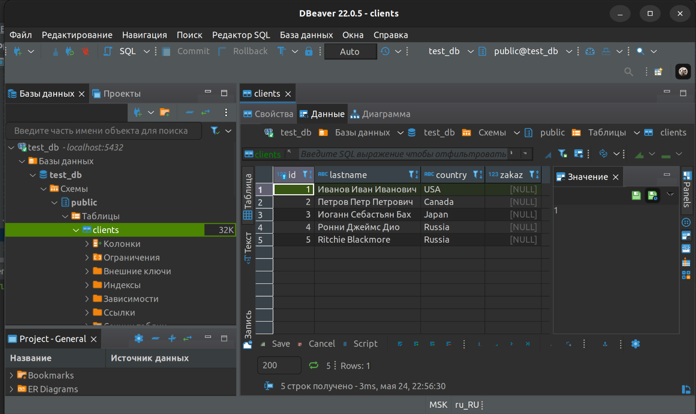

Используя SQL синтаксис:
- вычислите количество записей для каждой таблицы 
- приведите в ответе:
    - запросы 
    - результаты их выполнения.

```bash
test_db=# SELECT COUNT (*) FROM orders;
 count 
-------
     5
(1 row)

test_db=# SELECT COUNT (*) FROM clients;
 count 
-------
     5
(1 row)
```

## Задача 4

Часть пользователей из таблицы clients решили оформить заказы из таблицы orders.

Используя foreign keys свяжите записи из таблиц, согласно таблице:

|ФИО|Заказ|
|------------|----|
|Иванов Иван Иванович| Книга |
|Петров Петр Петрович| Монитор |
|Иоганн Себастьян Бах| Гитара |

Приведите SQL-запросы для выполнения данных операций.
```bash
test_db=# update  clients set zakaz = 3 where id = 1;
UPDATE 1
test_db=# update  clients set zakaz = 4 where id = 2;
UPDATE 1
test_db=# update  clients set zakaz = 5 where id = 3;
UPDATE 1
```

Приведите SQL-запрос для выдачи всех пользователей, которые совершили заказ, а также вывод данного запроса.
```bash
test_db=# SELECT * FROM clients WHERE zakaz is not null;
 id |       lastname       | country | zakaz 
----+----------------------+---------+-------
  1 | Иванов Иван Иванович | USA     |     3
  2 | Петров Петр Петрович | Canada  |     4
  3 | Иоганн Себастьян Бах | Japan   |     5
(3 rows)
```
## Задача 5

Получите полную информацию по выполнению запроса выдачи всех пользователей из задачи 4 
(используя директиву EXPLAIN).

Приведите получившийся результат и объясните что значат полученные значения.

```bash
test_db=# EXPLAIN SELECT * FROM clients WHERE zakaz is not null;
                        QUERY PLAN                         
-----------------------------------------------------------
 Seq Scan on clients  (cost=0.00..18.10 rows=806 width=72)
   Filter: (zakaz IS NOT NULL)
(2 rows)
```
В данном случае скрипт показывает стоимость(нагрузку на исполнение) запроса , и фильтрацию по полю zakaz для выборки

## Задача 6

Создайте бэкап БД test_db и поместите его в volume, предназначенный для бэкапов (см. Задачу 1).

```bash
test_db=# exit
root@4a5587cc12b5:/# pg_dump -U postgres test_db > test_db_dump
root@4a5587cc12b5:/# cat test_db_dump
--
-- PostgreSQL database dump
--

-- Dumped from database version 12.11 (Debian 12.11-1.pgdg110+1)
-- Dumped by pg_dump version 12.11 (Debian 12.11-1.pgdg110+1)

SET statement_timeout = 0;
SET lock_timeout = 0;
SET idle_in_transaction_session_timeout = 0;
SET client_encoding = 'UTF8';
SET standard_conforming_strings = on;
SELECT pg_catalog.set_config('search_path', '', false);
SET check_function_bodies = false;
SET xmloption = content;
SET client_min_messages = warning;
SET row_security = off;

SET default_tablespace = '';

SET default_table_access_method = heap;

--
-- Name: clients; Type: TABLE; Schema: public; Owner: postgres
--

CREATE TABLE public.clients (
    id integer NOT NULL,
    lastname text,
    country text,
    zakaz integer
);


ALTER TABLE public.clients OWNER TO postgres;

--
-- Name: orders; Type: TABLE; Schema: public; Owner: postgres
--

CREATE TABLE public.orders (
    id integer NOT NULL,
    name text,
    price integer
);


ALTER TABLE public.orders OWNER TO postgres;

--
-- Data for Name: clients; Type: TABLE DATA; Schema: public; Owner: postgres
--

COPY public.clients (id, lastname, country, zakaz) FROM stdin;
4	Ронни Джеймс Дио	Russia	\N
5	Ritchie Blackmore	Russia	\N
1	Иванов Иван Иванович	USA	3
2	Петров Петр Петрович	Canada	4
3	Иоганн Себастьян Бах	Japan	5
\.


--
-- Data for Name: orders; Type: TABLE DATA; Schema: public; Owner: postgres
--

COPY public.orders (id, name, price) FROM stdin;
1	Шоколад	10
2	Принтер	3000
3	Книга	500
4	Монитор	7000
5	Гитара	4000
\.


--
-- Name: clients clients_pkey; Type: CONSTRAINT; Schema: public; Owner: postgres
--

ALTER TABLE ONLY public.clients
    ADD CONSTRAINT clients_pkey PRIMARY KEY (id);


--
-- Name: orders orders_pkey; Type: CONSTRAINT; Schema: public; Owner: postgres
--

ALTER TABLE ONLY public.orders
    ADD CONSTRAINT orders_pkey PRIMARY KEY (id);


--
-- Name: clients clients_zakaz_fkey; Type: FK CONSTRAINT; Schema: public; Owner: postgres
--

ALTER TABLE ONLY public.clients
    ADD CONSTRAINT clients_zakaz_fkey FOREIGN KEY (zakaz) REFERENCES public.orders(id);


--
-- Name: TABLE clients; Type: ACL; Schema: public; Owner: postgres
--

GRANT SELECT,INSERT,DELETE,UPDATE ON TABLE public.clients TO "test-simple-user";
GRANT ALL ON TABLE public.clients TO "test-admin-user";


--
-- Name: TABLE orders; Type: ACL; Schema: public; Owner: postgres
--

GRANT SELECT,INSERT,DELETE,UPDATE ON TABLE public.orders TO "test-simple-user";
GRANT ALL ON TABLE public.orders TO "test-admin-user";


--
-- PostgreSQL database dump complete
--

##Копируем бэкап БД в папку с смонитрованным volume2 /var/lib/postgressql/backup
root@4a5587cc12b5:/# cp test_db_dump /var/lib/postgressql/backup/test_db_dump
root@4a5587cc12b5:/# exit
```


Остановите контейнер с PostgreSQL (но не удаляйте volumes).
```bash
valyan@valyan-pc:~$ docker ps
CONTAINER ID   IMAGE         COMMAND                  CREATED          STATUS          PORTS                                       NAMES
4a5587cc12b5   postgres:12   "docker-entrypoint.s…"   33 minutes ago   Up 33 minutes   0.0.0.0:5432->5432/tcp, :::5432->5432/tcp   pg-docker1
valyan@valyan-pc:~$ docker stop pg-docker1
pg-docker1
valyan@valyan-pc:~$ docker ps
CONTAINER ID   IMAGE     COMMAND   CREATED   STATUS    PORTS     NAMES
valyan@valyan-pc:~$
```

Поднимите новый пустой контейнер с PostgreSQL.

```bash
##Запускаем новый контейнер
valyan@valyan-pc:~$ docker run --rm --name pg-docker2 -e POSTGRES_PASSWORD=postgres -ti -p 5432:5432 -v vol1:/var/lib/postgressql/data -v vol2:/var/lib/postgressql/backup postgres:12

##Проверяем, что контейнер запустился корректно
valyan@valyan-pc:~$ docker ps
CONTAINER ID   IMAGE         COMMAND                  CREATED          STATUS          PORTS                                       NAMES
308240c62c59   postgres:12   "docker-entrypoint.s…"   27 seconds ago   Up 27 seconds   0.0.0.0:5432->5432/tcp, :::5432->5432/tcp   pg-docker2

##Подключаемся к контейнеру
valyan@valyan-pc:~$ docker exec -it pg-docker2 bash

##Подключаемся к экземпляру postgres и создаем пустую БД test_db
root@308240c62c59:/# psql -U postgres
psql (12.11 (Debian 12.11-1.pgdg110+1))
Type "help" for help.

postgres=# CREATE DATABASE test_db
postgres-# ;
CREATE DATABASE
postgres=# 
```
Восстановите БД test_db в новом контейнере.
```bash
##Запускаем новый контейнер
valyan@valyan-pc:~$ docker run --rm --name pg-docker2 -e POSTGRES_PASSWORD=postgres -ti -p 5432:5432 -v vol1:/var/lib/postgressql/data -v vol2:/var/lib/postgressql/backup postgres:12
##Подключаемся к контейнеру
valyan@valyan-pc:~$ docker exec -it pg-docker2 bash
##Подключаемся к инстансу postgres и создаем БД test_db, и 2 роли test-admin-user и test-simple-user, т.к мы бэкапили на предыдущем шаге только базу test_db с данными
root@59efba7794fa:/# psql -U postgres
psql (12.11 (Debian 12.11-1.pgdg110+1))
Type "help" for help.
postgres=# CREATE DATABASE test_db;
CREATE DATABASE
postgres=# \c test_db
You are now connected to database "test_db" as user "postgres".
test_db=# CREATE ROLE "test-admin-user";
CREATE ROLE
test_db=# CREATE ROLE "test-simple-user";
CREATE ROLE
test_db=# exit

##GПосле чего восстанавливаем базу test_db из бэкапа по пути /var/lib/postgressql/backup/test_db_dump
root@59efba7794fa:/# psql -U postgres test_db < /var/lib/postgressql/backup/test_db_dump
SET
SET
SET
SET
SET
 set_config 
------------
 
(1 row)

SET
SET
SET
SET
SET
SET
CREATE TABLE
ALTER TABLE
CREATE TABLE
ALTER TABLE
COPY 5
COPY 5
ALTER TABLE
ALTER TABLE
ALTER TABLE
GRANT
GRANT
GRANT
GRANT
```
Приведите список операций, который вы применяли для бэкапа данных и восстановления. 
Проверяем в dbeaver, что случилось с БД после бэкапа:  
-настройки драйвера postgreSQL:
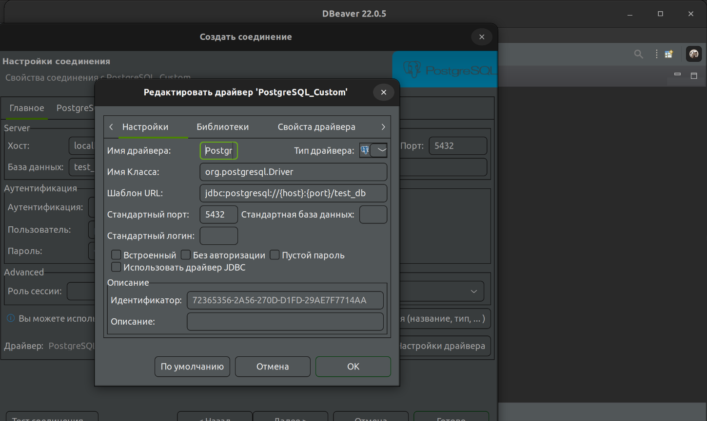 

- настройки подключения к БД:
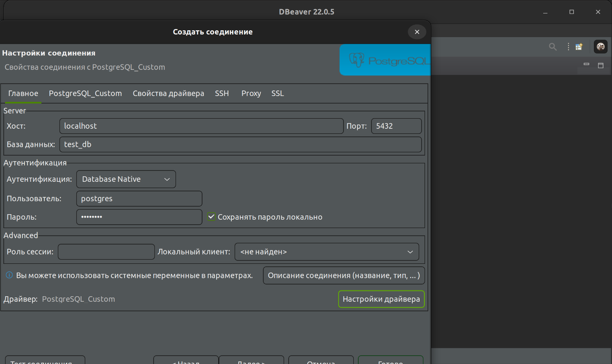 

- таблица clients после восстановления:
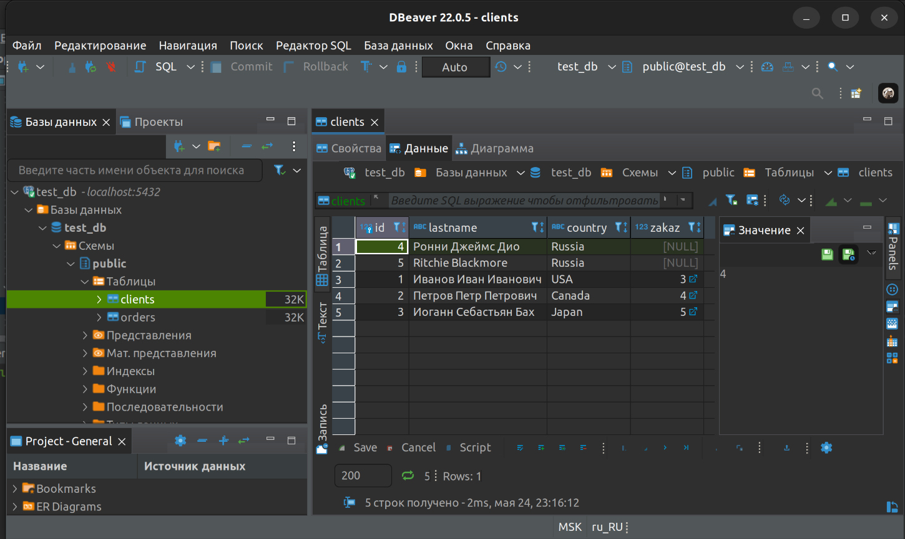  

- таблица orders после восстановления:
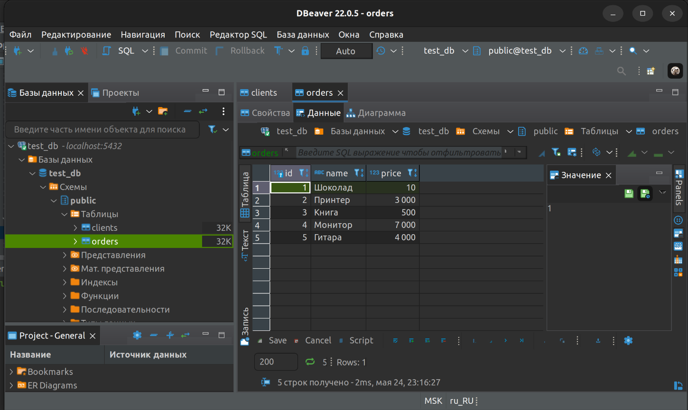 

- права роли test-admin-user после восстановления:
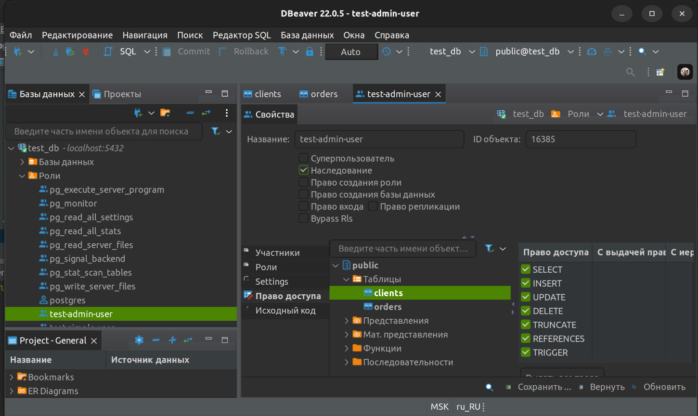 
- 
- права роли simple-user после восстановления:
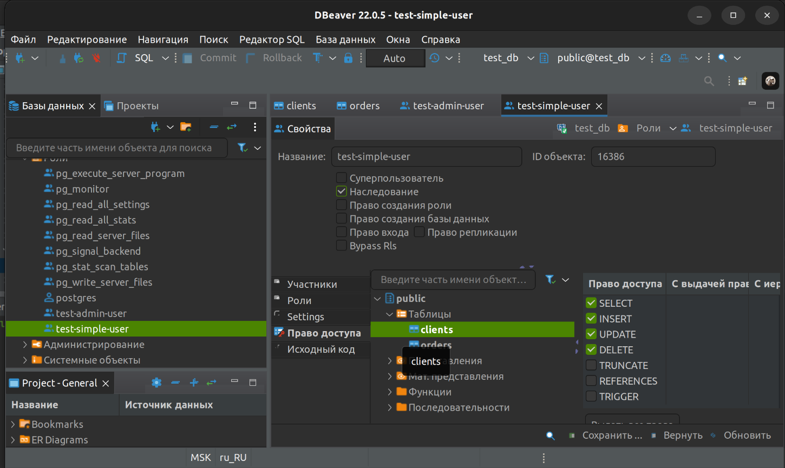 

Как видно, все восстановилось корректно