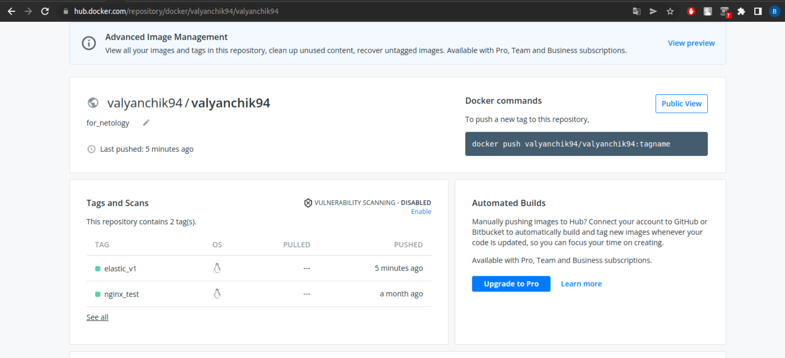

# Домашнее задание к занятию "6.5. Elasticsearch"

## Задача 1

В этом задании вы потренируетесь в:
- установке elasticsearch
- первоначальном конфигурировании elastcisearch
- запуске elasticsearch в docker

Используя докер образ [centos:7](https://hub.docker.com/_/centos) как базовый и 
[документацию по установке и запуску Elastcisearch](https://www.elastic.co/guide/en/elasticsearch/reference/current/targz.html):

- составьте Dockerfile-манифест для elasticsearch
- соберите docker-образ и сделайте `push` в ваш docker.io репозиторий
- запустите контейнер из получившегося образа и выполните запрос пути `/` c хост-машины

Требования к `elasticsearch.yml`:
- данные `path` должны сохраняться в `/var/lib`
- имя ноды должно быть `netology_test`

В ответе приведите:
- текст Dockerfile манифеста
```bash
valyan@valyan-pc:~$ cd Docker
valyan@valyan-pc:~/Docker$ cat Dockerfile
#6.5. Elasticsearch
FROM centos:7
LABEL ElasticSearch \
    (c)Vorotyntsev V
ENV PATH=/usr/lib:/usr/lib/jvm/jre-11/bin:$PATH

RUN yum install java-11-openjdk -y 
RUN yum install wget -y 

RUN wget https://artifacts.elastic.co/downloads/elasticsearch/elasticsearch-7.11.1-linux-x86_64.tar.gz \
    && wget https://artifacts.elastic.co/downloads/elasticsearch/elasticsearch-7.11.1-linux-x86_64.tar.gz.sha512 
RUN yum install perl-Digest-SHA -y 
RUN shasum -a 512 -c elasticsearch-7.11.1-linux-x86_64.tar.gz.sha512 \ 
    && tar -xzf elasticsearch-7.11.1-linux-x86_64.tar.gz \
    && yum upgrade -y
    
ADD elasticsearch.yml /elasticsearch-7.11.1/config/
ENV JAVA_HOME=/elasticsearch-7.11.1/jdk/
ENV ES_HOME=/elasticsearch-7.11.1
RUN groupadd elasticsearch \
    && useradd -g elasticsearch elasticsearch
    
RUN mkdir /var/lib/logs \
    && chown elasticsearch:elasticsearch /var/lib/logs \
    && mkdir /var/lib/data \
    && chown elasticsearch:elasticsearch /var/lib/data \
    && chown -R elasticsearch:elasticsearch /elasticsearch-7.11.1/
RUN mkdir /elasticsearch-7.11.1/snapshots &&\
    chown elasticsearch:elasticsearch /elasticsearch-7.11.1/snapshots
    
USER elasticsearch
CMD ["/usr/sbin/init"]
CMD ["/elasticsearch-7.11.1/bin/elasticsearch"]
```

```bash
##СОбираем докер-образ из файла
valyan@valyan-pc:~/Docker$ docker build -t valyan_elastic:v1 .
Sending build context to Docker daemon  6.656kB
Step 1/17 : FROM centos:7
7: Pulling from library/centos
2d473b07cdd5: Already exists 
Digest: sha256:c73f515d06b0fa07bb18d8202035e739a494ce760aa73129f60f4bf2bd22b407
##Вывод всего процесса сборки не прикладываю, слишком громоздко
.....

Step 17/17 : CMD ["/elasticsearch-7.11.1/bin/elasticsearch"]
 ---> Running in ceeccf3f68a6
Removing intermediate container ceeccf3f68a6
 ---> 6ed783d2f8ea
Successfully built 6ed783d2f8ea

##Вешаем на созданный образ Тег
valyan@valyan-pc:~/Docker$ docker tag valyan_elastic:v1 valyanchik94/valyanchik94:elastic_v1

Successfully tagged valyan_elastic:v1

##Список полученных образов в процессе создания собственного образа с elastic 
valyan@valyan-pc:~/Docker$ docker images
REPOSITORY       TAG       IMAGE ID       CREATED          SIZE
valyan_elastic   v1        6ed783d2f8ea   6 seconds ago    2.67GB
<none>           <none>    4e51fc461fe1   7 minutes ago    243MB
<none>           <none>    3f119a6013fb   9 minutes ago    243MB
<none>           <none>    bb9ab74b2984   11 minutes ago   243MB
postgres         13        03349ea4cfbc   2 weeks ago      373MB
centos           7         eeb6ee3f44bd   8 months ago     204MB
centos           latest    5d0da3dc9764   8 months ago     231MB

##Логинимся на докерхаб
valyan@valyan-pc:~$ docker login 
Login with your Docker ID to push and pull images from Docker Hub. If you don't have a Docker ID, head over to https://hub.docker.com to create one.
Username: valyanchik94
Password: 
WARNING! Your password will be stored unencrypted in /home/valyan/.docker/config.json.
Configure a credential helper to remove this warning. See
https://docs.docker.com/engine/reference/commandline/login/#credentials-store

Login Succeeded

##Пушим созданный образ на личный докерхаб
valyan@valyan-pc:~$ docker push valyanchik94/valyanchik94:elastic_v1
The push refers to repository [docker.io/valyanchik94/valyanchik94]
08397eef54cd: Pushed 
0d4ee4136b5f: Pushed 
d2cd0db7a7a3: Pushed 
b73ae4b9b254: Pushed 
a113bd01b9d5: Pushed 
c41b9f9aa18b: Pushed 
474f0844f823: Pushed 
a7ce9592d8a3: Pushed 
c128843675a8: Pushed 
174f56854903: Pushed 
elastic_v1: digest: sha256:88244ca22c0bcedead131777c8ce3196b134e672994ae18a9afc79f5464efa5f size: 2428
```

- ссылку на образ в репозитории dockerhub

https://hub.docker.com/repository/docker/valyanchik94/valyanchik94  

docker pull valyanchik94/valyanchik94:elastic_v1

- ответ `elasticsearch` на запрос пути `/` в json виде


## Задача 2

В этом задании вы научитесь:
- создавать и удалять индексы
- изучать состояние кластера
- обосновывать причину деградации доступности данных

Ознакомтесь с [документацией](https://www.elastic.co/guide/en/elasticsearch/reference/current/indices-create-index.html) 
и добавьте в `elasticsearch` 3 индекса, в соответствии со таблицей:

| Имя | Количество реплик | Количество шард |
|-----|-------------------|-----------------|
| ind-1| 0 | 1 |
| ind-2 | 1 | 2 |
| ind-3 | 2 | 4 |
```bash
[elasticsearch@820083df125b /]$ curl -X PUT localhost:9200/ind-1 -H 'Content-Type: application/json' -d'{ "settings": { "number_of_shards": 1,  "number_of_replicas": 0 }}'
[elasticsearch@820083df125b /]$ curl -X PUT localhost:9200/ind-2 -H 'Content-Type: application/json' -d'{ "settings": { "number_of_shards": 2,  "number_of_replicas": 1 }}'
[elasticsearch@820083df125b /]$ curl -X PUT localhost:9200/ind-3 -H 'Content-Type: application/json' -d'{ "settings": { "number_of_shards": 4,  "number_of_replicas": 2 }}'
```

Получите список индексов и их статусов, используя API и **приведите в ответе** на задание.
```bash
[elasticsearch@820083df125b /]$ curl -X GET 'http://localhost:9200/_cluster/health/ind-1?pretty'
{
  "cluster_name" : "netology_test",
  "status" : "green",
  "timed_out" : false,
  "number_of_nodes" : 1,
  "number_of_data_nodes" : 1,
  "active_primary_shards" : 1,
  "active_shards" : 1,
  "relocating_shards" : 0,
  "initializing_shards" : 0,
  "unassigned_shards" : 0,
  "delayed_unassigned_shards" : 0,
  "number_of_pending_tasks" : 0,
  "number_of_in_flight_fetch" : 0,
  "task_max_waiting_in_queue_millis" : 0,
  "active_shards_percent_as_number" : 100.0
}
[elasticsearch@820083df125b /]$ curl -X GET 'http://localhost:9200/_cluster/health/ind-2?pretty'
{
  "cluster_name" : "netology_test",
  "status" : "yellow",
  "timed_out" : false,
  "number_of_nodes" : 1,
  "number_of_data_nodes" : 1,
  "active_primary_shards" : 2,
  "active_shards" : 2,
  "relocating_shards" : 0,
  "initializing_shards" : 0,
  "unassigned_shards" : 2,
  "delayed_unassigned_shards" : 0,
  "number_of_pending_tasks" : 0,
  "number_of_in_flight_fetch" : 0,
  "task_max_waiting_in_queue_millis" : 0,
  "active_shards_percent_as_number" : 41.17647058823529
}
[elasticsearch@820083df125b /]$ curl -X GET 'http://localhost:9200/_cluster/health/ind-3?pretty'
{
  "cluster_name" : "netology_test",
  "status" : "yellow",
  "timed_out" : false,
  "number_of_nodes" : 1,
  "number_of_data_nodes" : 1,
  "active_primary_shards" : 4,
  "active_shards" : 4,
  "relocating_shards" : 0,
  "initializing_shards" : 0,
  "unassigned_shards" : 8,
  "delayed_unassigned_shards" : 0,
  "number_of_pending_tasks" : 0,
  "number_of_in_flight_fetch" : 0,
  "task_max_waiting_in_queue_millis" : 0,
  "active_shards_percent_as_number" : 41.17647058823529
}
```
Получите состояние кластера `elasticsearch`, используя API.
```bash
[elasticsearch@820083df125b /]$ curl -XGET localhost:9200/_cluster/health/?pretty=true
{
  "cluster_name" : "netology_test",
  "status" : "yellow",
  "timed_out" : false,
  "number_of_nodes" : 1,
  "number_of_data_nodes" : 1,
  "active_primary_shards" : 7,
  "active_shards" : 7,
  "relocating_shards" : 0,
  "initializing_shards" : 0,
  "unassigned_shards" : 10,
  "delayed_unassigned_shards" : 0,
  "number_of_pending_tasks" : 0,
  "number_of_in_flight_fetch" : 0,
  "task_max_waiting_in_queue_millis" : 0,
  "active_shards_percent_as_number" : 41.17647058823529
}
```
Как вы думаете, почему часть индексов и кластер находится в состоянии yellow?  

У индексов указано число реплик, т.к реплицировать некуда, из-за того что реплика по факту одна то индексы в статусе Yellow 
```bash
[elasticsearch@820083df125b /]$ curl -X DELETE 'http://localhost:9200/ind-1?pretty' 
{
  "acknowledged" : true
}
[elasticsearch@820083df125b /]$ curl -X DELETE 'http://localhost:9200/ind-2?pretty' 
{
  "acknowledged" : true
}
[elasticsearch@820083df125b /]$ curl -X DELETE 'http://localhost:9200/ind-3?pretty' 
{
  "acknowledged" : true
}
[elasticsearch@820083df125b /]$ curl -X GET 'http://localhost:9200/_cat/indices?v'
health status index uuid pri rep docs.count docs.deleted store.size pri.store.size
```
**Важно**

При проектировании кластера elasticsearch нужно корректно рассчитывать количество реплик и шард,
иначе возможна потеря данных индексов, вплоть до полной, при деградации системы.

## Задача 3

В данном задании вы научитесь:
- создавать бэкапы данных
- восстанавливать индексы из бэкапов

Создайте директорию `{путь до корневой директории с elasticsearch в образе}/snapshots`.

На этом этапе мой контейнер закрылся из-за нехватки ОЗУ на ноутбуке, пришлсоь закрывать часть открытого ПО и запускать контейнер по новой, из-за чего у контейнера в 3 задании сменится ID


Используя API [зарегистрируйте](https://www.elastic.co/guide/en/elasticsearch/reference/current/snapshots-register-repository.html#snapshots-register-repository) 
данную директорию как `snapshot repository` c именем `netology_backup`.
```bash
[elasticsearch@e93d74a845ef /]$ curl -XPOST localhost:9200/_snapshot/netology_backup?pretty -H 'Content-Type: application/json' -d'{"type": "fs", "settings": { "location":"/elasticsearch-7.11.1/snapshots" }}'
{
  "acknowledged" : true
}
```
Создайте индекс `test` с 0 реплик и 1 шардом и **приведите в ответе** список индексов.
```bash
[elasticsearch@e93d74a845ef /]$ curl -X GET 'http://localhost:9200/_cat/indices?v'
health status index uuid                   pri rep docs.count docs.deleted store.size pri.store.size
green  open   test  4jvY_Jo2TWGffUeMKKohag   1   0          0            0       208b           208b
```
[Создайте `snapshot`](https://www.elastic.co/guide/en/elasticsearch/reference/current/snapshots-take-snapshot.html) 
состояния кластера `elasticsearch`.

**Приведите в ответе** список файлов в директории со `snapshot`ами.

(на этом этапе я скопировал частично содержимое терминала и после почистил комп от докер-образов и все закрыл, в директории со spnapshot при запросе [elasticsearch@e93d74a845ef /]$ curl -X PUT localhost:9200/_snapshot/netology_backup/elasticsearch?wait_for_completion=true создались файлы :  
-index-1  
-index.latest  
-indices  
-meta-****.dat (вместо * набор псевдослучайных символов, скорее всего символическая ссылка на индекс)
-snap-1111.dat (вместо 1 набор псевдослучайных символов, скорее всего символическая ссылка на индекс)

```bash
[elasticsearch@e93d74a845ef /]$ curl -X PUT localhost:9200/_snapshot/netology_backup/elasticsearch?wait_for_completion=true
{"snapshot":{"snapshot":"elasticsearch","uuid":"9LIvhfUbRcWj48v0Je4G1g","version_id":7110199,"version":"7.11.1","indices":["test"],"data_streams":[],"include_global_state":true,"state":"SUCCESS","start_time":"2022-06-06T15:40:48.544Z","start_time_in_millis":1654530048544,"end_time":"2022-06-06T15:40:48.744Z","end_time_in_millis":1654530048744,"duration_in_millis":200,"failures":[],"shards":{"total":1,"failed":0,"successful":1}}}[elasticsearch@e93d74a845ef /]$ ls /elasticsearch-7.11.1/snapshots
index-0  index.latest  indices  meta-9LIvhfUbRcWj48v0Je4G1g.dat  snap-9LIvhfUbRcWj48v0Je4G1g.dat
```

Удалите индекс `test` и создайте индекс `test-2`. **Приведите в ответе** список индексов.
```bash
[elasticsearch@e93d74a845ef /]$ curl -X DELETE 'http://localhost:9200/test?pretty'
{
  "acknowledged" : true
}

##Создаем индекс test2
[elasticsearch@e93d74a845ef /]$ curl -X PUT localhost:9200/test-2?pretty -H 'Content-Type: application/json' -d'{ "settings": { "number_of_shards": 1,  "number_of_replicas": 0 }}'
{
  "acknowledged" : true,
  "shards_acknowledged" : true,
  "index" : "test-2"
}

[elasticsearch@e93d74a845ef /]$ curl -X GET 'http://localhost:9200/_cat/indices?v'
health status index  uuid                   pri rep docs.count docs.deleted store.size pri.store.size
green  open   test-2 fI28KBFFQCef0QX076u15w   1   0          0            0       208b           208b
```
[Восстановите](https://www.elastic.co/guide/en/elasticsearch/reference/current/snapshots-restore-snapshot.html) состояние
кластера `elasticsearch` из `snapshot`, созданного ранее. 
```bash
[elasticsearch@e93d74a845ef /]$ curl -X POST localhost:9200/_snapshot/netology_backup/elasticsearch/_restore?pretty -H 'Content-Type: application/json' -d'{"include_global_state":true}'
{
  "accepted" : true
}
[elasticsearch@e93d74a845ef /]$ curl -X GET 'http://localhost:9200/_cat/indices?v'
health status index  uuid                   pri rep docs.count docs.deleted store.size pri.store.size
green  open   test-2 fI28KBFFQCef0QX076u15w   1   0          0            0       208b           208b
green  open   test   CVG3gFxiT-qp00--9Mps7A   1   0          0            0       208b           208b
```
