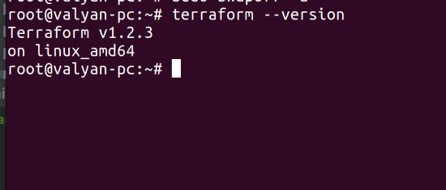
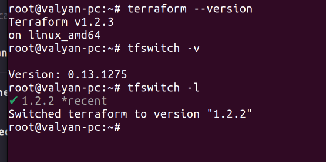

# Домашнее задание к занятию "7.1. Инфраструктура как код"

## Задача 1. Выбор инструментов. 
 
### Легенда
 
Через час совещание на котором менеджер расскажет о новом проекте. Начать работу над которым надо 
будет уже сегодня. 
На данный момент известно, что это будет сервис, который ваша компания будет предоставлять внешним заказчикам.
Первое время, скорее всего, будет один внешний клиент, со временем внешних клиентов станет больше.

Так же по разговорам в компании есть вероятность, что техническое задание еще не четкое, что приведет к большому
количеству небольших релизов, тестирований интеграций, откатов, доработок, то есть скучно не будет.  
   
Вам, как девопс инженеру, будет необходимо принять решение об инструментах для организации инфраструктуры.
На данный момент в вашей компании уже используются следующие инструменты: 
- остатки Сloud Formation, 
- некоторые образы сделаны при помощи Packer,
- год назад начали активно использовать Terraform, 
- разработчики привыкли использовать Docker, 
- уже есть большая база Kubernetes конфигураций, 
- для автоматизации процессов используется Teamcity, 
- также есть совсем немного Ansible скриптов, 
- и ряд bash скриптов для упрощения рутинных задач.  

Для этого в рамках совещания надо будет выяснить подробности о проекте, что бы в итоге определиться с инструментами:

1. Какой тип инфраструктуры будем использовать для этого проекта: изменяемый или не изменяемый?  
платформа содержит в себе "остатки cloud formation", что означает  неокончательный переход в облако, bestpractise современные толкуют о том, что лучше неизменяемая инфраструктура, в таком случае облако будет предпочтительнее локального ЦОД, опять же, все будет зависеть от нужд компании, если нужна секурность, то лучше бы посмотреть в сторону собственного ЦОД и в таком случае делать упор на изменяемую инфраструктуру и ansible соответственно, в любом случае полный отказ от ansible или от terraform некорректен, т.к оба инструмента в обоих случаях помогут по своему.  
2. Будет ли центральный сервер для управления инфраструктурой?  
С учетом того, что предлагаемые в задаче оба ключевых инструмента в контексте изменяемой\неизменяемой инфраструктуры(ansible И terraform) не требуют наличия установленных агентов, центральный сервер не пригодится, что избавит от дополнительных накладных расходов при его обслуживании
3. Будут ли агенты на серверах?  
Вопрос раскрыт в предыдущем  
4. Будут ли использованы средства для управления конфигурацией или инициализации ресурсов?   
Подитожив ответ на 1 вопрос: если нет жестких требований и большого количества вопросов к безопасникам, то лучше использовать cloud, и соответственно уклон делать в сторону неизменяемой инфраструктуры, для которой оптимальным будет система инициализации ресурсов, но, с учетом особенности Российского региона, к клауд мы придем не скоро, так что жестокие реалии говорят о том, что система управления конфигурацией была и есть неотъемлемой чатсью Российского ИТ  
 
В связи с тем, что проект стартует уже сегодня, в рамках совещания надо будет определиться со всеми этими вопросами.

### В результате задачи необходимо

1. Ответить на четыре вопроса представленных в разделе "Легенда". 
2. Какие инструменты из уже используемых вы хотели бы использовать для нового проекта?   
В контексте задачи я бы сделал упор на terraform и избавился по большей степени от "ручной автоматизации" (от нее никуда не дется), чем меньше будет инструментов, тем будет лучше для проекта, как по мне, нагромождать кучу всякого хлама по итогам может вылиться в инфраструктуру "из снежинок", что часто встречается, из-за чего возникает куча рутинной работы.  
3. Хотите ли рассмотреть возможность внедрения новых инструментов для этого проекта?   

Если для ответа на эти вопросы недостаточно информации, то напишите какие моменты уточните на совещании.

## Задача 2. Установка терраформ. 

Официальный сайт: https://www.terraform.io/

Установите терраформ при помощи менеджера пакетов используемого в вашей операционной системе.
В виде результата этой задачи приложите вывод команды `terraform --version`.

## Задача 3. Поддержка легаси кода. 

В какой-то момент вы обновили терраформ до новой версии, например с 0.12 до 0.13. 
А код одного из проектов настолько устарел, что не может работать с версией 0.13. 
В связи с этим необходимо сделать так, чтобы вы могли одновременно использовать последнюю версию терраформа установленную при помощи
штатного менеджера пакетов и устаревшую версию 0.12. 

В виде результата этой задачи приложите вывод `--version` двух версий терраформа доступных на вашем компьютере 
или виртуальной машине.  
Для поддержки различных версий установил утилиту tfswitch:  
curl -L https://raw.githubusercontent.com/warrensbox/terraform-switcher/release/install.sh | bash  
После чего появилась возможность переключаться между всем доступными от hashicorp версиями terraform:  

