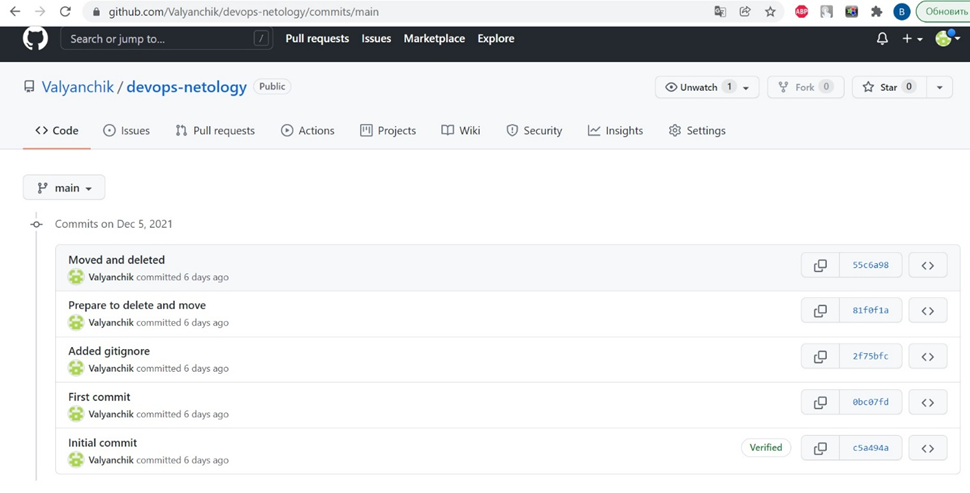
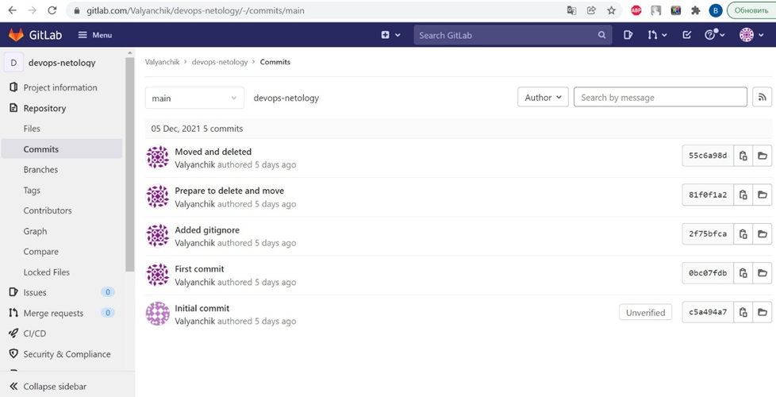
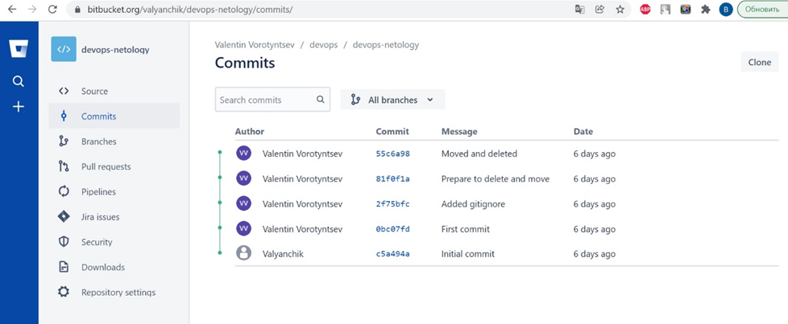
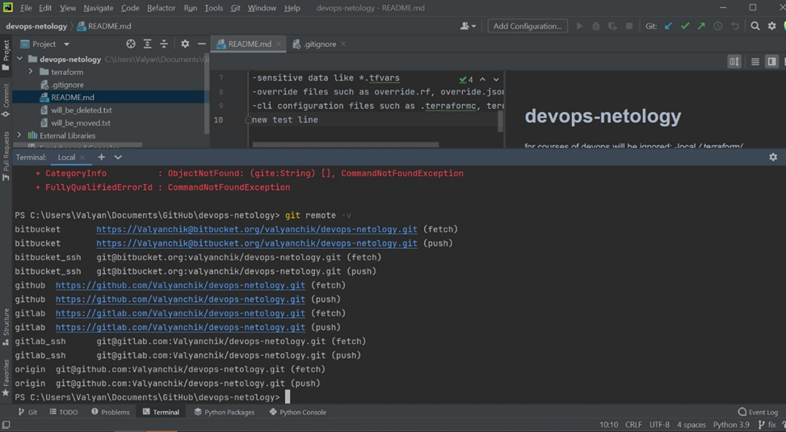
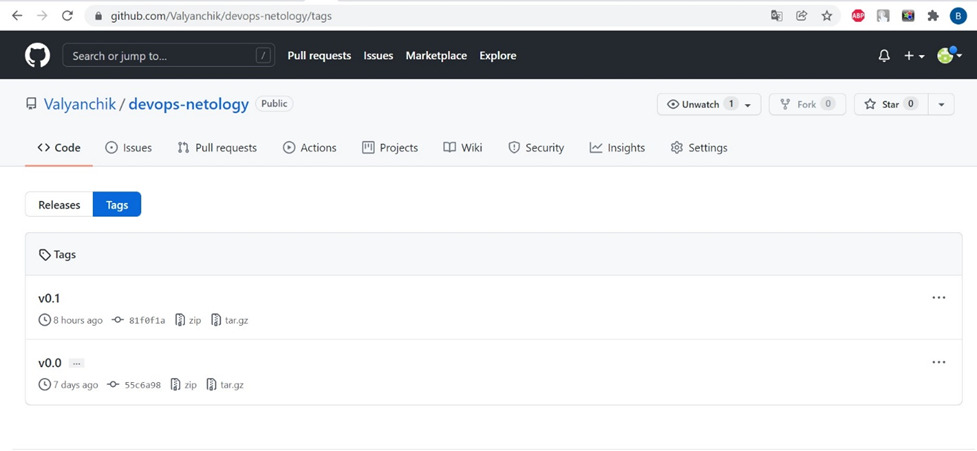
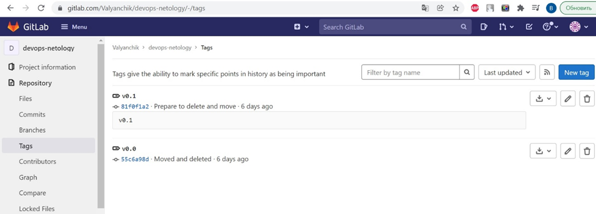
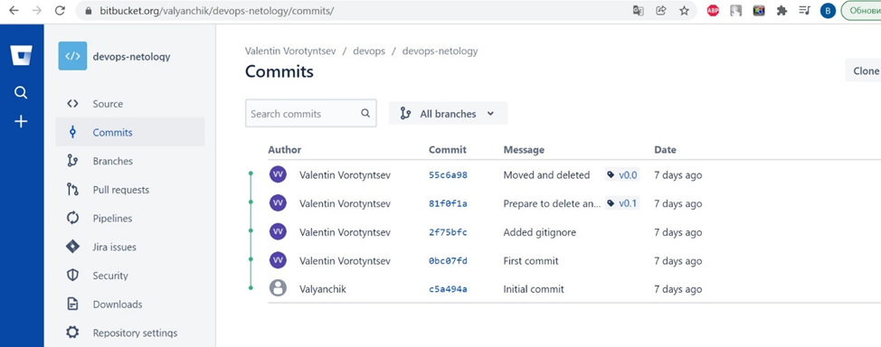
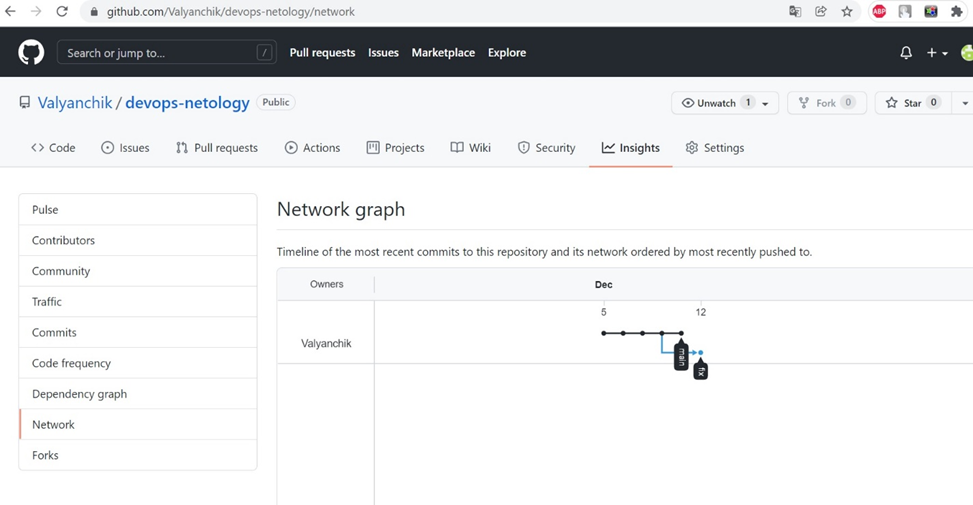
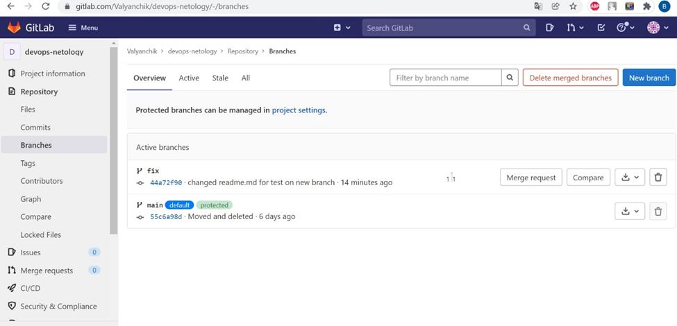
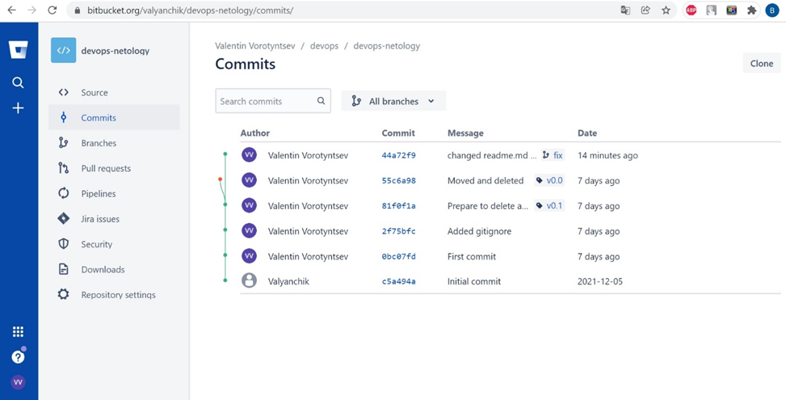

# Домашнее задание к занятию «2.2. Основы Git»

## Задание №1 – Знакомимся с gitlab и bitbucket 

История коммитов GitHub 
История коммитов GitLab 
История коммитов BitBucket 
Список подключенных удаленных репозиториев 

## Задание №2 – Теги
Теги на GitHub 
Теги на GutLab 
Теги на BitBucket 

## Задание №3 – Ветки 
Ветки на GitHub 
Ветки на GitLab 
Ветки на Bitbucket 

Ссылки на репозитории:
https://github.com/Valyanchik/devops-netology
https://gitlab.com/Valyanchik/devops-netology/
https://bitbucket.org/valyanchik/devops-netology/src/main/