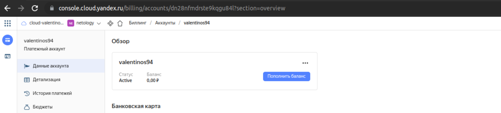
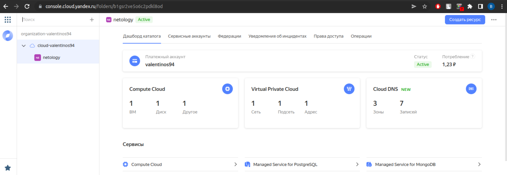
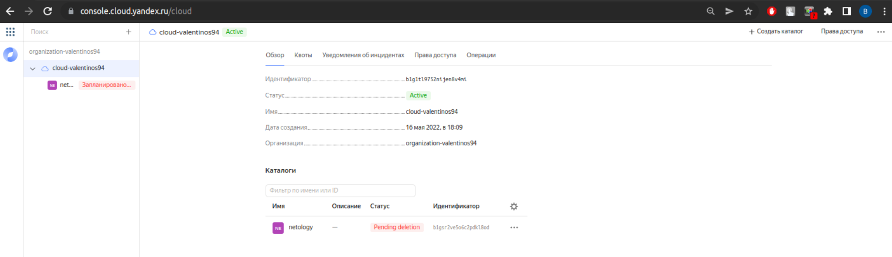

# Домашнее задание к занятию "7.2. Облачные провайдеры и синтаксис Terraform."

## Задача 1 (Вариант с Yandex.Cloud). Регистрация в ЯО и знакомство с основами (необязательно, но крайне желательно).
В целом и общем мы проделывали эти задания в блоке по docker, регистрировались в yandex.cloud с привязкой номера телефона и банковской карты, после чего Яндекс бесплатно предоставлял 1000 рубл на compute cloud и 3000 рублей на остальные ресурсы:  


Дополнительно поставим утилиты для дальнейшей работы с cloud:    
```bash
valyan@valyan-pc:~/terraform$ yc --version
Yandex Cloud CLI 0.91.0 linux/amd64
valyan@valyan-pc:~/terraform$ terraform --version
Terraform v1.2.3
on linux_amd64
+ provider registry.terraform.io/hashicorp/local v2.2.3
+ provider registry.terraform.io/hashicorp/null v3.1.1
+ provider registry.terraform.io/yandex-cloud/yandex v0.74.0
valyan@valyan-pc:~/terraform$ packer --version
1.8.0
```

## Задача 2. Создание yandex_compute_instance через терраформ. 

Для запуска ВМ в Яндекс-облаке нам пригодится:   

-образ ОС(сделаем при помощи packer)  
-folder(условное дисковое пространство, в котором будут крутиться созданые ВМ)  
-net(сетевое пространство, в котором будут крутиться ВМ, в Yandex Cloud есть SDN, что позволяет сэмулировать различные типы сетей(в рамках данного задания это не нужно, создадим простую network))  
-subnet(Именно в подсети и будут крутиться ВМ)  
-данные из вывода yc config list после инициализации профиля облака (token,cloud-id,folder-id, compute-default-zone)  


```bash
##инициализируем облако
valyan@valyan-pc:~$ yc init
Welcome! This command will take you through the configuration process.
Pick desired action:
 [1] Re-initialize this profile 'netology' with new settings 
 [2] Create a new profile
 [3] Switch to and re-initialize existing profile: 'default'
 [4] Switch to and re-initialize existing profile: 'sa-profile'
Please enter your numeric choice: 3
Please go to https://oauth.yandex.ru/authorize?response_type=token&client_id=************* in order to obtain OAuth token.

Please enter OAuth token: [AQAAAABdv***************************] 
You have one cloud available: 'cloud-valentinos94' (id = *******). It is going to be used by default.
You have no available folders. You will be guided through creating one.
Please enter a folder name: netology
Your current folder has been set to 'netology' (id = ***********).
Do you want to configure a default Compute zone? [Y/n] y
Which zone do you want to use as a profile default?
 [1] ru-central1-a
 [2] ru-central1-b
 [3] ru-central1-c
 [4] Don't set default zone
Please enter your numeric choice: 1
Your profile default Compute zone has been set to 'ru-central1-a'.

valyan@valyan-pc:~$ yc config list
token: *********
cloud-id: ********
folder-id: *********
compute-default-zone: ru-central1-a
```
```bash
####создаем в облаке сеть 
alyan@valyan-pc:~/terraform$ yc vpc network create
id: enpiicpesn1t70v6jss1
folder_id: b1gsr2ve5o6c2pdkl8od
created_at: "2022-06-26T18:53:59Z"
valyan@valyan-pc:~/terraform$ yc vpc network update enpiicpesn1t70v6jss1 --new-name net
id: enpiicpesn1t70v6jss1
folder_id: b1gsr2ve5o6c2pdkl8od
created_at: "2022-06-26T18:53:59Z"
name: net
valyan@valyan-pc:~/terraform$ yc vpc network list
+----------------------+------+
|          ID          | NAME |
+----------------------+------+
| enpiicpesn1t70v6jss1 | net  |
+----------------------+------+
##Создаем подсеть
valyan@valyan-pc:~/terraform$ yc vpc subnet create --name my-subnet-a --zone ru-central1-a --range 10.1.2.0/24 --network-name net --description "subnet via yc"
id: e9bngub1c5ue5ufaeq33
folder_id: b1gsr2ve5o6c2pdkl8od
created_at: "2022-06-26T18:58:35Z"
name: my-subnet-a
description: subnet via yc
network_id: enpiicpesn1t70v6jss1
zone_id: ru-central1-a
v4_cidr_blocks:
- 10.1.2.0/24
```
```bash
##Собираем образ пакером и проверяем его на валидность, вставляем наши параметры облака в образ

valyan@valyan-pc:~$ cat centos-7-base.json
{
  "builders": [
    {
      "disk_type": "network-nvme",
      "folder_id": "************",
      "image_description": "by packer",
      "image_family": "centos",
      "image_name": "centos-7-base",
      "source_image_family": "centos-7",
      "ssh_username": "centos",
      "subnet_id": "**********",
      "token": "**************",
      "type": "yandex",
      "use_ipv4_nat": true,
      "zone": "ru-central1-a"
    }
  ],
  "provisioners": [
    {
      "inline": [
        "sudo yum -y update",
        "sudo yum -y install bridge-utils bind-utils iptables curl net-tools tcpdump rsync telnet openssh-server"
      ],
      "type": "shell"
    }
  ]
}
##Проверяем валидность конфигурационного файла для образа ОС
valyan@valyan-pc:~$ packer validate centos-7-base.json
The configuration is valid.
```
```bash
##После чего все полученные данные запишем в variables.tf и provider.tf:  
```bash
valyan@valyan-pc:~/terraform$ cat provider.tf
# Provider
terraform {
  required_providers {
    yandex = {
      source = "yandex-cloud/yandex"
    }
  }
}

provider "yandex" {
  #service_account_key_file = "key.json"
  cloud_id  = "${var.yandex_cloud_id}"
  folder_id = "${var.yandex_folder_id}"
  zone = "${var.yandex_zone}"
  token = "${var.token}"
}
```
```bash
valyan@valyan-pc:~/terraform$ cat variables.tf

variable "yandex_cloud_id" {
  default = "********"
}
variable "yandex_folder_id" {
  default = "***********"
}
variable "centos-7-base" {
  default = "************"
}
variable "yandex_zone" {
  default ="************"
}
variable "token" {
 default = "************"
}
```


Далее в работе будут использоваться конфигурационные файлы с параметрами  и тасками для ansible, а так-же yml файлы конфигурации создаваемых хостов(взял из домашек по докеру, вместо 6 нод раскатаем для примера одну)  

```bash
##ansible config
valyan@valyan-pc:~/terraform$ cat ansible.cfg
[defaults]
inventory=./inventory
deprecation_warnings=False
command_warnings=False
ansible_port=22
host_key_checking = False

##terraform tasks 
valyan@valyan-pc:~/terraform$ cat ansible.tf
resource "null_resource" "wait" {
  provisioner "local-exec" {
    command = "sleep 100"
  }

  depends_on = [
    local_file.inventory
  ]
}

resource "null_resource" "cluster" {
  provisioner "local-exec" {
    command = "ANSIBLE_FORCE_COLOR=1 ansible-playbook -i ../ansible/inventory ../ansible/swarm-deploy-cluster.yml"
  }

  depends_on = [
    null_resource.wait
  ]
}

resource "null_resource" "sync" {
  provisioner "local-exec" {
    command = "ANSIBLE_FORCE_COLOR=1 ansible-playbook -i ../ansible/inventory ../ansible/swarm-deploy-sync.yml"
  }

  depends_on = [
    null_resource.cluster
  ]
}

resource "null_resource" "monitoring" {
  provisioner "local-exec" {
    command = "ANSIBLE_FORCE_COLOR=1 ansible-playbook -i ../ansible/inventory ../ansible/swarm-deploy-stack.yml --limit=managers"
  }

  depends_on = [
    null_resource.sync
  ]
}

valyan@valyan-pc:~/terraform$ cat inventory.tf
resource "local_file" "inventory" {
  content = <<-DOC
    # Ansible inventory containing variable values from Terraform.
    # Generated by Terraform.

    [nodes:children]
    managers
    workers

    [managers:children]
    active
    standby

    [active]
    node01.netology.yc ansible_host=${yandex_compute_instance.node01.network_interface.0.nat_ip_address}
    ##здесь были и остальные 5 нод, в данном задании они удалены
    DOC
  filename = "../ansible/inventory"

  depends_on = [
    yandex_compute_instance.node01,
  ]
}
```

```bash
##Конфигурация сети для yandex cloud(для одной ноды)
valyan@valyan-pc:~/terraform$ cat network.tf
# Network
resource "yandex_vpc_network" "default" {
  name = "net"
}

resource "yandex_vpc_subnet" "default" {
  name = "my-subnet-a"
  zone           = "ru-central1-a"
  network_id     = "${yandex_vpc_network.default.id}"
  v4_cidr_blocks = ["192.168.101.0/24"]
}
valyan@valyan-pc:~/terraform$ cat node1.tf
resource "yandex_compute_instance" "node01" {
  name                      = "node01"
  zone                      = "ru-central1-a"
  hostname                  = "node01.netology.yc"
  allow_stopping_for_update = true

  resources {
    cores  = 4
    memory = 8
  }

  boot_disk {
    initialize_params {
      image_id    = "${var.centos-7-base}"
      name        = "root-node01"
      type        = "network-nvme"
      size        = "10"
    }
  }

  network_interface {
    subnet_id  = "${yandex_vpc_subnet.default.id}"
    nat        = true
    ip_address = "192.168.101.11"
  }

  metadata = {
    ssh-keys = "centos:${file("~/.ssh/id_rsa.pub")}"
  }
}
```
```bash
valyan@valyan-pc:~/terraform$ cat output.tf
output "internal_ip_address_node01" {
  value = "${yandex_compute_instance.node01.network_interface.0.ip_address}"
}

output "external_ip_address_node01" {
  value = "${yandex_compute_instance.node01.network_interface.0.nat_ip_address}"
}
```

```bash
valyan@valyan-pc:~/terraform$ cat terraform.tfstate
{
  "version": 4,
  "terraform_version": "1.1.9",
  "serial": 28,
  "lineage": "8b2fea0b-01b1-049b-20d1-ba0d29032ac3",
  "outputs": {},
  "resources": []
}
valyan@valyan-pc:~/terraform$
```

После того, как все необходимые конфигурационные файлы собраны и настроены, проверяем terraform plan:  
terraform plan
```bash
valyan@valyan-pc:~/terraform$ terraform plan

Terraform used the selected providers to generate the following execution plan.
Resource actions are indicated with the following symbols:
  + create

Terraform will perform the following actions:

  # local_file.inventory will be created
  + resource "local_file" "inventory" {
      + content              = (known after apply)
      + directory_permission = "0777"
      + file_permission      = "0777"
      + filename             = "../ansible/inventory"
      + id                   = (known after apply)
    }

  # null_resource.cluster will be created
  + resource "null_resource" "cluster" {
      + id = (known after apply)
    }

  # null_resource.monitoring will be created
  + resource "null_resource" "monitoring" {
      + id = (known after apply)
    }

  # null_resource.sync will be created
  + resource "null_resource" "sync" {
      + id = (known after apply)
    }

  # null_resource.wait will be created
  + resource "null_resource" "wait" {
      + id = (known after apply)
    }

  # yandex_compute_instance.node01 will be created
  + resource "yandex_compute_instance" "node01" {
      + allow_stopping_for_update = true
      + created_at                = (known after apply)
      + folder_id                 = (known after apply)
      + fqdn                      = (known after apply)
      + hostname                  = "node01.netology.yc"
      + id                        = (known after apply)
      + metadata                  = {
          + "ssh-keys" = <<-EOT
                centos:ssh-rsa AAAAB3NzaC1yc2EAAAADAQABAAABgQD4VMi3rdna3RKNyCuEBc5gYhuvWSAA4oEQdA6Y6FWnc3JD6HOzH7PLAIMk4fADWe3+MLPf2lldq+9plxIYlYZgSvRdJDrLtjBKZvqxeo8KBeMD02NgQrFEScPpsZmGX79lEHopSeKxCogiNotqIH9XBQoBZIT4bIg1WIV+mUbJKYsfu5bQYW4ePqoRI5L4pOLhZcei6lMgoZjgjuldDIaG9s7WFrO7t0QLMc+xw/vvQQtA3uEGh3AEvYSC/xOYZk500pSy25sEp/uTBafO3T5016Dakc4QVuYUaypOC2DKkW6cm/PbTJt8gfSFZ+LkJ5r0+/Ii2Scc3/UyuIiISBQoNPaEMUIzr3PBAmaERL+JfkVAjo2i9qpMxrnlXmDoAhElMlYV4LVwXVzMUWikC94evqAe5eFrPTfP7RnKD3faotIPvoiNlgMhrxeDHQrVhfBkq4pJK0vwxNCgHQL+FO+iCcktSSTQ2VA0y6UvmMz5Bhm3Jz3QHpqF2gRPUnrgTQ8= valyan@valyan-pc
            EOT
        }
      + name                      = "node01"
      + network_acceleration_type = "standard"
      + platform_id               = "standard-v1"
      + service_account_id        = (known after apply)
      + status                    = (known after apply)
      + zone                      = "ru-central1-a"

      + boot_disk {
          + auto_delete = true
          + device_name = (known after apply)
          + disk_id     = (known after apply)
          + mode        = (known after apply)

          + initialize_params {
              + block_size  = (known after apply)
              + description = (known after apply)
              + image_id    = "fd8kmac9piub22cbcj6a"
              + name        = "root-node01"
              + size        = 10
              + snapshot_id = (known after apply)
              + type        = "network-nvme"
            }
        }

      + network_interface {
          + index              = (known after apply)
          + ip_address         = "192.168.101.11"
          + ipv4               = true
          + ipv6               = (known after apply)
          + ipv6_address       = (known after apply)
          + mac_address        = (known after apply)
          + nat                = true
          + nat_ip_address     = (known after apply)
          + nat_ip_version     = (known after apply)
          + security_group_ids = (known after apply)
          + subnet_id          = (known after apply)
        }

      + placement_policy {
          + host_affinity_rules = (known after apply)
          + placement_group_id  = (known after apply)
        }

      + resources {
          + core_fraction = 100
          + cores         = 4
          + memory        = 8
        }

      + scheduling_policy {
          + preemptible = (known after apply)
        }
    }

  # yandex_vpc_network.default will be created
  + resource "yandex_vpc_network" "default" {
      + created_at                = (known after apply)
      + default_security_group_id = (known after apply)
      + folder_id                 = (known after apply)
      + id                        = (known after apply)
      + labels                    = (known after apply)
      + name                      = "net"
      + subnet_ids                = (known after apply)
    }

  # yandex_vpc_subnet.default will be created
  + resource "yandex_vpc_subnet" "default" {
      + created_at     = (known after apply)
      + folder_id      = (known after apply)
      + id             = (known after apply)
      + labels         = (known after apply)
      + name           = "my-subnet-a"
      + network_id     = (known after apply)
      + v4_cidr_blocks = [
          + "192.168.101.0/24",
        ]
      + v6_cidr_blocks = (known after apply)
      + zone           = "ru-central1-a"
    }

Plan: 8 to add, 0 to change, 0 to destroy.

Changes to Outputs:
  + external_ip_address_node01 = (known after apply)
  + internal_ip_address_node01 = "192.168.101.11"

───────────────────────────────────────────────────────────────────────────────

Note: You didn't use the -out option to save this plan, so Terraform can't
guarantee to take exactly these actions if you run "terraform apply" now.
valyan@valyan-pc:~/terraform$ 
```
terraform plan ошибок не выдал, но при запуске terraform apply первый раз ругнулся на настройки network, все дело в том, что я не удалил сеть и подсеть после создания образа ОС пакером, настроенный план предполагает, что в yandex-cloud Не будет ничего кроме folder(удалил сеть и подсеть, запустил еще раз terraform apply):  

```bash
valyan@valyan-pc:~/terraform$ terraform apply

Terraform used the selected providers to generate the following execution plan. Resource actions are indicated
with the following symbols:


Apply complete! Resources: 8 added, 0 changed, 0 destroyed.

Outputs:

external_ip_address_node01 = "51.250.81.68"
internal_ip_address_node01 = "192.168.101.11"
valyan@valyan-pc:~/terraform$ ssh centos@51.250.81.68
[centos@node01 ~]$
```
Весь вывод terraform apply прикладывать не стал, там киллометровая лента, которая завершилась успешно  

После того, как план terraform выполнился успешно, проверяем содержимое yandex cloud:  
```bash
##созданные образы ОС
valyan@valyan-pc:~/terraform$ yc compute image list
+----------------------+---------------+--------+----------------------+--------+
|          ID          |     NAME      | FAMILY |     PRODUCT IDS      | STATUS |
+----------------------+---------------+--------+----------------------+--------+
| fd8kmac9piub22cbcj6a | centos-7-base | centos | f2euv1kekdgvc0jrpaet | READY  |
+----------------------+---------------+--------+----------------------+--------+

valyan@valyan-pc:~/terraform$
```
```bash
##Созданные сети
valyan@valyan-pc:~/terraform$ yc vpc network list
+----------------------+------+
|          ID          | NAME |
+----------------------+------+
| enpq17u27btai9vu5ccv | net  |
+----------------------+------+
```
```bash
##созданные подсети
valyan@valyan-pc:~/terraform$ yc vpc subnet list
+----------------------+-------------+----------------------+----------------+---------------+--------------------+
|          ID          |    NAME     |      NETWORK ID      | ROUTE TABLE ID |     ZONE      |       RANGE        |
+----------------------+-------------+----------------------+----------------+---------------+--------------------+
| e9bjc0ckbq6dlranbpgi | my-subnet-a | enpq17u27btai9vu5ccv |                | ru-central1-a | [192.168.101.0/24] |
+----------------------+-------------+----------------------+----------------+---------------+--------------------+
```
Так же, всю информацию можно подсмотреть в web:  
cloud:


vm:  


net:  


dns:  


более подробно vm:  


image:  


После проделанной работы удаляем все объекты compute cloud, дабы не расходовать халявные денюшки:  
финальный экран:


В качестве результата задания предоставьте:
1. Ответ на вопрос: при помощи какого инструмента (из разобранных на прошлом занятии) можно создать свой образ ami?  

Я создавал образ при помощи packer, но можно и без packer-а, в yandex-cloud есть уже список преднастроенных образов (правда, я не до конца разобрался, то платно или бесплатно, + на зеркалах самого hashicorp можно откопать готовые преднастроенные образы)  
2. Ссылку на репозиторий с исходной конфигурацией терраформа. 

Я приложил вывод содержимого variables.tf и provider.tf в ходе задания

