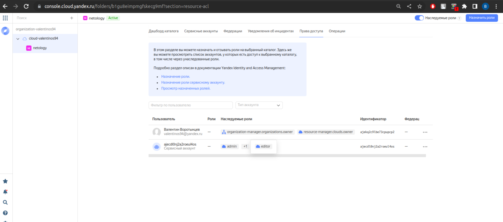

# Домашнее задание к занятию "7.3. Основы и принцип работы Терраформ"

## Задача 1. Создадим бэкэнд в S3 (необязательно, но крайне желательно).

Если в рамках предыдущего задания у вас уже есть аккаунт AWS, то давайте продолжим знакомство со взаимодействием
терраформа и aws. 

1. Создайте s3 бакет, iam роль и пользователя от которого будет работать терраформ. Можно создать отдельного пользователя,
а можно использовать созданного в рамках предыдущего задания, просто добавьте ему необходимы права, как описано 
[здесь](https://www.terraform.io/docs/backends/types/s3.html).
1. Зарегистрируйте бэкэнд в терраформ проекте как описано по ссылке выше. 

## Задача 2. Инициализируем проект и создаем воркспейсы. 

1. Выполните `terraform init`:
    * если был создан бэкэнд в S3, то терраформ создат файл стейтов в S3 и запись в таблице 
dynamodb.
    * иначе будет создан локальный файл со стейтами.  
1. Создайте два воркспейса `stage` и `prod`.
1. В уже созданный `aws_instance` добавьте зависимость типа инстанса от вокспейса, что бы в разных ворскспейсах 
использовались разные `instance_type`.
1. Добавим `count`. Для `stage` должен создаться один экземпляр `ec2`, а для `prod` два. 
1. Создайте рядом еще один `aws_instance`, но теперь определите их количество при помощи `for_each`, а не `count`.
1. Что бы при изменении типа инстанса не возникло ситуации, когда не будет ни одного инстанса добавьте параметр
жизненного цикла `create_before_destroy = true` в один из рессурсов `aws_instance`.
1. При желании поэкспериментируйте с другими параметрами и рессурсами.

В виде результата работы пришлите:
* Вывод команды `terraform workspace list`.
* Вывод команды `terraform plan` для воркспейса `prod`.  

---

### Как cдавать задание

Выполненное домашнее задание пришлите ссылкой на .md-файл в вашем репозитории.

---
инициализируем облако, запиливаем в переменные ИД фолдера
valyan@valyan-pc:~/terraform$ yc init
Welcome! This command will take you through the configuration process.
Pick desired action:
 [1] Re-initialize this profile 'default' with new settings 
 [2] Create a new profile
 [3] Switch to and re-initialize existing profile: 'netology'
 [4] Switch to and re-initialize existing profile: 'sa-profile'
Please enter your numeric choice: 3
Please go to https://oauth.yandex.ru/authorize?response_type=token&client_id=1a6990aa636648e9b2ef855fa7bec2fb in order to obtain OAuth token.

Please enter OAuth token: [AQAAAABdv*********************xLK4-WdQ4] 
You have one cloud available: 'cloud-valentinos94' (id = b1g1tl9752nijen8v4mi). It is going to be used by default.
You have no available folders. You will be guided through creating one.
Please enter a folder name: netology
Your current folder has been set to 'netology' (id = b1gu8eimpmgfskecg9mf).
Do you want to configure a default Compute zone? [Y/n] y
Which zone do you want to use as a profile default?
 [1] ru-central1-a
 [2] ru-central1-b
 [3] ru-central1-c
 [4] Don't set default zone
Please enter your numeric choice: 1
Your profile default Compute zone has been set to 'ru-central1-a'.
valyan@valyan-pc:~/terraform$ yc config list
token: AQAAAABdvPQLAATuwQE7FkpCB01lpWxLK4-WdQ4
cloud-id: b1g1tl9752nijen8v4mi
folder-id: b1gu8eimpmgfskecg9mf
compute-default-zone: ru-central1-a
valyan@valyan-pc:~/terraform$ 

создаем сервисный ак и статический ключ к нему

Назначаем роль сервисному аккаунту

Созданный сервисный аккаунт

СОздаем сеть в консоли

СОздаем ВМ

Создаем целевую группу

СОздаем бакет

СОздаем группу бэкендов с одни бекендом

СОздаем бакет и назначем права на чтение запись сервисной учетке odmen бакету:

