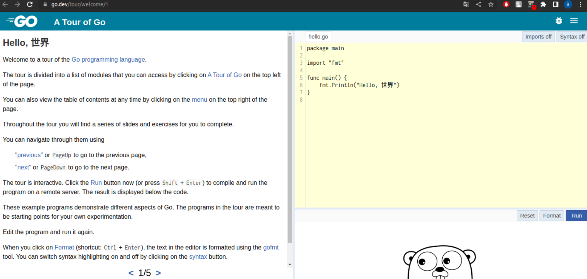

# Домашнее задание к занятию "7.5. Основы golang"


## Задача 1. Установите golang.
1. Воспользуйтесь инструкций с официального сайта: [https://golang.org/](https://golang.org/).

```bash
valyan@valyan-pc:~$ go version
go version go1.18.1 linux/amd64
```

## Задача 2. Знакомство с gotour.
Ознакомлен  
  

## Задача 3. Написание кода. 
Цель этого задания закрепить знания о базовом синтаксисе языка. Можно использовать редактор кода 
на своем компьютере, либо использовать песочницу: [https://play.golang.org/](https://play.golang.org/).

1. Напишите программу для перевода метров в футы (1 фут = 0.3048 метр). Можно запросить исходные данные 
у пользователя, а можно статически задать в коде.
    Для взаимодействия с пользователем можно использовать функцию `Scanf`:
```bash
valyan@valyan-pc:~/PycharmProjects/devops-netology/DZ32$ cat conv.go
package main
        
        import "fmt"
        
        import "math"
        
        func main() {
            fmt.Print("Введи значение в футах: ")
            var input float64
            
            fmt.Scanf("%f", &input)           // округлим до 2х знаков в строке
            output := input * float64(0.3048) // точное значение 
            rOutput := math.Round(output)     // округлим до целого
            sOutput := fmt.Sprintf("( %.2f)", output)
            fmt.Println("Значение в метрах:", rOutput, sOutput )    
        }
valyan@valyan-pc:~/PycharmProjects/devops-netology/DZ32$ go run conv.go
Введи значение в футах: 50
Значение в метрах: 15 ( 15.24)
```
 
2. Напишите программу, которая найдет наименьший элемент в любом заданном списке, например:
    ```
    x := []int{48,96,86,68,57,82,63,70,37,34,83,27,19,97,9,17,}
    ```
```bash
   valyan@valyan-pc:~/PycharmProjects/devops-netology/DZ32$ cat less.go
        package main
        
        import "fmt"
        
        func main() {
            x := []int{48,2, 96,86,3,68,57,82,63,70,37,34,83,27,19,97,9,17,1}
            current := 0
            fmt.Println ("Массив чисел : ", x)
            for i, value := range x {
                if (i == 0) {
                   current = value 
                } else {
                    if (value < current){
                        current = value
                    }
                }
            }
            fmt.Println("Наименьшее  число : ", current)
        }    
valyan@valyan-pc:~/PycharmProjects/devops-netology/DZ32$ go run less.go
Массив чисел :  [48 2 96 86 3 68 57 82 63 70 37 34 83 27 19 97 9 17 1]
Наименьшее  число :  1
```
3. Напишите программу, которая выводит числа от 1 до 100, которые делятся на 3. То есть `(3, 6, 9, …)`.

В виде решения ссылку на код или сам код. 
```bash
valyan@valyan-pc:~/PycharmProjects/devops-netology/DZ32$ cat 3.go
package main
        
        import "fmt"
        
        
        func main() {
            
            for i := 1; i <= 100; i++ {
                if ((i-1)%10) ==0 {
                        fmt.Print(i-1," -> ")
                }            
                        
                if (i%3) == 0 {
                    fmt.Print(i,", ")
                    }
                if (i%10) ==0 {
                    fmt.Println()
                }
            }
        }
valyan@valyan-pc:~/PycharmProjects/devops-netology/DZ32$ go run 3.go
0 -> 3, 6, 9, 
10 -> 12, 15, 18, 
20 -> 21, 24, 27, 30, 
30 -> 33, 36, 39, 
40 -> 42, 45, 48, 
50 -> 51, 54, 57, 60, 
60 -> 63, 66, 69, 
70 -> 72, 75, 78, 
80 -> 81, 84, 87, 90, 
90 -> 93, 96, 99, 
```

