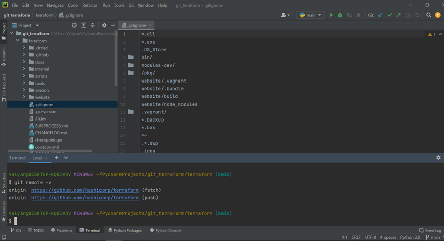

# Домашнее задание к занятию «2.4. Инструменты Git»

Для выполнения заданий в этом разделе давайте склонируем репозиторий с исходным кодом 
терраформа https://github.com/hashicorp/terraform 

В виде результата напишите текстом ответы на вопросы и каким образом эти ответы были получены. 

1. Найдите полный хеш и комментарий коммита, хеш которого начинается на `aefea`.
git show aefea
commit aefead2207ef7e2aa5dc81a34aedf0cad4c32545
Author: Alisdair McDiarmid <alisdair@users.noreply.github.com>
Date:   Thu Jun 18 10:29:58 2020 -0400

2. Какому тегу соответствует коммит `85024d3`?
git show 85024d3
commit 85024d3100126de36331c6982bfaac02cdab9e76 (tag: v0.12.23)
Тэг указан справа от ХЭШ коммита

3. Сколько родителей у коммита `b8d720`? Напишите их хеши.
git cat-file -p b8d720
Вывод будет следующим:

tree cec002aab630c8bc701cb85bc94e55e751cd2d8f
parent 56cd7859e05c36c06b56d013b55a252d0bb7e158  (наш родитель)
parent 9ea88f22fc6269854151c571162c5bcf958bee2b  (наш родитель)
author Chris Griggs <cgriggs@hashicorp.com> 1579657548 -0800
committer GitHub <noreply@github.com> 1579657548 -0800
gpgsig -----BEGIN PGP SIGNATURE-----

 wsBcBAABCAAQBQJeJ6lMCRBK7hj4Ov3rIwAAdHIIAAWogFD+6nxgm7suNlJVqGv3
 iczwk1OySRvZiDhgJuaIEZMduudoIBnv7XStZsg5wQ7a0byh4iU6z7w6vVKPyj1e
 2KyTqwriHOYqDJ/pljIX92btLU+rXDP0DpnTg8WuMthqUJGh6q8OGorvlIHDwcdN
 DKZxKaLPaBYCD5nuYMyhuh9T6+4ayEN4zUbl5vLPN7XmvhSf4yDQ0H4UaR596qOo
 phaqODHglNLegdGwi+JaTtDSB/JO5zJNfn8OnuRgyhoplmKKlhBAEwS4muxjjkzD
 cUtFA+jkXaVpbfEh/dBRb3yB4W17jrxFDuDESjXKiU61bc8Fwa1JrfQAFlXczmY=
 =s9Hk
 -----END PGP SIGNATURE-----

Merge pull request #23916 from hashicorp/cgriggs01-stable

[Cherrypick] community links

4. Перечислите хеши и комментарии всех коммитов которые были сделаны между тегами  v0.12.23 и v0.12.24.
git log --oneline --graph v0.12.23  v0.12.24
* 33ff1c03b (tag: v0.12.24) v0.12.24
* b14b74c49 [Website] vmc provider links
* 3f235065b Update CHANGELOG.md
* 6ae64e247 registry: Fix panic when server is unreachable
* 5c619ca1b website: Remove links to the getting started guide's old location
* 06275647e Update CHANGELOG.md
* d5f9411f5 command: Fix bug when using terraform login on Windows
* 4b6d06cc5 Update CHANGELOG.md
* dd01a3507 Update CHANGELOG.md
* 225466bc3 Cleanup after v0.12.23 release
* 85024d310 (tag: v0.12.23) v0.12.23

5. Найдите коммит в котором была создана функция `func providerSource`, ее определение в коде выглядит 
так `func providerSource(...)` (вместо троеточего перечислены аргументы).
git log -S 'providerSource'  --pretty=format:"%h %cd"
5b266dd5c Wed Oct 20 06:42:47 2021 -0700
c587384df Tue Oct 19 09:32:30 2021 -0400
583859e51 Thu Jun 17 12:08:37 2021 -0400
5f30efe85 Wed May 5 14:13:20 2021 -0400
c89004d22 Tue Apr 27 10:29:34 2021 -0400
31a5aa187 Tue Mar 9 11:12:00 2021 -0500
bab497912 Fri Dec 11 08:00:15 2020 -0800
e70ab09bf Wed Oct 14 07:53:41 2020 -0700
b3f5c7f1e Fri Oct 9 09:26:23 2020 -0700
0b734a280 Tue Sep 29 10:00:35 2020 -0700
9f824c53a Tue Sep 1 14:02:19 2020 -0400
d8e996436 Mon Aug 17 17:14:12 2020 -0400
87d1fb400 Tue Jul 7 15:20:20 2020 -0400
6b3d0ee64 Tue Jun 16 14:47:57 2020 -0400
dbe139e61 Tue Jun 16 14:47:57 2020 -0400
b611bd720 Fri Jun 12 15:39:55 2020 -0400
8b279b6f3 Thu May 28 15:20:41 2020 -0400
ca4010706 Thu May 28 09:24:32 2020 -0400
62d826e06 Mon May 25 16:50:12 2020 -0400
ae98bd12a Thu May 7 11:38:55 2020 -0400
5af1e6234 Tue Apr 21 16:28:59 2020 -0700
269d51148 Fri Apr 10 15:08:10 2020 -0400
8c928e835 Mon Apr 6 09:24:23 2020 -0700
958ea4f7d Mon Apr 6 09:24:23 2020 -0700
de6c9ccec Mon Apr 6 09:24:23 2020 -0700
0af09b23c Mon Apr 6 09:24:23 2020 -0700
add7006de Mon Apr 6 09:24:23 2020 -0700
d40085f37 Mon Apr 6 09:24:23 2020 -0700
3b0b29ef5 Mon Mar 16 12:50:24 2020 -0400
18dd1bb4d Fri Jan 10 11:54:53 2020 -0500
5e06e39fc Wed Nov 28 11:54:39 2018 -0600
Смотрим по дате создания самый первый коммит, в котором упоминается искомая функция providerSource, в нашем случае это коммит 5e06e39fc Wed Nov 28 11:54:39 2018 -0600

6. Найдите все коммиты в которых была изменена функция `globalPluginDirs`.
git log -S 'globalPluginDirs'  --pretty=format:"%h - %s"

35a058fb3 - main: configure credentials from the CLI config file
c0b176109 - prevent log output during init
8364383c3 - Push plugin discovery down into command package

7. Кто автор функции `synchronizedWriters`? 
git log -S 'synchronizedWriters'  --pretty=format:"%h - %an"

bdfea50cc - James Bardin
fd4f7eb0b - James Bardin
5ac311e2a - Martin Atkins
В нашем случае автором был Martin Atkins, в дальнейшем функцию правил James Bardin

 
Склонированный репозиторий hashicorp/terraform: 
