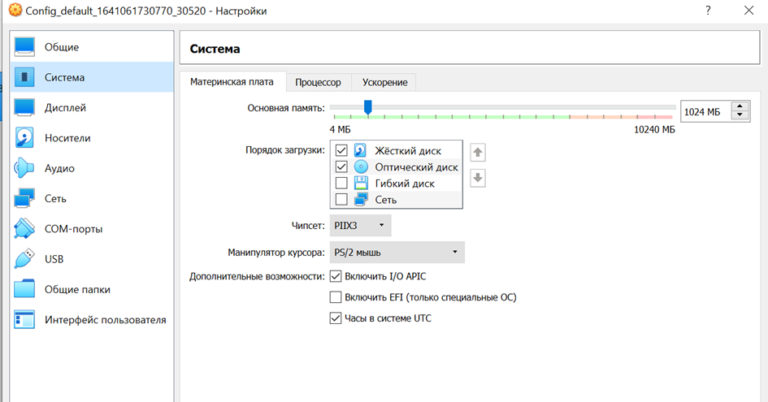
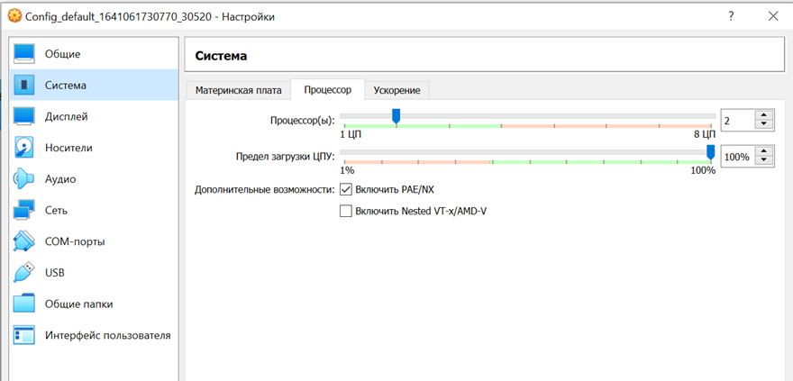
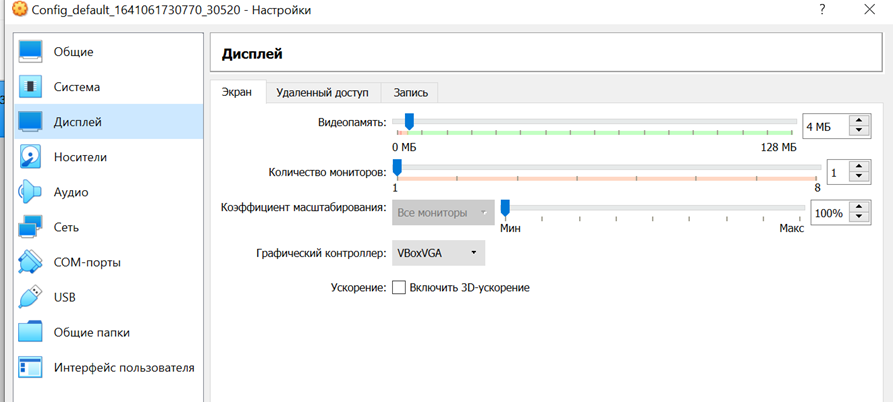
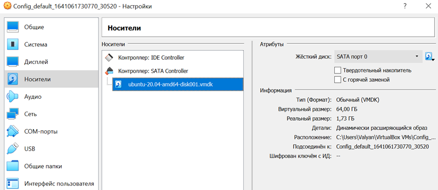
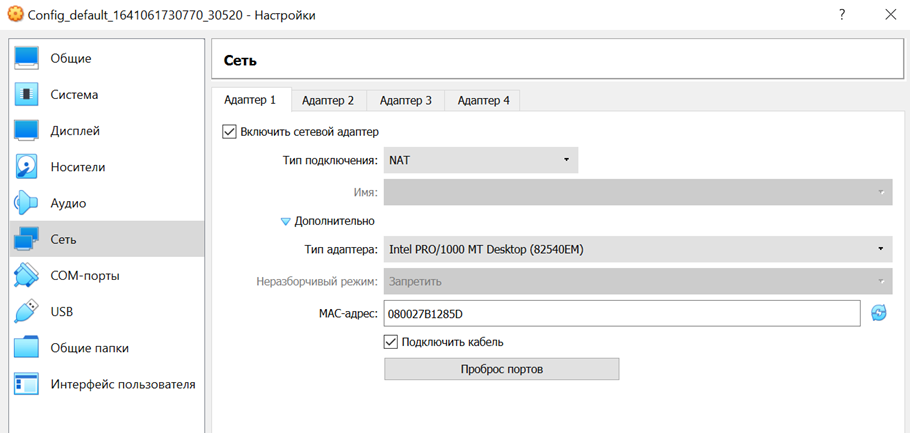
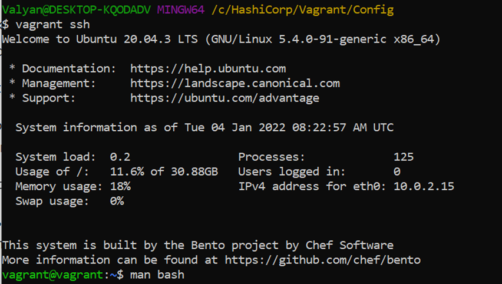
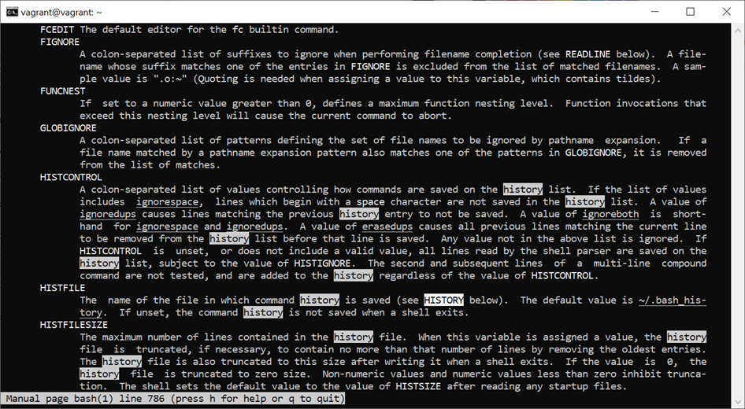
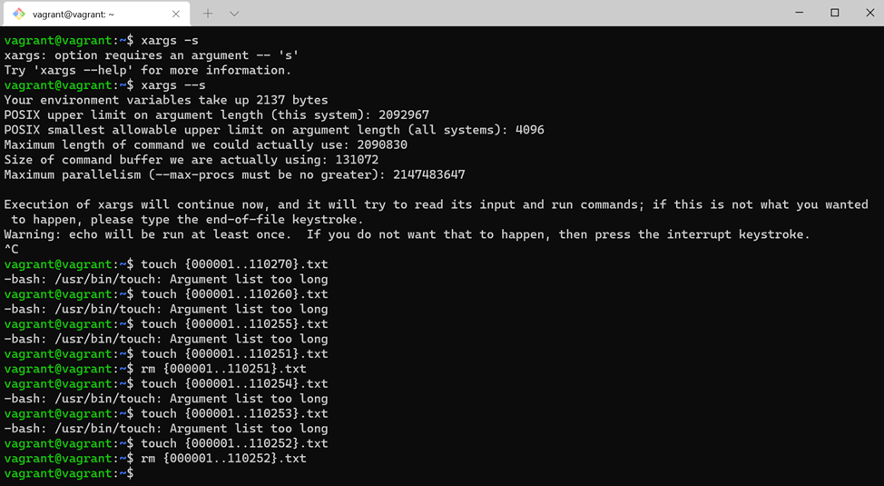
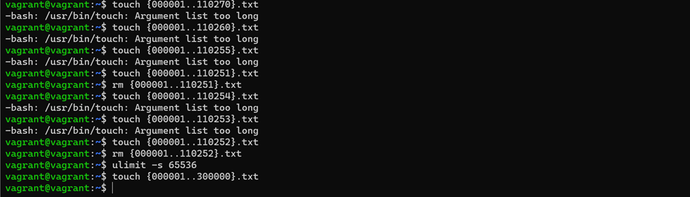

# Домашнее задание к занятию "3.1. Работа в терминале, лекция 1"

1. Установите средство виртуализации [Oracle VirtualBox](https://www.virtualbox.org/).

2. Установите средство автоматизации [Hashicorp Vagrant](https://www.vagrantup.com/).


3. В вашем основном окружении подготовьте удобный для дальнейшей работы терминал. Можно предложить:

    * iTerm2 в Mac OS X
    * Windows Terminal в Windows
    * выбрать цветовую схему, размер окна, шрифтов и т.д.
    * почитать о кастомизации PS1/применить при желании.

    Несколько популярных проблем:
    * Добавьте Vagrant в правила исключения перехватывающих трафик для анализа антивирусов, таких как Kaspersky, если у вас возникают связанные с SSL/TLS ошибки,
    * MobaXterm может конфликтовать с Vagrant в Windows,
    * Vagrant плохо работает с директориями с кириллицей (может быть вашей домашней директорией), тогда можно либо изменить [VAGRANT_HOME](https://www.vagrantup.com/docs/other/environmental-variables#vagrant_home), либо создать в системе профиль пользователя с английским именем,
    * VirtualBox конфликтует с Windows Hyper-V и его необходимо [отключить](https://www.vagrantup.com/docs/installation#windows-virtualbox-and-hyper-v),
    * [WSL2](https://docs.microsoft.com/ru-ru/windows/wsl/wsl2-faq#does-wsl-2-use-hyper-v-will-it-be-available-on-windows-10-home) использует Hyper-V, поэтому с ним VirtualBox также несовместим,
    * аппаратная виртуализация (Intel VT-x, AMD-V) должна быть активна в BIOS,
    * в Linux при установке [VirtualBox](https://www.virtualbox.org/wiki/Linux_Downloads) может дополнительно потребоваться пакет `linux-headers-generic` (debian-based) / `kernel-devel` (rhel-based).

4. С помощью базового файла конфигурации запустите Ubuntu 20.04 в VirtualBox посредством Vagrant:

    * Создайте директорию, в которой будут храниться конфигурационные файлы Vagrant. В ней выполните `vagrant init`. Замените содержимое Vagrantfile по умолчанию следующим:

        ```bash
        Vagrant.configure("2") do |config|
            config.vm.box = "bento/ubuntu-20.04"
        end
        ```

    * Выполнение в этой директории `vagrant up` установит провайдер VirtualBox для Vagrant, скачает необходимый образ и запустит виртуальную машину.

    * `vagrant suspend` выключит виртуальную машину с сохранением ее состояния (т.е., при следующем `vagrant up` будут запущены все процессы внутри, которые работали на момент вызова suspend), `vagrant halt` выключит виртуальную машину штатным образом.
Вывод консоли при запуске vagrant up после всех настроек выглядит следующим образом:
Valyan@DESKTOP-KQODADV MINGW64 /c/HashiCorp/Vagrant/Config
$ vagrant up
Bringing machine 'default' up with 'virtualbox' provider...
==> default: Box 'bento/ubuntu-20.04' could not be found. Attempting to find and install...
    default: Box Provider: virtualbox
    default: Box Version: >= 0
==> default: Loading metadata for box 'bento/ubuntu-20.04'
    default: URL: https://vagrantcloud.com/bento/ubuntu-20.04
==> default: Adding box 'bento/ubuntu-20.04' (v202112.19.0) for provider: virtualbox
    default: Downloading: https://vagrantcloud.com/bento/boxes/ubuntu-20.04/versions/202112.19.0/providers/virtualbox.box
    default:
==> default: Successfully added box 'bento/ubuntu-20.04' (v202112.19.0) for 'virtualbox'!
==> default: Importing base box 'bento/ubuntu-20.04'...
==> default: Matching MAC address for NAT networking...
==> default: Checking if box 'bento/ubuntu-20.04' version '202112.19.0' is up to date...
==> default: Setting the name of the VM: Config_default_1641061730770_30520
Vagrant is currently configured to create VirtualBox synced folders with
the `SharedFoldersEnableSymlinksCreate` option enabled. If the Vagrant
guest is not trusted, you may want to disable this option. For more
information on this option, please refer to the VirtualBox manual:

  https://www.virtualbox.org/manual/ch04.html#sharedfolders

This option can be disabled globally with an environment variable:

  VAGRANT_DISABLE_VBOXSYMLINKCREATE=1

or on a per folder basis within the Vagrantfile:

  config.vm.synced_folder '/host/path', '/guest/path', SharedFoldersEnableSymlinksCreate: false
==> default: Clearing any previously set network interfaces...
==> default: Preparing network interfaces based on configuration...
    default: Adapter 1: nat
==> default: Forwarding ports...
    default: 22 (guest) => 2222 (host) (adapter 1)
==> default: Booting VM...
==> default: Waiting for machine to boot. This may take a few minutes...
    default: SSH address: 127.0.0.1:2222
    default: SSH username: vagrant
    default: SSH auth method: private key
    default:
    default: Vagrant insecure key detected. Vagrant will automatically replace
    default: this with a newly generated keypair for better security.
    default:
    default: Inserting generated public key within guest...
    default: Removing insecure key from the guest if it's present...
    default: Key inserted! Disconnecting and reconnecting using new SSH key...
==> default: Machine booted and ready!
==> default: Checking for guest additions in VM...
==> default: Mounting shared folders...
    default: /vagrant => C:/HashiCorp/Vagrant/Config

5. Ознакомьтесь с графическим интерфейсом VirtualBox, посмотрите как выглядит виртуальная машина, которую создал для вас Vagrant, какие аппаратные ресурсы ей выделены. Какие ресурсы выделены по-умолчанию?
Параметры сэмулированной материнской платы ВМ
Параметры сэмулированного процессора ВМ 
Параметры сэмулированного видеоадаптера ВМ 
Параметры сэмулированного диска ВМ 
Параметры сэмулированного сетевого адаптера ВМ 

6. Ознакомьтесь с возможностями конфигурации VirtualBox через Vagrantfile: [документация](https://www.vagrantup.com/docs/providers/virtualbox/configuration.html). Как добавить оперативной памяти или ресурсов процессора виртуальной машине?
config.vm.provider "virtualbox" do |v|  
v.memory = 1024  v.cpus = 2
end

7. Команда `vagrant ssh` из директории, в которой содержится Vagrantfile, позволит вам оказаться внутри виртуальной машины без каких-либо дополнительных настроек. Попрактикуйтесь в выполнении обсуждаемых команд в терминале Ubuntu.
Подключение к ВМ из терминала при помощи vagrant ssh 

8. Ознакомиться с разделами `man bash`, почитать о настройках самого bash:
   
    * какой переменной можно задать длину журнала `history`, и на какой строчке manual это описывается?
    HISTSIZE — количество команд, которые необходимо запоминать в списке истории (по умолчанию — 500);
    HISTFILESIZE — максимальное количество строк, содержащееся в файле истории ~/.bash_history (по умолчанию — 500);
    Страничка по histsize из man 
   
    * что делает директива `ignoreboth` в bash?
    Опция HISTCONTROL контролирует каким образом список команд сохраняется в истории.
    ignorespace — не сохранять строки начинающиеся с символа <пробел>
    ignoredups — не сохранять строки, совпадающие с последней выполненной командой
    ignoreboth — использовать обе опции ‘ignorespace’ и ‘ignoredups’
   
9. В каких сценариях использования применимы скобки `{}` и на какой строчке `man bash` это описано?
{} - зарезервированные слова, список, в т.ч. список команд команд в отличии от "(...)" исполнятся в текущем инстансе, 
используется в различных условных циклах, условных операторах, или ограничивает тело функции, 
В командах выполняет подстановку элементов из списка, если упрощенно то  цикличное выполнение команд с подстановкой 
например mkdir ./DIR_{A..Z} - создаст каталоги с именами DIR_A, DIR_B и т.д. до DIR_Z
строка 343

10. С учётом ответа на предыдущий вопрос, как создать однократным вызовом `touch` 100000 файлов? Получится ли аналогичным образом создать 300000? Если нет, то почему?

touch {000001..100000}.txt создаст в текущей директории 100000 файлов с названиями 1.txt,2.txt,…100000.txt
300000 создать не получится, т.к в системе установлено ограничение на длину списка аргументов для команд о чем свидетельствует ошибка:
 -bash: /usr/bin/touch: Argument list too long
Ошибка при создании более чем 100000 файлов командой touch 

Соответственно, при одноразовом вызове команды touch можно создать количество файлов в 110252 (вычислил опытным путем), связано это с ограничение размера стека 8192, увеличив размер стека до 65536 (опять же – подобрал опытным путем умножая на 2 каждый раз) команда для создания 300000 файлов сработает
Создание более 100000 файлов после изменения размера стека 

11. В man bash поищите по `/\[\[`. Что делает конструкция `[[ -d /tmp ]]`

проверяет условие у -d /tmp и возвращает ее статус (0 или 1), наличие катаолга /tmp

Например в скрипте можно так:

if [[ -d /tmp ]]
then
    echo "каталог есть"
else
    echo "каталога нет"
fi

12. Основываясь на знаниях о просмотре текущих (например, PATH) и установке новых переменных; командах, которые мы рассматривали, добейтесь в выводе type -a bash в виртуальной машине наличия первым пунктом в списке:

     ```bash
     bash is /tmp/new_path_directory/bash
     bash is /usr/local/bin/bash
     bash is /bin/bash
     ```

     (прочие строки могут отличаться содержимым и порядком)
     В качестве ответа приведите команды, которые позволили вам добиться указанного вывода или соответствующие скриншоты.
vagrant@vagrant:~$ mkdir /tmp/new_path_dir/
vagrant@vagrant:~$ cp /bin/bash /tmp/new_path_dir/
vagrant@vagrant:~$ type -a bash
bash is /usr/bin/bash
bash is /bin/bash
vagrant@vagrant:~$ PATH=/tmp/new_path_dir/:$PATH
vagrant@vagrant:~$ type -a bash
bash is /tmp/new_path_dir/bash
bash is /usr/bin/bash
bash is /bin/bash

13. Чем отличается планирование команд с помощью `batch` и `at`?

Различные типа расписания в man bash 
At -  выполняет команду в заданное время
Batch -  выполняет команду по достижению загрузки системы определенного уровня

15. Завершите работу виртуальной машины чтобы не расходовать ресурсы компьютера и/или батарею ноутбука.

 
 ---

## Как сдавать задания

Обязательными к выполнению являются задачи без указания звездочки. Их выполнение необходимо для получения зачета и диплома о профессиональной переподготовке.

Задачи со звездочкой (*) являются дополнительными задачами и/или задачами повышенной сложности. Они не являются обязательными к выполнению, но помогут вам глубже понять тему.

Домашнее задание выполните в файле readme.md в github репозитории. В личном кабинете отправьте на проверку ссылку на .md-файл в вашем репозитории.

Также вы можете выполнить задание в [Google Docs](https://docs.google.com/document/u/0/?tgif=d) и отправить в личном кабинете на проверку ссылку на ваш документ.
Название файла Google Docs должно содержать номер лекции и фамилию студента. Пример названия: "1.1. Введение в DevOps — Сусанна Алиева".

Если необходимо прикрепить дополнительные ссылки, просто добавьте их в свой Google Docs.

Перед тем как выслать ссылку, убедитесь, что ее содержимое не является приватным (открыто на комментирование всем, у кого есть ссылка), иначе преподаватель не сможет проверить работу. Чтобы это проверить, откройте ссылку в браузере в режиме инкогнито.

[Как предоставить доступ к файлам и папкам на Google Диске](https://support.google.com/docs/answer/2494822?hl=ru&co=GENIE.Platform%3DDesktop)

[Как запустить chrome в режиме инкогнито ](https://support.google.com/chrome/answer/95464?co=GENIE.Platform%3DDesktop&hl=ru)

[Как запустить  Safari в режиме инкогнито ](https://support.apple.com/ru-ru/guide/safari/ibrw1069/mac)

Любые вопросы по решению задач задавайте в чате учебной группы.

---