# Домашнее задание к занятию "3.2. Работа в терминале, лекция 2"

1. Какого типа команда `cd`? Попробуйте объяснить, почему она именно такого типа; опишите ход своих мыслей, если считаете что она могла бы быть другого типа.
CD – команда смены директории, встроенная в текущую оболочку(bash, tcsh и т.д), вызывается внутри текущей сессии терминала, что является удобным решением, т.к для вызова этой команды во внешнем терминале придется каждый раз перенаправлять поток ввода (в данном случае можно было бы написать alias, но в этом нет особого смысла), потому как при вызове во внешнем терминале без перенаправления она будет влиять на внешний терминал и на его окружение.

2. Какая альтернатива без pipe команде `grep <some_string> <some_file> | wc -l`? `man grep` поможет в ответе на этот вопрос. Ознакомьтесь с [документом](http://www.smallo.ruhr.de/award.html) о других подобных некорректных вариантах использования pipe.
Сравнение вывода Grep  в различном формате 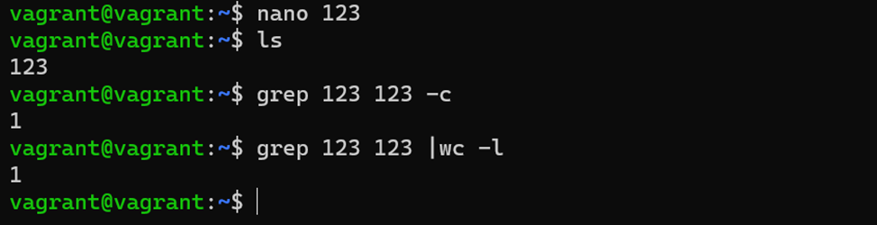

3. Какой процесс с PID `1` является родителем для всех процессов в вашей виртуальной машине Ubuntu 20.04?
Вывод pstree -p 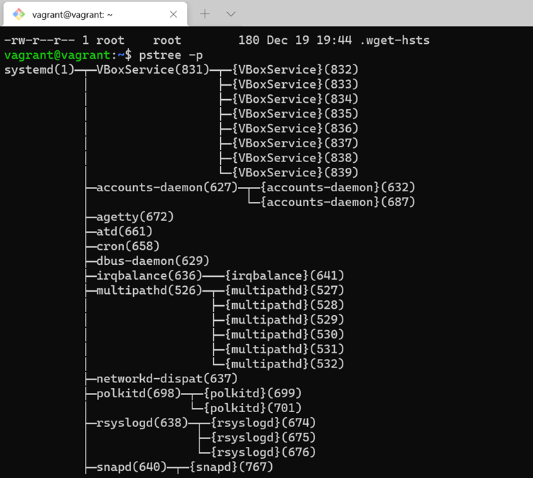
На вм процесс с PID=1 systemd

4. Как будет выглядеть команда, которая перенаправит вывод stderr `ls` на другую сессию терминала?
Для начала нужно создать еще одну сессию терминала а затем в нее перенаправить stderr при помощи ls -l  \root 2>/dev/pts1
Перенаправление stderr из одного терминала в другой 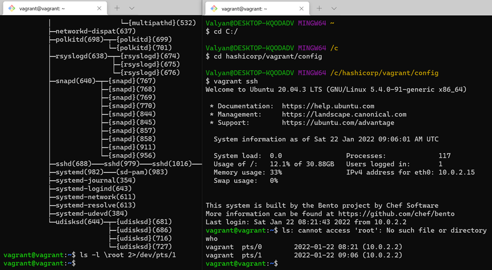

5. Получится ли одновременно передать команде файл на stdin и вывести ее stdout в другой файл? Приведите работающий пример.
Перенаправление одного файла с stdin на stdout другого файла 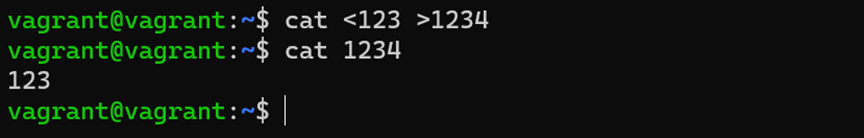

6. Получится ли находясь в графическом режиме, вывести данные из PTY в какой-либо из эмуляторов TTY? Сможете ли вы наблюдать выводимые данные?
Перенаправление данных с PTY в TTY 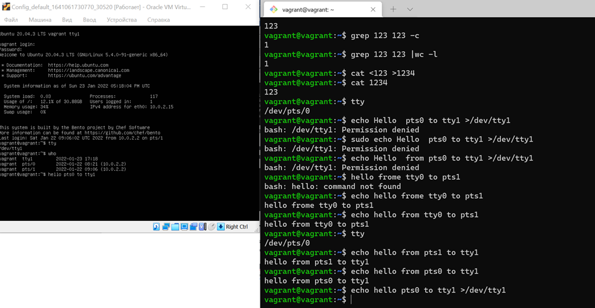

7. Выполните команду `bash 5>&1`. К чему она приведет? Что будет, если вы выполните `echo netology > /proc/$$/fd/5`? Почему так происходит?
bash 5>&1 создаст дескриптор с 5 и перенаправит его на stdout
echo netology > /proc/$$/fd/5   выведет netology, который мы перенаправили в дескриптор ‘5’ 
Перенаправление netology  в дескриптор ‘5’ и его последующий вывод в stdout 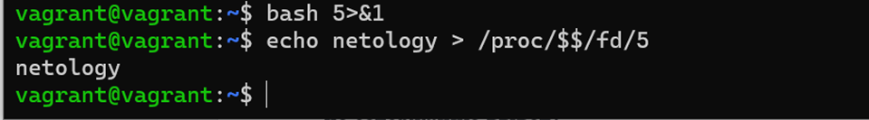

8. Получится ли в качестве входного потока для pipe использовать только stderr команды, не потеряв при этом отображение stdout на pty? Напоминаем: по умолчанию через pipe передается только stdout команды слева от `|` на stdin команды справа.
Это можно сделать, поменяв стандартные потоки местами через промежуточный новый дескриптор, который вы научились создавать в предыдущем вопросе.
Перенаправление stdout в stderr через промежуточный дескриптор 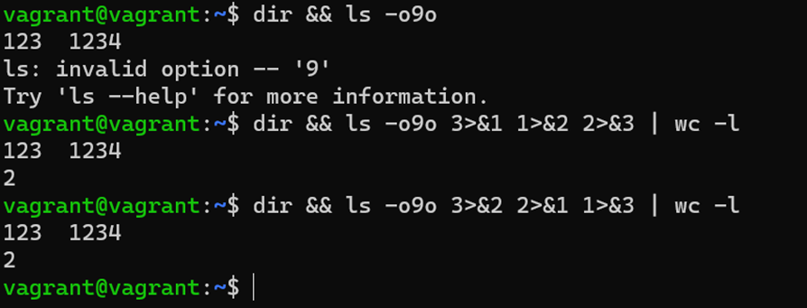
3>&2 - новый дескриптор перенаправили в stderr 
2>&1 - stderr перенаправили в stdout 
1>&3 - stdout перенаправили  в новый дескриптор
Таким образом на экран вывелось содержимое директории и ошибка в виде «2» из-за неправильно заданного пключа команды ls

9. Что выведет команда `cat /proc/$$/environ`? Как еще можно получить аналогичный по содержанию вывод?

cat /proc/$$/environ выведет на экран переменные окружения, которые можно так же вывести при помощи printenv
Вывод cat/proc/$$/environ 
Вывод printenv 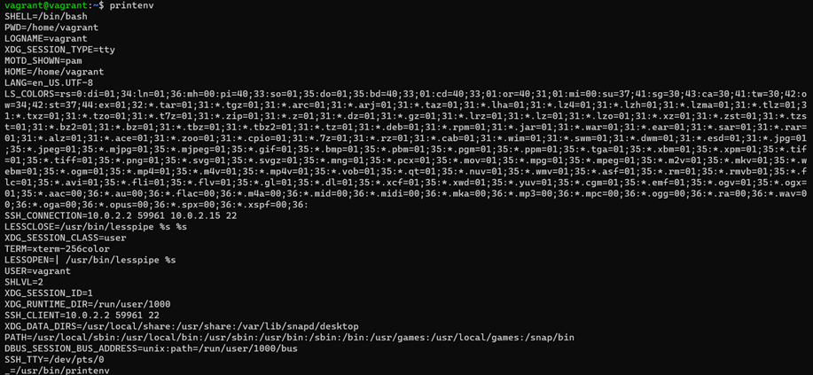

10. Используя `man`, опишите что доступно по адресам `/proc/<PID>/cmdline`, `/proc/<PID>/exe`.
man по proc, строка 172 ( /proc/[pid]/cmdline) 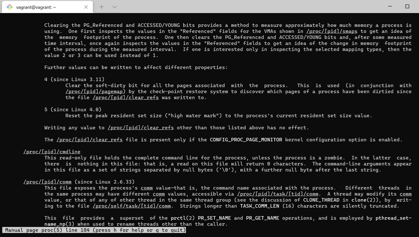
man по proc, строка 221 ( /proc/[pid]/exe) 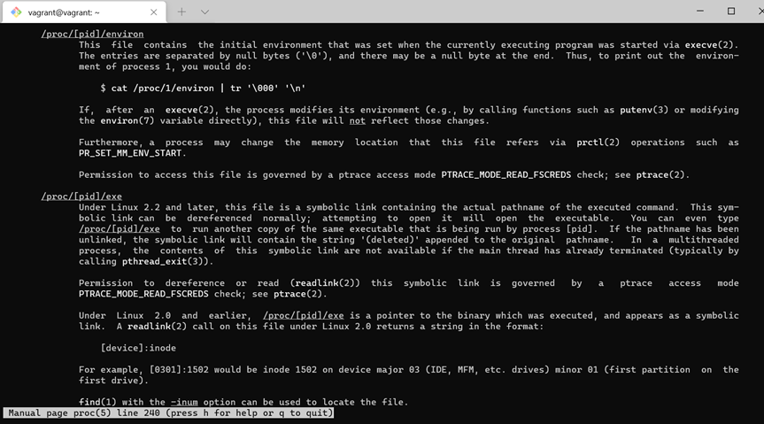


11. Узнайте, какую наиболее старшую версию набора инструкций SSE поддерживает ваш процессор с помощью `/proc/cpuinfo`.
Вывод команды grep sse /proc/cpuinfo 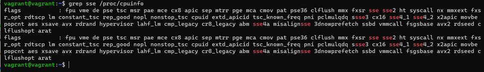
Вывод grep sse /proc/cpuinfo показал, что максимально поддерживаемым является SSE4.2

12. При открытии нового окна терминала и `vagrant ssh` создается новая сессия и выделяется pty. Это можно подтвердить командой `tty`, которая упоминалась в лекции 3.2. Однако:

     ```bash
     vagrant@netology1:~$ ssh localhost 'tty'
     not a tty
     ```

     Почитайте, почему так происходит, и как изменить поведение.
Находясь  windows terminal и подключившись к ВМ при помощи vagrant ssh мы находимся в PTY(псевдотерминальном подключении), т.е сессии, которая взаимодействует с гостевой ОС и которая  открылась при подключении по ssh к ВМ с внешней хостовой машины, на внешней хостовой машине при этом для данного подключения не создан tty  и ожидается, что будет запрос пользователя/пароля при попытке подключиться к localhost, можно воспользоваться ssh -t localhost 'tty' , однако без добавления ключа в список ключей сделать этого не получит
Попытка подключения к localhost из pty сессии 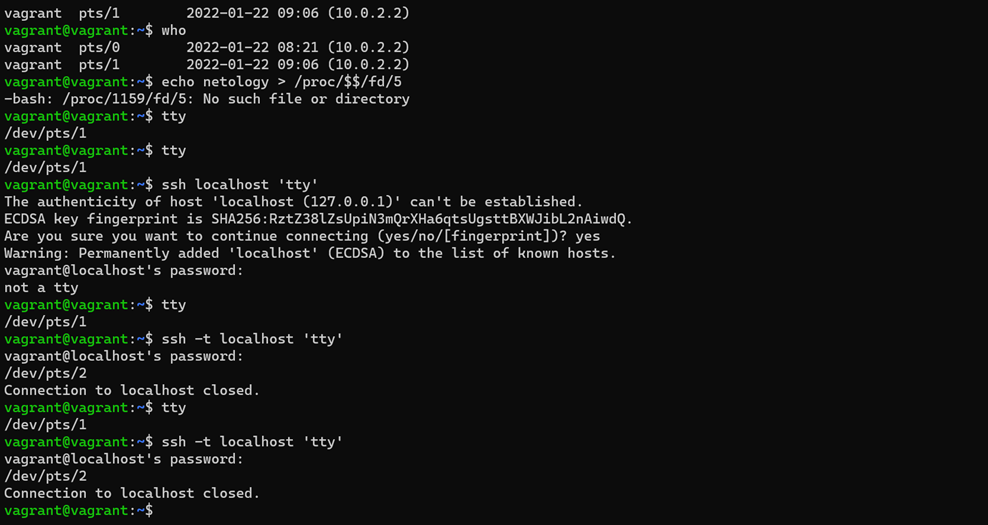

13. Бывает, что есть необходимость переместить запущенный процесс из одной сессии в другую. Попробуйте сделать это, воспользовавшись `reptyr`. Например, так можно перенести в `screen` процесс, который вы запустили по ошибке в обычной SSH-сессии.
Процесс перехвата процесс pty из tty при помощи reptyr 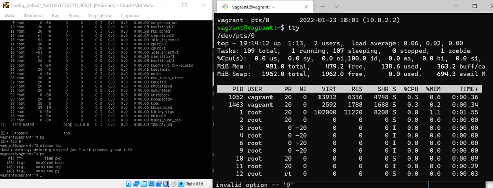
На tty сессии запускаем утилиту top
top
Далее отправляем top в background при помощи
ctrl+z
bg
Далее убираем процесс top из таблицы задач
disown top
потом в новом окне терминала pty перехватываем процесс (PID в моем случае 1460) 
reptyr 1460

14. `sudo echo string > /root/new_file` не даст выполнить перенаправление под обычным пользователем, так как перенаправлением занимается процесс shell'а, который запущен без `sudo` под вашим пользователем. Для решения данной проблемы можно использовать конструкцию `echo string | sudo tee /root/new_file`. Узнайте что делает команда `tee` и почему в отличие от `sudo echo` команда с `sudo tee` будет работать.

Вывод при помощи tee 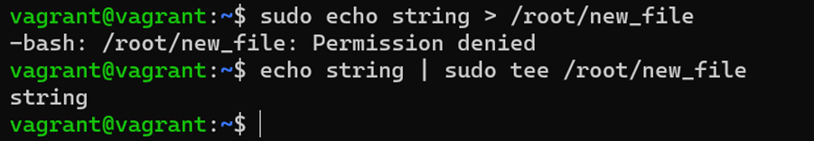
команда tee делает вывод одновременно в файл, указаный в качестве параметра и в stdout. В echo string | sudo tee /root/new_file получает вывод из stdin, перенаправленный через pipe от stdout команды echo и так как команда запущена от sudo, она имеет права на запись в файл

