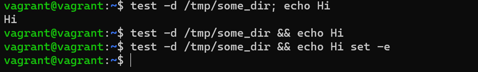

# Домашнее задание к занятию "3.3. Операционные системы, лекция 1"

1. Какой системный вызов делает команда `cd`? В прошлом ДЗ мы выяснили, что `cd` не является самостоятельной  программой, это `shell builtin`, поэтому запустить `strace` непосредственно на `cd` не получится. Тем не менее, вы можете запустить `strace` на `/bin/bash -c 'cd /tmp'`. В этом случае вы увидите полный список системных вызовов, которые делает сам `bash` при старте. Вам нужно найти тот единственный, который относится именно к `cd`. Обратите внимание, что `strace` выдаёт результат своей работы в поток stderr, а не в stdout.

Полный список системных вызовов bash 
Нужный нам системный вызов это chdir(“/tmp”) = 0

2. Попробуйте использовать команду `file` на объекты разных типов на файловой системе. Например:
    ```bash
    vagrant@netology1:~$ file /dev/tty
    /dev/tty: character special (5/0)
    vagrant@netology1:~$ file /dev/sda
    /dev/sda: block special (8/0)
    vagrant@netology1:~$ file /bin/bash
    /bin/bash: ELF 64-bit LSB shared object, x86-64
    ```
    Используя `strace` выясните, где находится база данных `file` на основании которой она делает свои догадки.

Опробовав strace для разных объектов и покопавшись в гугле выяснил, что база данных типов файлов находится в  /usr/share/mime/magic 
строка openat(AT_FDCWD, "/usr/share/misc/magic.mgc", O_RDONLY) = 3 
в случае всех трех типов файлов из задания

Вывод strace для /dev/sda 

3. Предположим, приложение пишет лог в текстовый файл. Этот файл оказался удален (deleted в lsof), однако возможности сигналом сказать приложению переоткрыть файлы или просто перезапустить приложение – нет. Так как приложение продолжает писать в удаленный файл, место на диске постепенно заканчивается. Основываясь на знаниях о перенаправлении потоков предложите способ обнуления открытого удаленного файла (чтобы освободить место на файловой системе).

Попытки очистить даленный файл 

ping    2119 vagrant    1w   REG  253,0     1604 1048605 /home/vagrant/123 (deleted) 
echo ' ' > /proc/2119/fd/1  	- не помогло
truncate -s 0 123		- не помогло
единственное рабочее решение убить процесс kill 2119

4. Занимают ли зомби-процессы какие-то ресурсы в ОС (CPU, RAM, IO)?

Зомби не занимают ресурсов ОС как и процессы-сироты, но в отличии от процессов-сирот зомби-процессы блокируют записи в таблице процессов, размер которой ограничен для каждого пользователя и системы в целом. При достижении лимита записей все процессы пользователя, от имени которого выполняется создающий зомби родительский процесс, не будут способны создавать новые дочерние процессы. Кроме этого, пользователь, от имени которого выполняется родительский процесс, не сможет зайти на консоль (локальную или удалённую) или выполнить какие-либо команды на уже открытой консоли (потому что для этого командный интерпретатор sh должен создать новый процесс), и для восстановления работоспособности (завершения виновной программы) будет необходимо вручную перезагрузить машину (будь то ВМ или хостовая ОС).


5. В iovisor BCC есть утилита `opensnoop`:
    ```bash
    root@vagrant:~# dpkg -L bpfcc-tools | grep sbin/opensnoop
    /usr/sbin/opensnoop-bpfcc
    ```
    На какие файлы вы увидели вызовы группы `open` за первую секунду работы утилиты? Воспользуйтесь пакетом `bpfcc-tools` для Ubuntu 20.04. Дополнительные [сведения по установке](https://github.com/iovisor/bcc/blob/master/INSTALL.md).

Запуск bpfcc 
В первые секунды вызывали отмеченные на рисунке красным файлы

6. Какой системный вызов использует `uname -a`? Приведите цитату из man по этому системному вызову, где описывается альтернативное местоположение в `/proc`, где можно узнать версию ядра и релиз ОС.

Используется системный вызов uname()
Описание места, из которого инфа о системе тянется нашел в гугле, т.к man по uname выдавал только информацию о команде:
Part of the utsname information is also accessible  via  /proc/sys/ker‐ nel/{ostype, hostname, osrelease, version, domainname}.

7. Чем отличается последовательность команд через `;` и через `&&` в bash? Например:
    ```bash
    root@netology1:~# test -d /tmp/some_dir; echo Hi
    Hi
    root@netology1:~# test -d /tmp/some_dir && echo Hi
    root@netology1:~#
    ```
    Есть ли смысл использовать в bash `&&`, если применить `set -e`?

Оператор точка с запятой (;) позволяет запускать несколько команд за один раз, и выполнение команд происходит последовательно.
Оператор AND (&&) будет выполнять следующую команду только в том случае, если при выполнении предыдущей команды SUCCEEDS, т.е. состояние выхода предыдущей команды равно «0» — программа выполнена успешно.
set -e - прерывает сессию при любом ненулевом значении исполняемых команд в конвеере кроме последней

Применение set -e в случае test -d /tmp/some_dir && echo Hi не даст результата, т.к вывод test -d /tmp/some_dir && echo Hi будет ненулевой (т.е ошибочный) и выполнение команды прекратиться в любом случае

Вывод test -d /tmp/some_dir && echo Hi 

9. Из каких опций состоит режим bash `set -euxo pipefail` и почему его хорошо было бы использовать в сценариях?

man bash поиск по pipefail 

-e прерывает выполнение исполнения при ошибке любой команды кроме последней в последовательности 
-x вывод трейса простых команд 
-u неустановленные/не заданные параметры и переменные считаются как ошибки, с выводом в stderr текста ошибки и выполнит завершение неинтерактивного вызова 
-o pipefail возвращает код возврата набора/последовательности команд, ненулевой при последней команды или 0 для успешного выполнения команд. 

Для сценария такой формат позволит:
 -детализировать вывод ошибок
 -завершить сценарий при наличии ошибок, на любом этапе выполнения сценария, кроме последней завершающей команды

11. Используя `-o stat` для `ps`, определите, какой наиболее часто встречающийся статус у процессов в системе. В `man ps` ознакомьтесь (`/PROCESS STATE CODES`) что значат дополнительные к основной заглавной буквы статуса процессов. Его можно не учитывать при расчете (считать S, Ss или Ssl равнозначными).

man по ps, 397 строка – process state codes 
вывод ps -ax 

Наиболее часто встречающиеся процессы:
Ss, Ssl,S – процессы, ожидающие завершения и находящиеся в состоянии сна
I – фоновые бездействующие процессы ядра
Доп символы из 411 строки по man ps показывают дополнительные характеристики:
<  - высокоприоритетные (не назначенные другим пользователям)
N - низкоприоритетные (назначенные другим пользователям
L - имеющие страницы, заблокированные в памяти (для процессов в режиме реального времени или для специфичных процессов ввода\вывода)
S – лидер сеанса
L – многопоточный
+ - в группе передне-фоновых процессов (процессов, которые отображаются пользователю)

(из MAN по PS)