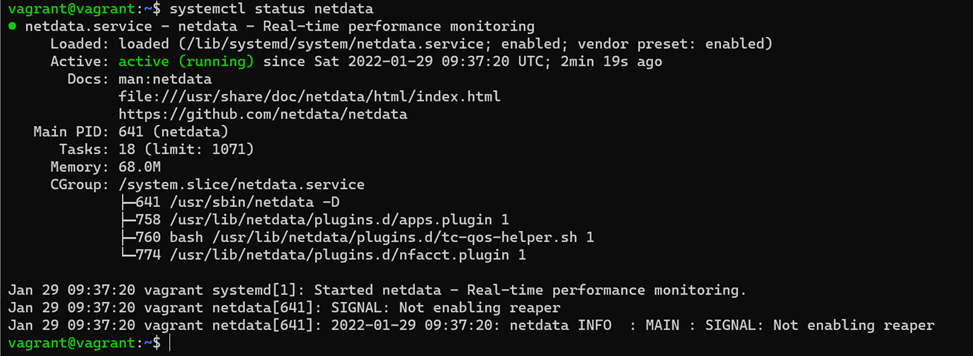

# Домашнее задание к занятию "3.4. Операционные системы, лекция 2"

1. На лекции мы познакомились с [node_exporter](https://github.com/prometheus/node_exporter/releases). В демонстрации его исполняемый файл запускался в background. Этого достаточно для демо, но не для настоящей production-системы, где процессы должны находиться под внешним управлением. Используя знания из лекции по systemd, создайте самостоятельно простой [unit-файл](https://www.freedesktop.org/software/systemd/man/systemd.service.html) для node_exporter:

    * поместите его в автозагрузку,
    * предусмотрите возможность добавления опций к запускаемому процессу через внешний файл (посмотрите, например, на `systemctl cat cron`),
    * удостоверьтесь, что с помощью systemctl процесс корректно стартует, завершается, а после перезагрузки автоматически поднимается.

Установленный prometheus node exporter 
Юнит-файл служба prometheus-node-exporter 


2. Ознакомьтесь с опциями node_exporter и выводом `/metrics` по-умолчанию. Приведите несколько опций, которые вы бы выбрали для базового мониторинга хоста по CPU, памяти, диску и сети.

Метрики по умолчанию 
CPU: 
node_cpu_seconds_total{cpu="0",mode="idle"} node_cpu_seconds_total{cpu="0",mode="system"} node_cpu_seconds_total{cpu="0",mode="user"} 
process_cpu_seconds_total 
Memory: 
node_memory_MemAvailable_bytes 
node_memory_MemFree_bytes 
Disk(для каждого диска): 
node_disk_io_time_seconds_total{device="sda"} 
node_disk_read_bytes_total{device="sda"}
 node_disk_read_time_seconds_total{device="sda"} node_disk_write_time_seconds_total{device="sda"} 
Network(для каждого адаптера): 
node_network_receive_errs_total{device="eth0"} node_network_receive_bytes_total{device="eth0"} node_network_transmit_bytes_total{device="eth0"} node_network_transmit_errs_total{device="eth0"}

Вышеперечисленные метрики вытянул из стандартного списка grep-ом по ключевым словам cpu,mem,disk,network, которых там достаточно много судя по выводу, конечно, удобнее смотреть что-то более визуализированное (порт пробрасывать не стал, да и визуализация без Prometheus GUI не предусмотрена для сырого Node_exporter судя по статьям из гугла)

3. Установите в свою виртуальную машину [Netdata](https://github.com/netdata/netdata). Воспользуйтесь [готовыми пакетами](https://packagecloud.io/netdata/netdata/install) для установки (`sudo apt install -y netdata`). После успешной установки:
    * в конфигурационном файле `/etc/netdata/netdata.conf` в секции [web] замените значение с localhost на `bind to = 0.0.0.0`,
    * добавьте в Vagrantfile проброс порта Netdata на свой локальный компьютер и сделайте `vagrant reload`:

    ```bash
    config.vm.network "forwarded_port", guest: 19999, host: 19999
    ```

    После успешной перезагрузки в браузере *на своем ПК* (не в виртуальной машине) вы должны суметь зайти на `localhost:19999`. Ознакомьтесь с метриками, которые по умолчанию собираются Netdata и с комментариями, которые даны к этим метрикам.

Состояние службы netdata после перезагрузки ВМ и vagrant 
Главное окно gui netdata 
Список метрик по умолчанию справа на главной панели gui утилиты мониторинга(на рисунке выделено красным), так же можно добавить своих собственных экранов ниже доступного списка метрик

4. Можно ли по выводу `dmesg` понять, осознает ли ОС, что загружена не на настоящем оборудовании, а на системе виртуализации?

Часть вывода dmesg 
Виртуальная машина понимает, что запущена на платформе виртуализации, она так же понимает, что это за платформа и некоторые из ее параметров о  чем свидетельствует вывод dmesg | grep virtual. Более подробно можно посмотреть в выводе самого dmesg ничего не отфильтровывая.

5. Как настроен sysctl `fs.nr_open` на системе по-умолчанию? Узнайте, что означает этот параметр. Какой другой существующий лимит не позволит достичь такого числа (`ulimit --help`)?

Вывод ulimit, fs.nr_open и значения file-max 

Максимально значение количества десрипторов в системе установлено в /proc/sys/fs/fule-max, большее количество десрипторов сооздать не удастся.
Значение fs.nr_open = 1048576 «жесткий» limit Для одного пользователя

жесткий лимит на количество дескрипторов для пользователя 

8. Запустите любой долгоживущий процесс (не `ls`, который отработает мгновенно, а, например, `sleep 1h`) в отдельном неймспейсе процессов; покажите, что ваш процесс работает под PID 1 через `nsenter`. Для простоты работайте в данном задании под root (`sudo -i`). Под обычным пользователем требуются дополнительные опции (`--map-root-user`) и т.д.

unshare процесса sleep из неймспейса /dev/pts/0 

sleep в общем списке процессов в неймспейсе /dev/pts/1 

захваченный nsenter-ом процесс sleep(pid=1583)  под pid=1 в неймспейсе /dev/pts/1 

11. Найдите информацию о том, что такое `:(){ :|:& };:`. Запустите эту команду в своей виртуальной машине Vagrant с Ubuntu 20.04 (**это важно, поведение в других ОС не проверялось**). Некоторое время все будет "плохо", после чего (минуты) – ОС должна стабилизироваться. Вызов `dmesg` расскажет, какой механизм помог автоматической стабилизации. Как настроен этот механизм по-умолчанию, и как изменить число процессов, которое можно создать в сессии?

:(){ :|:& };:  это форк-бомба — форма атаки типа «отказ в обслуживании» (DoS) против систем Unix. Используется операция форка, которая является функцией bash. Эта функция выполняется рекурсивно. Она часто используется системными администраторами для проверки ограничений пользовательских процессов на сервере. Ограничения процессов Linux можно настроить через /etc/security/limits.conf и PAM, чтобы избежать бомбы bash fork(). После успешной активации форк-бомбы в системе может оказаться невозможным возобновить нормальную работу без перезагрузки системы, поскольку единственным решением для форк-бомбы является уничтожение всех ее экземпляров.
Лимит  процессов для пользователя можно задать при помощи:
- ulimit -u 100, где 100 это число процессов (можно задать любое другое произвольное число не превышающее «жесткий лимит», установленный в системе по умолчанию), 
-настроить через /etc/security/limits.conf 
-при  помощи подключаемых модулей аутентификации (PAM).
Судя по выводу dmesg  механизм :
[  146.741018] cgroup: fork rejected by pids controller in /user.slice/user-1000.slice/session-1.scope
Помог стабилизировать работу системы
