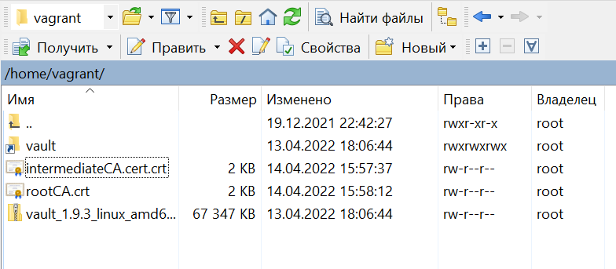
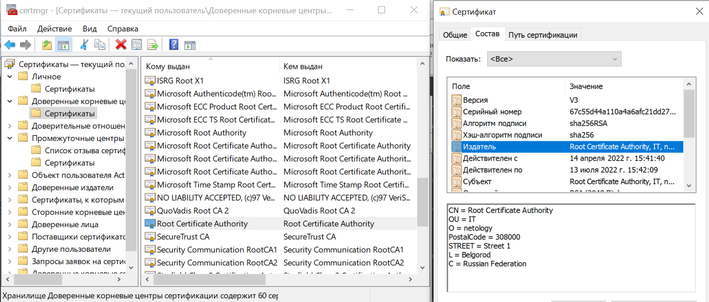
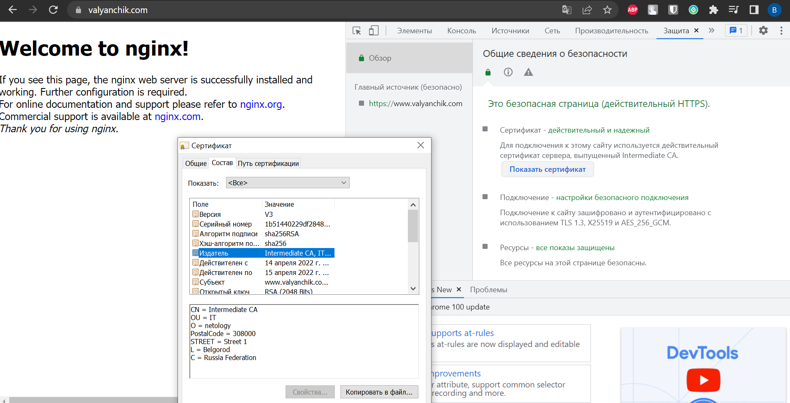
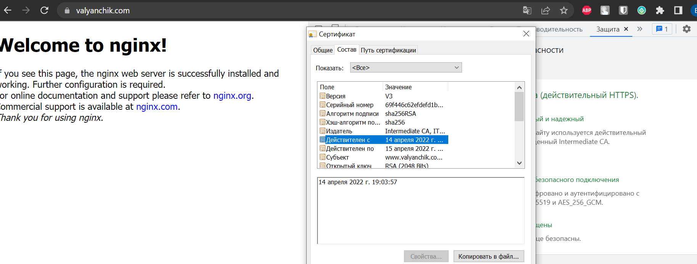
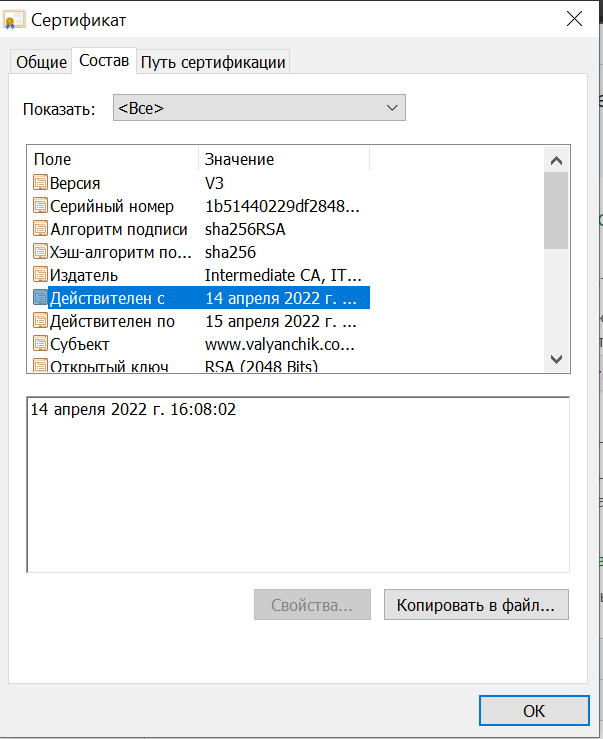
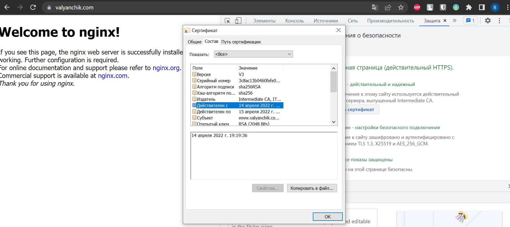
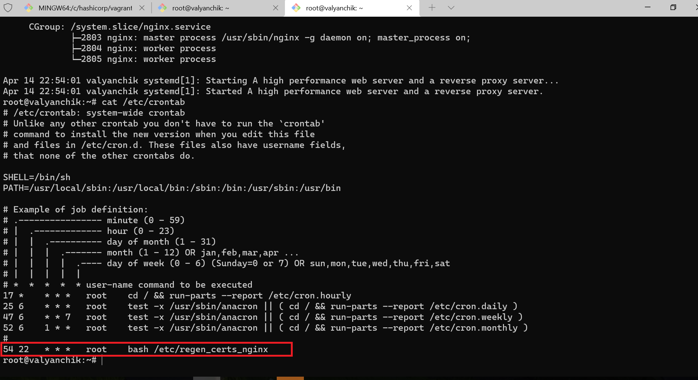
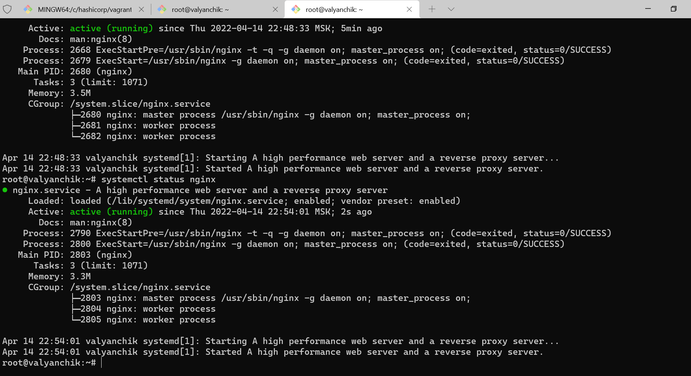
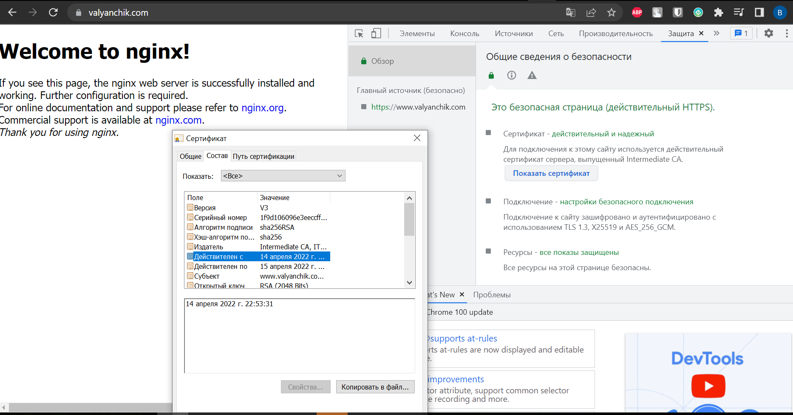

# Курсовая работа по итогам модуля "DevOps и системное администрирование"

## Задание

1. Создайте виртуальную машину Linux.
Vagrant-файл приведен к следующему виду:

Vagrant.configure("2") do |config|  
  config.vm.box = "bento/ubuntu-20.04"  

  config.vm.network "forwarded_port", guest: 80, host: 8080, host_ip: "127.0.0.1"  
  config.vm.network "forwarded_port", guest: 22, host: 22, host_ip: "127.0.0.1"  
  config.vm.network "forwarded_port", guest: 443, host: 443, host_ip: "127.0.0.1"  

  config.vm.network "public_network"  

  config.vm.provision "shell", inline: <<-SHELL  
     apt update  
	 apt install -y net-tools  
	 apt install -y nginx  
	 apt install -y jq  
	 apt install -y unzip  
	 echo "VAULT_ADDR=http://127.0.0.1:8200" >> ~/.bashrc  
	 echo "VAULT_TOKEN=root" >> ~/.bashrc  
	 echo "PATH="$PATH:/usr/local/bin"" >> ~/.bashrc  
	 vault -autocomplete-install  
	 complete -C /usr/local/bin/vault vault  
	 ln -s /usr/local/bin vault  
  SHELL  
end  

Для выполнения курсового проекта необходимо доустановить некоторый софт, а именно:  

-net-tools для комфортной работы с сервером по ipv4 и ориентирования в сетевых интерфейсах    
-nginx - целевой веб-сервер, для которого и будем генерить сертификаты ssl      
-jq - утилита для работы с файлами формата json  
-unzip  - для распаковки архива с vault, т.к качаться он будет как архив  

Так же нужно немного донастроить сервер, чтобы не заморачиваться каждый раз при удалении ВМ:  

-echo "VAULT_ADDR=http://127.0.0.1:8200" >> ~/.bashrc  - экспорт переменной окружения с адресом сервера vault   
-echo "VAULT_TOKEN=root" >> ~/.bashrc   - экспорт переменной окружения для обозначения корневого токена сервера vault  
-echo "PATH="$PATH:/usr/local/bin"" >> ~/.bashrc  -прописываем путь к бинарникам (т.к vault распакуем как бинарник в указанную папку)  
-vault -autocomplete-install  - автозаполнение команд синтакса vault    
-complete -C /usr/local/bin/vault vault  
-ln -s /usr/local/bin vault  - прописываем символическую ссылку на бинарник с vault  

2. Установите ufw и разрешите к этой машине сессии на порты 22 и 443, при этом трафик на интерфейсе localhost (lo) должен ходить свободно на все порты.

Результирующая политика будет следующая: 

```bash
root@valyanchik:/etc/nginx/sites-available# ufw status numbered
Status: active

     To                         Action      From
     --                         ------      ----
[ 1] Nginx Full                 ALLOW IN    Anywhere             
[ 2] 22                         ALLOW IN    Anywhere             
[ 3] 443                        ALLOW IN    Anywhere             
[ 4] Anywhere on lo             ALLOW IN    Anywhere             
[ 5] Nginx Full (v6)            ALLOW IN    Anywhere (v6)        
[ 6] 22 (v6)                    ALLOW IN    Anywhere (v6)        
[ 7] 443 (v6)                   ALLOW IN    Anywhere (v6)        
[ 8] Anywhere (v6) on lo        ALLOW IN    Anywhere (v6)        
```

3. Установите hashicorp vault ([инструкция по ссылке](https://learn.hashicorp.com/tutorials/vault/getting-started-install?in=vault/getting-started#install-vault)).
Проделываем следующие действия: 

-wget https://hashicorp-releases.website.yandexcloud.net/vault/1.9.3/vault_1.9.3_linux_amd64.zip  #скачиваем архив с бинарником vault  
-unzip ~/vault_1.9.3_linux_amd64.zip  #распаковываем скачанный архив в корень  
-mv ~/vault /usr/local/bin/  #перемещаем распакованный бинарник в папку, на которую прописана символическая ссылка  

После чего vault готов к работе. Проверяем работоспособность бинарника командой vault:  

```bash
root@valyanchik:/etc/nginx/sites-available# vault
Usage: vault <command> [args]

Common commands:
    read        Read data and retrieves secrets
    write       Write data, configuration, and secrets
    delete      Delete secrets and configuration
    list        List data or secrets
    login       Authenticate locally
    agent       Start a Vault agent
    server      Start a Vault server
    status      Print seal and HA status
    unwrap      Unwrap a wrapped secret

Other commands:
    audit          Interact with audit devices
    auth           Interact with auth methods
    debug          Runs the debug command
    kv             Interact with Vault's Key-Value storage
    lease          Interact with leases
    monitor        Stream log messages from a Vault server
    namespace      Interact with namespaces
    operator       Perform operator-specific tasks
    path-help      Retrieve API help for paths
    plugin         Interact with Vault plugins and catalog
    policy         Interact with policies
    print          Prints runtime configurations
    secrets        Interact with secrets engines
    ssh            Initiate an SSH session
    token          Interact with tokens
root@valyanchik:/etc/nginx/sites-available#
```

4. Cоздайте центр сертификации по инструкции ([ссылка](https://learn.hashicorp.com/tutorials/vault/pki-engine?in=vault/secrets-management)) и выпустите сертификат для использования его в настройке веб-сервера nginx (срок жизни сертификата - месяц).

Нашел другой гайд, т.к предложенный не до конца понятен, порядок действий следующий:
В отдельной сессии запускаем vault в dev-режиме:   

```bash
root@valyanchik:~# vault server -dev -dev-root-token-id root
==> Vault server configuration:

             Api Address: http://127.0.0.1:8200
                     Cgo: disabled
         Cluster Address: https://127.0.0.1:8201
              Go Version: go1.17.5
              Listener 1: tcp (addr: "127.0.0.1:8200", cluster address: "127.0.0.1:8201", max_request_duration: "1m30s", max_request_size: "33554432", tls: "disabled")
               Log Level: info
                   Mlock: supported: true, enabled: false
           Recovery Mode: false
                 Storage: inmem
                 Version: Vault v1.9.3
             Version Sha: 7dbdd57243a0d8d9d9e07cd01eb657369f8e1b8a

==> Vault server started! Log data will stream in below:

2022-04-14T15:28:15.198+0300 [INFO]  proxy environment: http_proxy="\"\"" https_proxy="\"\"" no_proxy="\"\""
2022-04-14T15:28:15.199+0300 [WARN]  no `api_addr` value specified in config or in VAULT_API_ADDR; falling back to detection if possible, but this value should be manually set
2022-04-14T15:28:15.213+0300 [INFO]  core: Initializing VersionTimestamps for core
2022-04-14T15:28:15.220+0300 [INFO]  core: security barrier not initialized
2022-04-14T15:28:15.221+0300 [INFO]  core: security barrier initialized: stored=1 shares=1 threshold=1
2022-04-14T15:28:15.224+0300 [INFO]  core: post-unseal setup starting
2022-04-14T15:28:15.238+0300 [INFO]  core: loaded wrapping token key
2022-04-14T15:28:15.238+0300 [INFO]  core: Recorded vault version: vault version=1.9.3 upgrade time="2022-04-14 15:28:15.238569497 +0300 MSK m=+0.653505693"
2022-04-14T15:28:15.239+0300 [INFO]  core: successfully setup plugin catalog: plugin-directory="\"\""
2022-04-14T15:28:15.240+0300 [INFO]  core: no mounts; adding default mount table
2022-04-14T15:28:15.243+0300 [INFO]  core: successfully mounted backend: type=cubbyhole path=cubbyhole/
2022-04-14T15:28:15.250+0300 [INFO]  core: successfully mounted backend: type=system path=sys/
2022-04-14T15:28:15.253+0300 [INFO]  core: successfully mounted backend: type=identity path=identity/
2022-04-14T15:28:15.274+0300 [INFO]  core: successfully enabled credential backend: type=token path=token/2022-04-14T15:28:15.275+0300 [INFO]  rollback: starting rollback manager
2022-04-14T15:28:15.276+0300 [INFO]  core: restoring leases
2022-04-14T15:28:15.278+0300 [INFO]  identity: entities restored
2022-04-14T15:28:15.278+0300 [INFO]  identity: groups restored
2022-04-14T15:28:15.278+0300 [INFO]  expiration: lease restore complete
2022-04-14T15:28:15.278+0300 [INFO]  core: post-unseal setup complete
2022-04-14T15:28:15.280+0300 [INFO]  core: root token generated
2022-04-14T15:28:15.280+0300 [INFO]  core: pre-seal teardown starting
2022-04-14T15:28:15.280+0300 [INFO]  rollback: stopping rollback manager
2022-04-14T15:28:15.280+0300 [INFO]  core: pre-seal teardown complete
2022-04-14T15:28:15.280+0300 [INFO]  core.cluster-listener.tcp: starting listener: listener_address=127.0.0.1:8201
2022-04-14T15:28:15.280+0300 [INFO]  core.cluster-listener: serving cluster requests: cluster_listen_address=127.0.0.1:8201
2022-04-14T15:28:15.282+0300 [INFO]  core: post-unseal setup starting
2022-04-14T15:28:15.282+0300 [INFO]  core: loaded wrapping token key
2022-04-14T15:28:15.282+0300 [INFO]  core: successfully setup plugin catalog: plugin-directory="\"\""
2022-04-14T15:28:15.283+0300 [INFO]  core: successfully mounted backend: type=system path=sys/
2022-04-14T15:28:15.285+0300 [INFO]  core: successfully mounted backend: type=identity path=identity/
2022-04-14T15:28:15.285+0300 [INFO]  core: successfully mounted backend: type=cubbyhole path=cubbyhole/
2022-04-14T15:28:15.290+0300 [INFO]  core: successfully enabled credential backend: type=token path=token/2022-04-14T15:28:15.291+0300 [INFO]  rollback: starting rollback manager
2022-04-14T15:28:15.291+0300 [INFO]  core: restoring leases
2022-04-14T15:28:15.291+0300 [INFO]  expiration: lease restore complete
2022-04-14T15:28:15.291+0300 [INFO]  identity: entities restored
2022-04-14T15:28:15.291+0300 [INFO]  identity: groups restored
2022-04-14T15:28:15.291+0300 [INFO]  core: post-unseal setup complete
2022-04-14T15:28:15.291+0300 [INFO]  core: vault is unsealed
2022-04-14T15:28:15.296+0300 [INFO]  expiration: revoked lease: lease_id=auth/token/root/hebccdcba7e6bbe4a948cf45c9f4a3a57e0955b5fdf86529a8097de68afa8dd7d
2022-04-14T15:28:15.307+0300 [INFO]  core: successful mount: namespace="\"\"" path=secret/ type=kv
2022-04-14T15:28:15.315+0300 [INFO]  secrets.kv.kv_bbf83437: collecting keys to upgrade
2022-04-14T15:28:15.316+0300 [INFO]  secrets.kv.kv_bbf83437: done collecting keys: num_keys=1
2022-04-14T15:28:15.316+0300 [INFO]  secrets.kv.kv_bbf83437: upgrading keys finished
WARNING! dev mode is enabled! In this mode, Vault runs entirely in-memory
and starts unsealed with a single unseal key. The root token is already
authenticated to the CLI, so you can immediately begin using Vault.

You may need to set the following environment variable:

    $ export VAULT_ADDR='http://127.0.0.1:8200'

The unseal key and root token are displayed below in case you want to
seal/unseal the Vault or re-authenticate.

Unseal Key: a+quQGHVpygc7NhtT1hY1u5fdCMS0lhFB37+PS0W95s=
Root Token: root

Development mode should NOT be used in production installations!

2022-04-14T15:38:04.272+0300 [INFO]  core: successful mount: namespace="\"\"" path=pki_root_ca/ type=pki
2022-04-14T15:46:12.756+0300 [INFO]  core: successful mount: namespace="\"\"" path=pki_int_ca/ type=pki
```

Переключаемся на другую терминальную сессию и прописываем для этой сессии необходимые переменные окружения (при генерации ВМ вагрантом переменные записываются в ~/.bashrc, но, почему-то не срабатывают, приходится заново каждый раз импортить):    
export VAULT_ADDR=http://127.0.0.1:8200  	
export VAULT_TOKEN=root  

После чего можно приступать к настройке центра сертификации, порядок действий следующий:  

Активируем PKI тип секрета для корневого центра сертификации:    
```bash
vault secrets enable \  
    -path=pki_root_ca \  
    -description="PKI Root CA" \  
    -max-lease-ttl="2160h" \  
    pki  
```
Создаем корневой сертификат центра сертификации (CA):  
```bash
vault write -format=json pki_root_ca/root/generate/internal \
    common_name="Root Certificate Authority" \
    country="Russian Federation" \
    locality="Belgorod" \
    street_address="Street 1" \
    postal_code="308000" \
    organization="netology" \
    ou="IT" \
    ttl="2160h" > pki-root-ca.json
```
Сохраняем корневой сертификат. В дальнейшем именно его надо распространять в организации и делать доверенным  
```bash
cat pki-root-ca.json | jq -r .data.certificate > rootCA.pem
```
Публикуем URL’ы для корневого центра сертификации:  
```bash
vault write pki_root_ca/config/urls \
    issuing_certificates="http://www.valyanchik.com:8200/v1/pki_root_ca/ca" \
    crl_distribution_points="http://www.valyanchik.com:8200/v1/pki_root_ca/crl"
```

Активируем PKI тип секрета для промежуточного центра сертификации:  
```bash
vault secrets enable \
    -path=pki_int_ca \
    -description="PKI Intermediate CA" \
    -max-lease-ttl="2160h" \
    pki
```
Генерируем запрос на выдачу сертификата для промежуточного центра сертификации:  
```bash
vault write -format=json pki_int_ca/intermediate/generate/internal \
   common_name="Intermediate CA" \
   country="Russian Federation" \
   locality="Belgorod" \
   street_address="
Street 1
" \
   postal_code="308000" \
   organization="
netology
" \
   ou="IT" \
   ttl="2160h" | jq -r '.data.csr' > pki_intermediate_ca.csr
```
Отправляем полученный CSR-файл в корневой центр сертификации, получаем сертификат для промежуточного центра сертификации:  
```bash
vault write -format=json pki_root_ca/root/sign-intermediate csr=@pki_intermediate_ca.csr \
   country="Russia Federation" \
   locality="Belgorod" \
   street_address="
Street 1
" \
   postal_code="308000" \
   organization="
netology
" \
   ou="IT" \
   format=pem_bundle \
   ttl="2160h" | jq -r '.data.certificate' > intermediateCA.cert.pem
```
Публикуем подписанный сертификат промежуточного центра сертификации:  
```bash
vault write pki_int_ca/intermediate/set-signed \
    certificate=@intermediateCA.cert.pem
```
Публикуем URL’ы для промежуточного центра сертификации:  
```bash
vault write pki_int_ca/config/urls \
    issuing_certificates="http://www.valyanchik.com:8200/v1/pki_int_ca/ca" \
    crl_distribution_points="http://www.valyanchik.com:8200/v1/pki_int_ca/crl"
```
Создаем роль, с помощью которой будем выдавать сертификаты для серверов:  
```bash
vault write pki_int_ca/roles/valyanchik-dot-com-server \
    country="Russia Federation" \
    locality="Belgorod" \
    street_address="
Street 1
" \
    postal_code="308000" \
    organization="
netology
" \
    ou="IT" \
    allowed_domains="valyanchik.com" \
    allow_subdomains=true \
    max_ttl="2160h" \
    key_bits="2048" \
    key_type="rsa" \
    allow_any_name=false \
    allow_bare_domains=false \
    allow_glob_domain=false \
    allow_ip_sans=true \
    allow_localhost=false \
    client_flag=false \
    server_flag=true \
    enforce_hostnames=true \
    key_usage="DigitalSignature,KeyEncipherment" \
    ext_key_usage="ServerAuth" \
    require_cn=true
```
Создаем роль, с помощью которой будем выдавать сертификаты для клиентов:
```bash
vault write pki_int_ca/roles/valyanchik-dot-com-client \
    country="Russia Federation" \
    locality="Belgorod" \
    street_address="
Street 1
" \
    postal_code="308000" \
    organization="
netology
" \
    ou="IT" \
    allow_subdomains=true \
    max_ttl="2160h" \
    key_bits="2048" \
    key_type="rsa" \
    allow_any_name=true \
    allow_bare_domains=false \
    allow_glob_domain=false \
    allow_ip_sans=false \
    allow_localhost=false \
    client_flag=true \
    server_flag=false \
    enforce_hostnames=false \
    key_usage="DigitalSignature" \
    ext_key_usage="ClientAuth" \
    require_cn=true
```
Создаем сертификат на 24 часа для домена www.valyanchik.com:  
```bash
vault write -format=json pki_int_ca/issue/valyanchik-dot-com-server \
    common_name="www.valyanchik.com" \
    alt_names="www.valyanchik.com" \
    ttl="24h" > www.valyanchik.com.crt
```
Сохраняем сертификат в правильном формате:  
```bash
cat www.valyanchik.com.crt | jq -r .data.certificate > /etc/ssl/www.valyanchik.com.crt.pem
cat www.valyanchik.com.crt | jq -r .data.issuing_ca >> /etc/ssl/www.valyanchik.com.crt.pem
cat www.valyanchik.com.crt | jq -r .data.private_key > /etc/ssl/www.valyanchik.com.crt.key
```
 
```bash
root@valyanchik:~# ls
intermediateCA.cert.pem  pki-root-ca.json  snap
pki_intermediate_ca.csr  rootCA.pem        www.valyanchik.com.crt
```
```bash
root@valyanchik:/etc/ssl# ls
certs  openssl.cnf  private  www.valyanchik.com.crt.key  www.valyanchik.com.crt.pem
```
По итогам нам понядобятся следующие файлы:   
-rootCA.pem корневой сертификат удостоверяющего центра  
-intermediateCA.cert.pem промежуточный сертификат удостоверяющего центра  
-www.valyanchik.com.crt.key ключ к ssl сертификату домена www.valyanchik.com  
-www.valyanchik.com.crt.pem ssl сертификат домена www.valyanchik.com  

5. Установите корневой сертификат созданного центра сертификации в доверенные в хостовой системе.
Забираем сформированные rootCA.pem intermediateCA.cert.pem при помощи winscp на хостовую машину (предварительно пересохраняем файлы, дописывая в конце вместо .pem .crt, т.е windows  с файлами .pem не умеет по умолчанию, нужно колдовать)  
  
устанавливаем сертификаты соответственно в "доверенные корневые центры сертификации" и "промежуточные центры сертификации":    


6. Установите nginx.
nginx был установлен при создании машины в vagrant (apt install nginx)  
7. По инструкции ([ссылка](https://nginx.org/en/docs/http/configuring_https_servers.html)) настройте nginx на https, используя ранее подготовленный сертификат:
  - можно использовать стандартную стартовую страницу nginx для демонстрации работы сервера;
  - можно использовать и другой html файл, сделанный вами;

Удалив лишние комментарии из файла /etc/nginx/sites-available/default получился следующий конфиг:    
```bash
# Default server configuration
#
server {
        listen 80 default_server;
        listen [::]:80 default_server;

        # SSL configuration
         listen 443 ssl default_server;
         listen [::]:443 ssl default_server;

        ssl_certificate /etc/ssl/www.valyanchik.com.crt.pem;

        ssl_certificate_key /etc/ssl/www.valyanchik.com.crt.key;

        root /var/www/html;

        index index.html index.htm index.nginx-debian.html;
        server_name  valyanchik.com www.valyanchik.com;

        location / {
                try_files $uri $uri/ =404;
        }

}
```
8. Откройте в браузере на хосте https адрес страницы, которую обслуживает сервер nginx.
При открытии сертификата сайта показаны следующие параметры:  

Сайт с "зелеными" параметрами, что говорит о корректности работы цепочки сертификата  
9. Создайте скрипт, который будет генерировать новый сертификат в vault:
  - генерируем новый сертификат так, чтобы не переписывать конфиг nginx;
  - перезапускаем nginx для применения нового сертификата.
   

Скрипт перевыпуска сертификата с последующим перезапуском nginx представлен ниже:
```bash
#!/bin/bash
####создаем переменные окружения для текущей сессии####
export VAULT_ADDR=http://127.0.0.1:8200
export VAULT_TOKEN=root
####генерим новый сертификат####
vault write -format=json pki_int_ca/issue/valyanchik-dot-com-server \
    common_name="www.valyanchik.com" \
    alt_names="www.valyanchik.com" \
    ttl="24h" > www.valyanchik.com.crt
####записываем сгенерированные данные в файлы ключа и сертификата####
cat www.valyanchik.com.crt | jq -r .data.certificate > /etc/www.valyanchik.com.crt.pem
cat www.valyanchik.com.crt | jq -r .data.issuing_ca >> /etc/www.valyanchik.com.crt.pem
cat www.valyanchik.com.crt | jq -r .data.private_key > /etc/www.valyanchik.com.crt.key
####перезаписываем существующие сертификаты####
cp /etc/www.valyanchik.com.crt.pem /etc/ssl/www.valyanchik.com.crt.pem
cp /etc/www.valyanchik.com.crt.key /etc/ssl/www.valyanchik.com.crt.key
####рестартим веб-сервер для применения новых сертификатов####
systemctl restart nginx
####удаляем старые сертификаты####
rm /etc/www.valyanchik.com.crt.key
rm /etc/www.valyanchik.com.crt.pem

```
После сохранения скрипта его необходимо сделать исполняемым (chmod +x /etc/regen_certs_nginx)  

В качестве проверки корректности работы скрипта сверим следующие данные:

-Время работы nginx до запуска скрипта:  
```bash
root@valyanchik:/etc# systemctl status nginx
● nginx.service - A high performance web server and a reverse proxy server
     Loaded: loaded (/lib/systemd/system/nginx.service; enabled; vendor preset: enabled)
     Active: active (running) since Thu 2022-04-14 16:13:04 MSK; 2h 34min ago
       Docs: man:nginx(8)
    Process: 1502 ExecStartPre=/usr/sbin/nginx -t -q -g daemon on; master_process on; (code=exited, statu>
    Process: 1503 ExecStart=/usr/sbin/nginx -g daemon on; master_process on; (code=exited, status=0/SUCCE>
   Main PID: 1504 (nginx)
      Tasks: 3 (limit: 1071)
     Memory: 4.0M
     CGroup: /system.slice/nginx.service
             ├─1504 nginx: master process /usr/sbin/nginx -g daemon on; master_process on;
             ├─1505 nginx: worker process
             └─1506 nginx: worker process

Apr 14 16:13:04 valyanchik systemd[1]: Starting A high performance web server and a reverse proxy server.>
Apr 14 16:13:04 valyanchik systemd[1]: Started A high performance web server and a reverse proxy server.
root@valyanchik:/etc#
```

-Время выпуска сертификата для nginx до запуска скрипта:

нынешний сертификат выпущен 14.04.2022 в 16:08    
     

-Содержимое сертификата для nginx до запуска скрипта:  
```bash
root@valyanchik:/etc# cat /etc/ssl/www.valyanchik.com.crt.pem
-----BEGIN CERTIFICATE-----
MIIExzCCA6+gAwIBAgIUG1FEAinfKEhDGzJzfla2iQqEQnAwDQYJKoZIhvcNAQEL
BQAwgY0xGjAYBgNVBAYTEVJ1c3NpYSBGZWRlcmF0aW9uMREwDwYDVQQHEwhCZWxn
b3JvZDERMA8GA1UECRMIU3RyZWV0IDExDzANBgNVBBETBjMwODAwMDERMA8GA1UE
ChMIbmV0b2xvZ3kxCzAJBgNVBAsTAklUMRgwFgYDVQQDEw9JbnRlcm1lZGlhdGUg
Q0EwHhcNMjIwNDE0MTMwODAyWhcNMjIwNDE1MTMwODMyWjCBkDEaMBgGA1UEBhMR
UnVzc2lhIEZlZGVyYXRpb24xETAPBgNVBAcTCEJlbGdvcm9kMREwDwYDVQQJEwhT
dHJlZXQgMTEPMA0GA1UEERMGMzA4MDAwMREwDwYDVQQKEwhuZXRvbG9neTELMAkG
A1UECxMCSVQxGzAZBgNVBAMTEnd3dy52YWx5YW5jaGlrLmNvbTCCASIwDQYJKoZI
hvcNAQEBBQADggEPADCCAQoCggEBANXvXrL+FmGr63v0HlWhKbO1vLwf3QXxi2qV
CeWJapEUlpiBmLGdRjlH9t4Sesr987qFDp0dxTLq3DuwWctGcm7JfjUHbWNZgPOO
2NTJRL1CwmQFN+tPm6mHeAp1EfJZW2QG5Kbf4/99nufVkeLltN/PLF37RdKlVb2N
JPLzjWJsx0uF/LfSG2DSFXan9LFLYMqWJyXxmtE9IH7Rh8vMl83ar/kZbvSFTHXq
DvtnsC9XoyAAQa/4Qk2sxu0zyxSBfsnr5pCtV+HdJ6Yr3xDdHWuiyNI9iOSZZbk4
TZ5RsRN6Uw0kU9nWv8Oypk/5S1VNz2DYh+yd285/X12OFU0L65kCAwEAAaOCARgw
ggEUMA4GA1UdDwEB/wQEAwIFoDATBgNVHSUEDDAKBggrBgEFBQcDATAdBgNVHQ4E
FgQUWVD0RRQs+W3uiwUazF31BdjXyTQwHwYDVR0jBBgwFoAUzBrNwD5FUUkh03ix
y+hmiDS12vcwSwYIKwYBBQUHAQEEPzA9MDsGCCsGAQUFBzAChi9odHRwOi8vd3d3
LnZhbHlhbmNoaWsuY29tOjgyMDAvdjEvcGtpX2ludF9jYS9jYTAdBgNVHREEFjAU
ghJ3d3cudmFseWFuY2hpay5jb20wQQYDVR0fBDowODA2oDSgMoYwaHR0cDovL3d3
dy52YWx5YW5jaGlrLmNvbTo4MjAwL3YxL3BraV9pbnRfY2EvY3JsMA0GCSqGSIb3
DQEBCwUAA4IBAQB4xX5viV9rLlRdbK40buQd19J8tIyMiXgIYcG09ohOufhy40/R
7hphPm5aMuC4z1HlWWt2iXS2ngAT6O5P/xeg936070lZLLGsqDTZ+ItfJ1fjIvLl
9a6meFbItLQEKKxJgfD/n3cel4Xo3iCu4C6PCxfATSMnFWvKUQpXi+V+eDuWyHGl
DNKnEy8UQihJfVICBa1bkaGM1a1/Tl9yIjI/NOS0Ds8khoj+azGgdulJdB6Ve866
5g3xXUsvdRPP9XMO3HwfzAYFyKf3Lr7/Dd7YfYfSsjBgGRX8Azbr26Mmep5ZPuEz
W4mGngs2mlcSbhLqcglKwSvoXnvFlBypKeVy
-----END CERTIFICATE-----
-----BEGIN CERTIFICATE-----
MIIErTCCA5WgAwIBAgIUMeFgD2riGNmIj5OHkFqQ1ecdRbUwDQYJKoZIhvcNAQEL
BQAwgZkxGzAZBgNVBAYTElJ1c3NpYW4gRmVkZXJhdGlvbjERMA8GA1UEBxMIQmVs
Z29yb2QxETAPBgNVBAkTCFN0cmVldCAxMQ8wDQYDVQQREwYzMDgwMDAxETAPBgNV
BAoTCG5ldG9sb2d5MQswCQYDVQQLEwJJVDEjMCEGA1UEAxMaUm9vdCBDZXJ0aWZp
Y2F0ZSBBdXRob3JpdHkwHhcNMjIwNDE0MTI0OTQxWhcNMjIwNzEzMTI1MDExWjCB
jTEaMBgGA1UEBhMRUnVzc2lhIEZlZGVyYXRpb24xETAPBgNVBAcTCEJlbGdvcm9k
MREwDwYDVQQJEwhTdHJlZXQgMTEPMA0GA1UEERMGMzA4MDAwMREwDwYDVQQKEwhu
ZXRvbG9neTELMAkGA1UECxMCSVQxGDAWBgNVBAMTD0ludGVybWVkaWF0ZSBDQTCC
ASIwDQYJKoZIhvcNAQEBBQADggEPADCCAQoCggEBANCfr48QVzaGF50jPDRp9SNW
ScLYgRgAWwFdfYm9iuPwrJXQx7ejkjrTrk/RgXvZe9a5vi+z8UZcCgC+YFy0U7EB
eSL1OGtdUp5ZAhwb8zsfxwmbl7r6eb4y9gt8N3ajTm+eY0i8FJWDtEQRkOMMU4rf
8Kbay7OUzA4ABr113oOb+TVYLBjwJwBkPoyA1dmS/0aTEZlJZNxdAyFnnY9fKUrR
d2ENgrriVx/WSK1bAKXkza+WeiKP9j3WfQW+uOUfPyYMLcWJv8Y1Gl1GB36U9yeI
HDTgWeEPZesgdDYpEqLbdiukLYR3tufdHDSFcvjQ10snkxGi5Of9N6+b25mVpGcC
AwEAAaOB9jCB8zAOBgNVHQ8BAf8EBAMCAQYwDwYDVR0TAQH/BAUwAwEB/zAdBgNV
HQ4EFgQUzBrNwD5FUUkh03ixy+hmiDS12vcwHwYDVR0jBBgwFoAU1iDlgMeVpgTg
6YbDPmSXQSKOLLEwTAYIKwYBBQUHAQEEQDA+MDwGCCsGAQUFBzAChjBodHRwOi8v
d3d3LnZhbHlhbmNoaWsuY29tOjgyMDAvdjEvcGtpX3Jvb3RfY2EvY2EwQgYDVR0f
BDswOTA3oDWgM4YxaHR0cDovL3d3dy52YWx5YW5jaGlrLmNvbTo4MjAwL3YxL3Br
aV9yb290X2NhL2NybDANBgkqhkiG9w0BAQsFAAOCAQEASUJRrjEUznHvduMRZKPB
w8nYJYJqoQfXk1FLAXuQUpMA5Nw9gopS/DqpCjQDdNnc9THtp0Bma0Gpprov3vy4
gyUWXtFDuLImidejUUtkvJ1jOIBJVT3s7hOmkMLqk3MmL00xjXPox8JkSq0QcCND
qwpm6DAvv6xdvgzzSAKUpVGEAjMqpcoCMGwxJhz8YR+xMh7KcIrCkFUd7nC1P18k
5E2x1oCNjIYyZve92HRtWkQpV3/tkUtwWkDCqJnVIjwN3sXuVddAr911L7lpTLMB
WYWKDcKOfu1NmW8toT3E/RDgjuRQ6AofIkxO27Bp5KmkMHwPyr2y69teno5aaG1s
lQ==
-----END CERTIFICATE-----
```

После запускаем скрипт regen_certs_nginx командой bash regen_certs_nginx и сравниваем предыдущие 3 параметра:

-Время запуска и работы nginx:    
```bash
root@valyanchik:/etc# systemctl status nginx
● nginx.service - A high performance web server and a reverse proxy server
     Loaded: loaded (/lib/systemd/system/nginx.service; enabled; vendor preset: enabled)
     Active: active (running) since Thu 2022-04-14 19:20:06 MSK; 5s ago
       Docs: man:nginx(8)
    Process: 1988 ExecStartPre=/usr/sbin/nginx -t -q -g daemon on; master_process on; (code=exited, status=0/SUCCESS)
    Process: 2000 ExecStart=/usr/sbin/nginx -g daemon on; master_process on; (code=exited, status=0/SUCCESS)
   Main PID: 2001 (nginx)
      Tasks: 3 (limit: 1071)
     Memory: 3.5M
     CGroup: /system.slice/nginx.service
             ├─2001 nginx: master process /usr/sbin/nginx -g daemon on; master_process on;
             ├─2002 nginx: worker process
             └─2003 nginx: worker process

Apr 14 19:20:06 valyanchik systemd[1]: Starting A high performance web server and a reverse proxy server...
Apr 14 19:20:06 valyanchik systemd[1]: Started A high performance web server and a reverse proxy server.
```

-Время выпуска сертификата на сайте после обновления странички:  


Время выпуска сменилось на 14.04.2022 19:19:36

-Содержимое нового сертификата:  
```bash
root@valyanchik:/etc# cat /etc/ssl/www.valyanchik.com.crt.pem
-----BEGIN CERTIFICATE-----
MIIExzCCA6+gAwIBAgIUPIrBOwRg/v4BgLhW9IhFOgbxDhwwDQYJKoZIhvcNAQEL
BQAwgY0xGjAYBgNVBAYTEVJ1c3NpYSBGZWRlcmF0aW9uMREwDwYDVQQHEwhCZWxn
b3JvZDERMA8GA1UECRMIU3RyZWV0IDExDzANBgNVBBETBjMwODAwMDERMA8GA1UE
ChMIbmV0b2xvZ3kxCzAJBgNVBAsTAklUMRgwFgYDVQQDEw9JbnRlcm1lZGlhdGUg
Q0EwHhcNMjIwNDE0MTYxOTM2WhcNMjIwNDE1MTYyMDA1WjCBkDEaMBgGA1UEBhMR
UnVzc2lhIEZlZGVyYXRpb24xETAPBgNVBAcTCEJlbGdvcm9kMREwDwYDVQQJEwhT
dHJlZXQgMTEPMA0GA1UEERMGMzA4MDAwMREwDwYDVQQKEwhuZXRvbG9neTELMAkG
A1UECxMCSVQxGzAZBgNVBAMTEnd3dy52YWx5YW5jaGlrLmNvbTCCASIwDQYJKoZI
hvcNAQEBBQADggEPADCCAQoCggEBAOCdWMCqeG/w16gORoU6OvNa4E6yk2tZhhVC
1b9WBdEIkEp3LyOXG20rx5bUzlIJC7zwkiCduXboJ61qYGDQSsOkKk6IK8/ENXeN
EOduxbBgZ11B1gdDrtOeR0mqAkB5OBVEBe5gcIBOpV0PbYCqMFwtpXHMYWEof//3
gz/JfUzZ8/AagHCcYI6JjOP26AiOFietTAClPHWajFbdgxauQBU/q3oVwtTL170W
13VbONTDkvSXAs8VZTaHrOal7yTG0aIKBY3APNFgbIbfVIaXufbIvJpWbPLV5z6d
iXw0VsEu52awdrEDp8NnxZsiw3j9xiAvjeB4pirLEqCiBdwDJwUCAwEAAaOCARgw
ggEUMA4GA1UdDwEB/wQEAwIFoDATBgNVHSUEDDAKBggrBgEFBQcDATAdBgNVHQ4E
FgQUNzyGJ7W0lNCzTYELrzaN/RzjrBswHwYDVR0jBBgwFoAUzBrNwD5FUUkh03ix
y+hmiDS12vcwSwYIKwYBBQUHAQEEPzA9MDsGCCsGAQUFBzAChi9odHRwOi8vd3d3
LnZhbHlhbmNoaWsuY29tOjgyMDAvdjEvcGtpX2ludF9jYS9jYTAdBgNVHREEFjAU
ghJ3d3cudmFseWFuY2hpay5jb20wQQYDVR0fBDowODA2oDSgMoYwaHR0cDovL3d3
dy52YWx5YW5jaGlrLmNvbTo4MjAwL3YxL3BraV9pbnRfY2EvY3JsMA0GCSqGSIb3
DQEBCwUAA4IBAQCCC2meGesTwh0wbwIDgYoFNU00zveW1WUZbfCmj+knGsKmchT2
RWkBS553nC5fIhIoqYTH1tvwBAciIh7udbe/qXK/gzPL5uRPTy5Gk/GgZ93ISScr
4QOk9Lscw/RwCQZ3poIphaWtB5AXfhSNdNbrRoTSBMDmAdqfjC1DHWC8GWdETMIF
5/RVe68rowO0djadG+Td226g5ODuOQAauSq2EdM59D079Rd7fnyO8x0Y9saFlp6F
A88R0vxZGkbKNsq03Sme0+uqFi+g9c78qwWjrgWgd88SqH5p/pGHsoaVJZQUV3GE
yG5MjbkFQUrxVwYVe7V16uLD+SJkS/G2YZmM
-----END CERTIFICATE-----
-----BEGIN CERTIFICATE-----
MIIErTCCA5WgAwIBAgIUMeFgD2riGNmIj5OHkFqQ1ecdRbUwDQYJKoZIhvcNAQEL
BQAwgZkxGzAZBgNVBAYTElJ1c3NpYW4gRmVkZXJhdGlvbjERMA8GA1UEBxMIQmVs
Z29yb2QxETAPBgNVBAkTCFN0cmVldCAxMQ8wDQYDVQQREwYzMDgwMDAxETAPBgNV
BAoTCG5ldG9sb2d5MQswCQYDVQQLEwJJVDEjMCEGA1UEAxMaUm9vdCBDZXJ0aWZp
Y2F0ZSBBdXRob3JpdHkwHhcNMjIwNDE0MTI0OTQxWhcNMjIwNzEzMTI1MDExWjCB
jTEaMBgGA1UEBhMRUnVzc2lhIEZlZGVyYXRpb24xETAPBgNVBAcTCEJlbGdvcm9k
MREwDwYDVQQJEwhTdHJlZXQgMTEPMA0GA1UEERMGMzA4MDAwMREwDwYDVQQKEwhu
ZXRvbG9neTELMAkGA1UECxMCSVQxGDAWBgNVBAMTD0ludGVybWVkaWF0ZSBDQTCC
ASIwDQYJKoZIhvcNAQEBBQADggEPADCCAQoCggEBANCfr48QVzaGF50jPDRp9SNW
ScLYgRgAWwFdfYm9iuPwrJXQx7ejkjrTrk/RgXvZe9a5vi+z8UZcCgC+YFy0U7EB
eSL1OGtdUp5ZAhwb8zsfxwmbl7r6eb4y9gt8N3ajTm+eY0i8FJWDtEQRkOMMU4rf
8Kbay7OUzA4ABr113oOb+TVYLBjwJwBkPoyA1dmS/0aTEZlJZNxdAyFnnY9fKUrR
d2ENgrriVx/WSK1bAKXkza+WeiKP9j3WfQW+uOUfPyYMLcWJv8Y1Gl1GB36U9yeI
HDTgWeEPZesgdDYpEqLbdiukLYR3tufdHDSFcvjQ10snkxGi5Of9N6+b25mVpGcC
AwEAAaOB9jCB8zAOBgNVHQ8BAf8EBAMCAQYwDwYDVR0TAQH/BAUwAwEB/zAdBgNV
HQ4EFgQUzBrNwD5FUUkh03ixy+hmiDS12vcwHwYDVR0jBBgwFoAU1iDlgMeVpgTg
6YbDPmSXQSKOLLEwTAYIKwYBBQUHAQEEQDA+MDwGCCsGAQUFBzAChjBodHRwOi8v
d3d3LnZhbHlhbmNoaWsuY29tOjgyMDAvdjEvcGtpX3Jvb3RfY2EvY2EwQgYDVR0f
BDswOTA3oDWgM4YxaHR0cDovL3d3dy52YWx5YW5jaGlrLmNvbTo4MjAwL3YxL3Br
aV9yb290X2NhL2NybDANBgkqhkiG9w0BAQsFAAOCAQEASUJRrjEUznHvduMRZKPB
w8nYJYJqoQfXk1FLAXuQUpMA5Nw9gopS/DqpCjQDdNnc9THtp0Bma0Gpprov3vy4
gyUWXtFDuLImidejUUtkvJ1jOIBJVT3s7hOmkMLqk3MmL00xjXPox8JkSq0QcCND
qwpm6DAvv6xdvgzzSAKUpVGEAjMqpcoCMGwxJhz8YR+xMh7KcIrCkFUd7nC1P18k
5E2x1oCNjIYyZve92HRtWkQpV3/tkUtwWkDCqJnVIjwN3sXuVddAr911L7lpTLMB
WYWKDcKOfu1NmW8toT3E/RDgjuRQ6AofIkxO27Bp5KmkMHwPyr2y69teno5aaG1s
lQ==
-----END CERTIFICATE-----
```
Как видим, содержимое сертификата отличается от предыдущего
Из чего делаем вывод, что скрипт работает как надо  

10. Поместите скрипт в crontab, чтобы сертификат обновлялся какого-то числа каждого месяца в удобное для вас время.  

В общесистемный файл /etc/crontab добавляем:  
54 22   * * *   root    bash /etc/regen_certs_nginx  
  
что означает запуск скрипта bash /etc/regen_certs_nginx от имени root каждый день в 22:54   

Смотрим на systemctl status nginx в текущей сессии и наблюдаем, что скрипт сработал:  



Смотрим на содержимое сертификата и время его выпуска после обновления странички в браузере и видим время 22:53:31 (на 30 секунд почему то отличается от времени запуска скрипта, но скрипт сработал, как задумано)  
